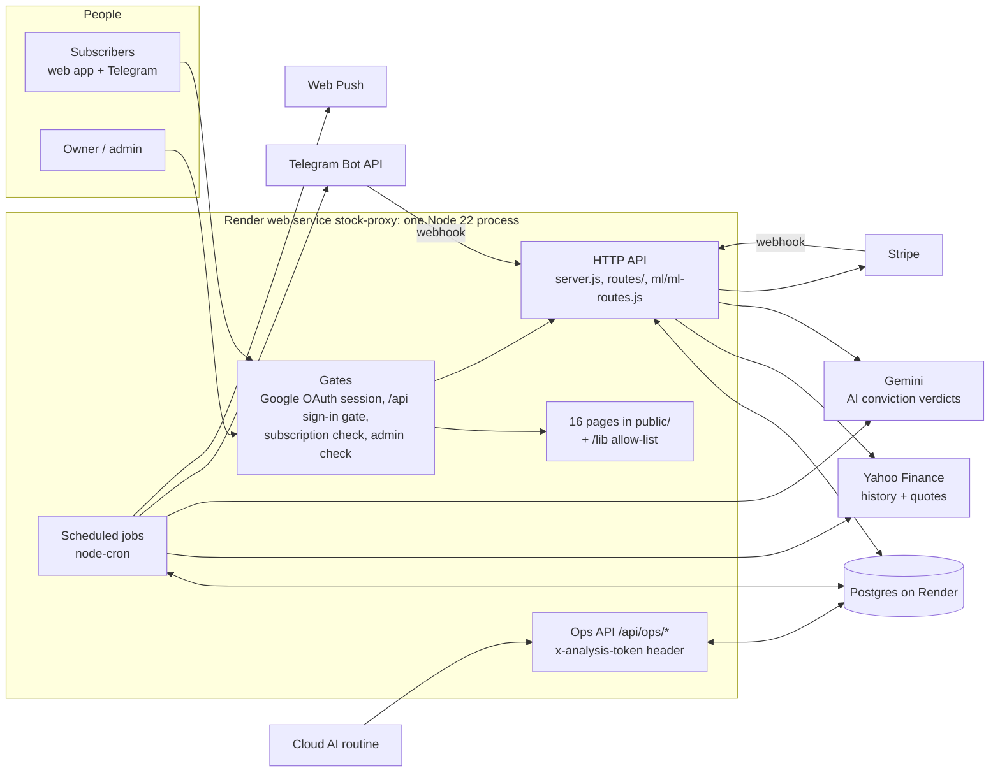
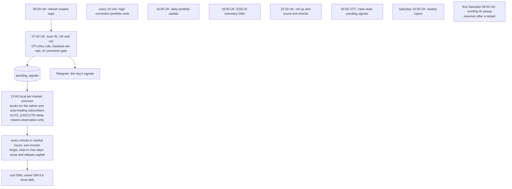

# SignalForge

SignalForge scans the Indian, UK and US markets every weekday morning for DTI-rule buy signals, gates them through backtest win rates and an AI conviction check, and books them into paper portfolios. It then monitors every position until it exits, telling subscribers what happened on Telegram and in the web app.

It runs as a single Node 22 / Express process with Postgres, on Render (`stock-proxy.onrender.com`). Pushing to `main` deploys it.

**This file is the single source of truth.** It holds, in this order:
1. the feature table: what exists, its version, when it was last tested and its status;
2. the changelog;
3. how the system works;
4. the rules every change must follow;
5. the file structure.

Update it in the same commit as the change it describes. See rule 1.

---

## 1. Features

**Legend**
- **Version** is the feature's own version. Every row starts at `1.0` on the 2026-09-23 baseline (`e2774d5`). A fix adds `0.1`; a rework adds `1.0`. The changelog names the commit.
- **Last tested** is the date and kind of the last green automated run that exercised the feature. *Unit* = jest unit suites; *endpoint* = the HTTP harness; *browser* = page smoke tests.
- **Status**:

| Status | Meaning |
|---|---|
| ✅ Working | Its endpoint and unit tests pass. |
| 🟢 Unit-tested | The core logic is covered by unit tests; endpoint tests are pending. |
| 🟡 Untested | No automated test yet. |
| ⚠️ Faulty | Verified bug(s); a fix is queued. |
| ❌ Broken | The failure is user-visible. |
| 🗑️ Dead | Nothing calls it; its removal is queued. |
| 🧪 Detect-only | Built but switched off. |
| ⏳ Owner | Waits for an owner decision (running cost, feature output, or owner-only access). |

### Accounts & access

| Feature | Version | Last tested | Status |
|---|---|---|---|
| Sign-in & session (Google OAuth: `/login`, `/auth/google*`, `/logout`, `GET /api/user`) | 1.0 | — | ⚠️ Faulty: `GET /api/user` omits `isAdmin`, so the Admin link never shows. Sessions live in memory, so every deploy signs everyone out. |
| Free trial & subscription access (`/api/user/subscription/*`, `ensureSubscriptionActive`) | 1.0 | — | ❌ Broken: the trial page misreads its status (always day 0), and its trial route exists only when Stripe keys are set. Cancelling ends access at once. Re-trials are unlimited. Schema drift on `users`. |
| Paid checkout (Stripe: `/api/stripe/*`) | 1.0 | — | ❌ Broken end to end: the envelope is misread, the billing period is missing, and the webhook sits behind the sign-in gate. ⏳ Owner: the advertised price (£24/$29/₹999) ≠ the billed price (£9.99/$12.99/₹799). |
| Privacy & GDPR (data summary, download, delete account, consent) | 1.0 | — | ❌ Broken: delete-account returns 500 and deletes nothing for any user with a subscription row. The consent POST gets 404. `user_settings` is missing from the export and the delete. |

### Signals & trading

| Feature | Version | Last tested | Status |
|---|---|---|---|
| 7 AM scan → signals (07:00 UK, weekdays; `POST /api/scanner/run` token) | 1.1 | 2026-09-23 · unit | 🟢 Unit-tested (signal store). The anonymous `POST /api/signals/from-scan` is gone: the scan stores its signals in process. The scan itself has no endpoint test yet. |
| 1 PM trade executor (13:00 local for IN, UK, US; `AUTO_EXECUTE` kill switch) | 1.0 | — | ⚠️ Faulty: `POST /api/executor/manual-execute/:market` is open to any signed-in account. |
| Scanner page: signals feed & auto-trading opt-in (`/api/signals/recent`, `/api/user/auto-trading`) | 1.0 | — | 🟡 Untested |
| Positions: trade journal (`/api/trades*`) | 1.0 | — | ⚠️ Faulty: a stale edit can reopen a closed trade, deletes don't release capital, and legacy trades re-import on every load. |
| Positions: pending-signals panel (`/api/signals/pending`, add/dismiss) | 1.0 | — | ⚠️ Faulty: the add and dismiss routes let any account change a signal for everyone. |
| Paper capital ledger (`/api/portfolio/capital`, `/api/ops/reconcile-capital`) | 1.0 | — | ⚠️ Faulty: deleting a trade leaks its capital, and nothing checks for drift nightly (GAPS #6). |
| Exit monitor & close-failure alerts (every minute in market hours) | 1.0 | 2026-09-23 · unit | 🟢 Unit-tested (same-day exit, close failure). ⚠️ `POST /api/exit-monitor/*` is open to any account; the outer errors are only logged. |
| Exit-check retention (23:20 UK; `/api/ops/exit-checks-stats`, GAPS #13 closed) | 1.0 | 2026-09-23 · unit | 🟢 Unit-tested; verified on prod 2026-09-19 |
| High-conviction portfolio & weekly report (every 10 min; Sat 10:00 UK) | 1.0 | 2026-09-23 · unit | 🟢 Unit-tested (re-entry, close failure). ⚠️ Updates are keyed by symbol with no unique index; the exit alert is sent at most once. |
| EOD AI summary (19:00 UK weekdays) | 1.0 | — | 🟡 Untested; a `-0.00%` cosmetic bug. |
| AI conviction check, on demand (`/api/ml/conviction/*`) | 1.0 | — | ⚠️ Faulty: any trial account can spend Gemini calls on arbitrary symbols and seed the shared verdict. |
| Monthly AI sweep (first Saturday 08:00 UK; boot resume; GAPS #20/#21 fixed) | 1.0 | 2026-09-23 · unit | 🟢 Unit-tested; first real run Sat 2026-10-03. ⏳ Owner: the fresh re-score (~5,029 Gemini calls a month) roughly doubles the actual AI spend. |
| AI analysis routine feed (`GET /api/signals/screened-today`) | 1.0 | — | 🟡 Untested; the routine sends a write-capable token in the URL. |
| Market data: Yahoo proxy & live prices (`/yahoo/*`, `POST /api/prices`) | 1.0 | — | ⚠️ Faulty: it is anonymous with a wildcard CORS header, so any site can use it as a proxy. `/api/prices` is unbounded. Volume is read from the wrong CSV column. |
| Data repairs: pence/pounds flips (GAPS #18), stale fills (GAPS #19) | 1.0 | 2026-09-23 · unit | 🧪 Detect-only. ⏳ Owner: `PRICE_UNIT_REPAIR=true` changes which UK stocks qualify. Stale fills stay off until GAPS #1. |
| Market caps (06:00 UK weekdays + Sat 08:00) | 1.0 | — | 🟡 Untested; the Saturday refresh overlaps the monthly sweep. |
| Simulator (`portfolio-backtest.html`) | 1.0 | — | ⚠️ Faulty: exit-reason colours are assigned by position; it uses a different engine from the live scan (GAPS #7); a missing close books a NaN P/L. |
| Positions chart dialog | 1.0 | — | ⚠️ Faulty: dark-mode legend colours are hard-coded; a dead parameter path. |
| Trailing stop (−5% → break-even at +4% → +1% for each further +1%) | 0.9 | 2026-09-18 · unit (WIP) | ⏳ Owner: built, not shipped. The backtest shows expectancy +1.56 → +1.44 %/trade. |

### Notifications

| Feature | Version | Last tested | Status |
|---|---|---|---|
| Telegram bot & account linking (`/api/telegram/webhook`, link/unlink) | 1.0 | — | ⚠️ Faulty: the webhook secret is optional, and a non-production boot with the real token deletes prod's webhook. |
| Alerts preferences page (`/api/alerts/preferences`) | 1.0 | — | ⚠️ Faulty: the switches are decorative (the wiring is built but not shipped), and the POST lets a body `user_id` overwrite another user's row. |
| Web push notifications (`/api/push/*`) | 1.0 | — | ❌ Broken: every notification click opens `/account`, which is a 404. The manifest is not linked. |

### Admin portal (`/admin`)

| Feature | Version | Last tested | Status |
|---|---|---|---|
| Dashboard & live events | 1.0 | — | ⚠️ Faulty: the audit log is always empty, the SSE stream has no producer, and payment figures are hard-coded. |
| Users & complimentary access | 1.0 | — | ⚠️ Faulty: a deleted user is re-created by their next request. |
| Plans & subscriptions | 1.0 | — | ⚠️ Faulty: counts and MRR miss Stripe rows; the trends are hard-coded. |
| Payments | 1.0 | — | ❌ Broken: refunds always return 500 (wrong table), and "verify" never activates the subscription. |
| Analytics | 1.0 | — | ⚠️ Faulty: invented numbers are shown as data. |
| Database tools & system health | 1.0 | — | ⚠️ Faulty: `/database/status` always returns 500, stubs report false success, and the SQL console's read-only mode is bypassable. |
| Settings | 1.0 | — | ⚠️ Faulty: 8 buttons report success without doing anything. |
| Signal testing & diagnostics | 1.0 | — | ⚠️ Faulty: diagnostics show every signal as `MARKET_NOT_FOUND`, and test-scan reports success on errors. |
| Telegram subscribers | 1.0 | — | 🟡 Untested |
| "Run tests" buttons (`/api/admin/tests/*`) | 1.0 | — | ❌ Broken: they spawn scripts that write test rows into the prod DB and always fail. Removal queued. |
| Audit log viewer, JWT token auth | 1.0 | — | 🗑️ Dead (no page loads them) |

### Platform

| Feature | Version | Last tested | Status |
|---|---|---|---|
| Ops probes & health (`/api/ops/*`, `/health`) | 1.0 | — | ⚠️ Faulty: `/health` shows UK time an hour ahead during BST and reports a "SQLite" session store. |
| Pages, static files & `/lib` allow-list (16 pages) | 1.0 | 2026-09-23 · unit | 🟢 Unit-tested (the `/lib` tripwire); page smoke tests pending. |
| Process reliability (crash handlers, shutdown, sessions, DB pools) | 1.0 | — | ⚠️ Faulty: no `unhandledRejection` handler, SIGTERM is swallowed, sessions are in memory, there are 12 extra pg pools, and geoip preloads ~146 MB for a dead route. |
| Diagnostics & legacy one-off routes (11, e.g. `/api/debug/users`) | 1.0 | — | 🗑️ Dead: `/api/debug/users` leaks every email to any account. Removal queued. |
| Legacy ML toolkit (`/api/ml/*` × 7, not the conviction routes) | 1.0 | — | 🗑️ Dead: it fabricates news headlines and loads its models at every boot. Removal queued. |
| `routes/gdpr.js` (never mounted) | 1.0 | — | 🗑️ Dead |
| Endpoint test harness (every route, every page contract) | — | — | 🟡 Being built |

### Strategy & data quality: the GAPS register (from the 2026-08-07 audit; full evidence in `git show e2774d5:docs/GAPS.md`)

| Feature | Version | Last tested | Status |
|---|---|---|---|
| #1 Selection = Wilson lower bound ≥ target and ≥ 15 backtest trades | — | — | ❌ Open (critical). Shadow study first; switching live selection is ⏳ owner. |
| #2 Honest backtest fills (high/low, stop wins, gaps at open, fees) | — | — | ❌ Open (critical) |
| #3 Walk-forward, out-of-sample selection | — | — | ❌ Open (high) |
| #4 Entry threshold study (0 vs −25 vs −40) | — | — | ❌ Open (high) |
| #5 Market-regime gate | — | — | ❌ Open (medium) |
| #6 Capital ledger derived or reconciled nightly | 1.0 | — | ⚠️ Partly fixed on 2026-08-29 (close-and-release, reconcile endpoint); nightly drift check pending |
| #7 One backtest engine for scan, Simulator and research | — | — | ❌ Open |
| #8 Anchored 7-day DTI buckets | — | — | ❌ Open |
| #9 Strategy parameters in one module, not hard-coded (the settings UI was removed in `885a46a`) | — | — | ❌ Open |
| #10 Universe refresh and dead-ticker pruning | — | — | ❌ Open |
| #11 Dated FX rates | — | — | ❌ Open |
| #12 Telegram delivery failures counted | — | — | ❌ Open |
| #14 `strategy_version` stamped on every trade | — | — | ❌ Open |
| #15 Benchmark return per trade | — | — | ❌ Open |
| #16 Kill switch | 1.0 | — | 🟡 Closed, untested: `AUTO_EXECUTE=false` puts the system in observation mode. The executor's endpoint tests will cover it. |
| #17 Unit tests for strategy maths and ledger invariants | — | — | ❌ Open |

---

## 2. Changelog

Newest first. Each line is one commit on `main`; `git show <sha>` has the full reasoning.

**2026-09-23**
- *(this commit)* Close the anonymous signal injection: the 7 AM scan stores its signals in process, and `POST /api/signals/from-scan` is removed
- `e24bcf3` `README.md` becomes the single source of truth. `docs/GAPS.md` is folded into §1, `CLAUDE.md` now points here, and plan documents are retired.
- `e2774d5` Remove 12 dead one-off scripts from the repo root
- `e1180fa` Say in the AI sweep report when Gemini failed; record how the 08-22 and 08-29 sweeps stopped (GAPS #21)
- `45d0abf` Pick a dead AI sweep up after a restart, and tell the owner how each run ended (GAPS #21)
- `18fff2c` Stop serving server source under `/lib`: only the pages' files, signed in
- `38da32b` Tell the owner when a high-conviction close fails
- `885a46a` Remove `/api/settings` and `settings-manager.js`
- `740f5e8` Remove the two caller-less `/api/alerts` test routes and their helpers
- `1ec33b1` Remove `POST /api/debug-dti-scan`
- `b4683a3` Remove `POST /api/test-7am-scan`
- `c6d5ef8` Remove `telegram-button-test.html`

**2026-09-20**
- `7b34bd4` CLAUDE.md: stop pointing sessions at `main.css`
- `f9ef31b` Stop loading the dead alerts-modal script on the Positions page
- `d3fd3ee` Stop loading two scripts the Positions page never uses
- `8f475a0` Retire `main.css` and the settings stub, the last of the v1 front end
- `0c64efa` Remove the performance-modal CSS block

**2026-09-19**
- `07a111d` Make the monthly AI sweep re-score (GAPS #20)
- `3915d14` Tell the owner when the exit monitor cannot close a position
- `15380a9`, `6ed7eb3`, `cb83855`, `f7fe8e5`, `7fc18ae`, `d9fb8ea`, `200518f`, `e54a8e9` Remove the dead second layer of client code (CSV upload path, the unused `>75%` copies, dead CSS ids)
- `234d59f` Read-only probe for the Alerts page switches
- `23a5100` Route the direct Yahoo readers through the price-unit repair (GAPS #18)
- `1159327` Let the exit monitor close a position on the day it was booked
- `43a2b3f`, `b166500` Remove two Telegram relay endpoints (open relays through the official bot)
- `230b232` Detect Yahoo's pence/pounds flips, detect-only (GAPS #18)
- `9bafd54` Drop the dead high-conviction alert guard
- `998253e`, `4fc001e`, `a1dff40`, `34f9014`, `20e7551` Remove the dead pre-v3 Scanner scripts and their hooks
- `f9742cd` Retire the legacy `checkTradeAlerts` loop: the exit monitor is the only closer
- `cc6a35d`, `86fa059` Exit-check retention job and its probe (GAPS #13)
- Merges: `80b6baf`, `1a8ff1f`, `c65fc45`, `cc3dac6`

**2026-08-31**
- `729e415` Run the AI conviction sweep monthly instead of weekly (cost)

**2026-08-29**
- `934deef` Show which DTI rule fired
- `7f9da93` Scanner mobile nav, per-market chart currency, visible entry triggers
- `3325abf` Positions page density pass
- `c39595c` Position chart dialog gets full chart controls
- `b56d4b9` Per-user auto-trading: the 7 AM signals book to every subscriber's own portfolio
- `4e57c69` Fix the calculation layer: win rate, capital ledger and duplicates, plus candlesticks, DD-MM-YYYY dates and the ntfy QR code

**2026-08-15**
- `9a4adb6` Weekend AI sweep scores the full universe
- `bc45554` Daily shared verdict cache for the Simulator's AI check
- `86c3853` AI conviction gate in the Simulator
- `4f8f3d0` Anchor trades to the real entry price; live Positions page

**2026-08-10**
- `24723b5` Day-reset ops endpoint + nightly 7 PM UK EOD AI summary
- `70036b5` Gate trade execution on AI conviction

**2026-08-09**
- `219a14d`, `d8a2b32`, `0588d5a`, `c835fe2`, `365c84a` Admin consolidated at `/admin`; admin and owner-review fixes

**2026-08-08**
- `28acec8` v3.1 surface: checkout flow, trial lifecycle, data page, legal docs
- `8c56fc6`, `e4dd3e3`, `aa32ea7`, `bae2cdf`, `4999e0a` Migrate Alerts, Simulator, Account, Positions and Scanner to the v3 "Poster" design
- `c2917a2`, `94dc5ab` Adopt the v3 design system; rebuild landing, pricing and login

**2026-08-07** (reset baseline: live trades archived, observation mode)
- `8adecdc`, `a7c8724` Token-guarded `GET /api/signals/screened-today` for the AI routine
- `a983ddd` `AUTO_EXECUTE` observation mode and the gap register
- `19a3fc4` Fix the scanner crash on zero-result scans; 1-minute exit monitoring

---

## 3. How the system works



**The trading day (all times are the job's own time zone):**



---

## 4. Strict rules

These rules bind every contributor and every Claude session; `CLAUDE.md` points here.

### 4.1 This document
1. **README.md is the single source of truth.** Update it in the same commit as the change it describes:
   - the feature row (version, last tested, status);
   - the changelog line;
   - §5 when files move.
2. **No plan documents.** Never create `PLAN-*.md`, TODO lists or scratch docs in the repo. Keep working notes in your own scratch space; the outcome lands here.
3. A feature is **✅ Working** only when a test that exercises it passed on that commit. Never mark a row from reading code.

### 4.2 Decisions (owner's standing orders, 2026-09-23)
4. Act on your own best recommendation; do not wait for the owner.
5. Ask the owner **only** when:
   - you genuinely cannot decide;
   - a change **raises running cost** (Render plan, Gemini or other paid-API volume, database tier);
   - a change **diminishes output or features** (removes something users get, or lowers signal quality or expectancy).

   Gather those into one report. Improvements, cost cuts and clutter removal need no approval.
6. Credentials live only in Render's environment and the local `.env`. Never commit, print or log them, or put them in a URL. Rotating a credential is an owner-only action.
7. Trading-output switches stay as they are until the owner says otherwise:
   - `PRICE_UNIT_REPAIR` and `STALE_FILL_REPAIR` stay detect-only;
   - `SELECTION_STOP_MODE` stays `fixed`;
   - the GAPS #1–#5 selection rules run in shadow only.

### 4.3 Shared working tree (several sessions work in this one clone at once)
8. **Never** run `git add`, `git rm`, `git commit`, `git stash` or `git checkout <file>` in the shared tree. Instead:
   - build commits in a private index: `GIT_INDEX_FILE=<scratch> git read-tree <main>`, then `update-index`, `write-tree` and `commit-tree -p <main>`;
   - hash blobs with `hash-object -w --no-filters`, because several files are CRLF;
   - publish with a compare-and-swap, `git update-ref refs/heads/main <new> <old>`;
   - sync only your own paths into the shared index.
9. Re-derive BASE from `refs/heads/main` at build time; another session may have moved it. Build blobs from the BASE blob plus your own hunks, never from a working file someone else has edited.
10. **No git worktrees.** That also rules out `isolation: worktree` and follow-up chips, which open worktrees. To test an exact commit, `git archive <sha> | tar -x` into a scratch folder, symlink `node_modules`, run the tests, then delete the folder.
11. Before you push:
    - `git log origin/main..main` must list only your commits;
    - the previous Render deployment must have finished;
    - push a pinned sha: `git push origin ${SHA}:refs/heads/main`.
12. Every change goes live, because Render deploys `main` on push. Confirm it with `GET /api/ops/version` and the `x-analysis-token` header, never a query string. Watch deploys and logs with the Render MCP when it is connected; otherwise use the GitHub deployment statuses.
13. **Deploy freeze:** no pushes on the first Saturday of a month between 08:00 and 12:00 UK. The monthly AI sweep runs in-process, and a deploy kills it.

### 4.4 Safety
14. Never run a script, route or handler that touches production data, messages users or spends paid-API budget just to see what it does. Scan triggers, broadcasts, the sweep and admin test runners are off-limits for probing.
15. Probe the database read-only. Schema changes are idempotent SQL: boot DDL in `database-postgres.js`, or a file in `migrations/` (file names are migration keys, so never rename them). Verify the result on the target database.
16. Local runs use the local Postgres and stub `node-cron`. On weekdays 02:00–22:00 UK, an unstubbed boot runs the exit monitor every minute.

### 4.5 Evidence & commits
17. Every "nothing uses X" claim needs a positive control through the same command, and every search runs from a bash script file. Known traps on the dev Mac:
    - zsh globbing and the `$VAR:x` modifiers;
    - `git grep -E` has no `\b`;
    - `\x27` inside double quotes is not a quote;
    - `grep` is aliased to `ugrep`;
    - `grep -q` under `pipefail`.
18. A commit message explains *why*, lists what was deliberately left alone, and states how the change was verified on that exact tree. Tests must be green on the exact tree before you push.

### 4.6 Front end
19. CSS is the v3 "Poster" design system:
    - tokens and components live in `public/css/design-system/`;
    - every page loads `design-system/index.css` plus one page sheet:
      - `app.css`: index, trades, portfolio-backtest, account, telegram-subscribe (admin-v2 adds `admin.css` on top);
      - `commerce.css`: checkout, trial activation, legal and data pages;
      - `marketing.css`: landing, pricing, login;
    - component specs and tokens are in `design/handoff-v3/README.md`;
    - reuse tokens and classes before adding CSS, and keep only one copy of anything duplicated;
    - never recreate `main.css`;
    - no inline CSS in HTML or JS.
20. Use Google Fonts and Google Material Icons.

---

## 5. File directory and structure

```
signalforge/
├── server.js                 Express app: gates, most HTTP routes, boot DDL calls, static serving
├── database-postgres.js      TradeDB: the Postgres pool, boot schema (CREATE/ALTER IF NOT EXISTS), every query
├── README.md                 this file, the single source of truth
├── CLAUDE.md                 pointer for Claude sessions to this file
├── package.json              npm start = node server.js; jest scripts
├── render.yaml               Render web service (npm install / npm start)
├── jest.config.js            jest: tests/unit + tests/integration
├── fix-india-position-count.js   required by POST /api/admin/fix-position-count (removal queued)
├── run-single-migration.js   apply one migrations/*.sql file by hand (move to scripts/ queued)
├── setup-bot.sh              the Telegram bot's command menu (move to scripts/ queued)
├── reset-telegram-webhook.sh Telegram webhook recovery (move to scripts/ queued)
├── config/                   auth.js (passport, Google OAuth, sessions), stripe.js, security.js (unused)
├── middleware/               subscription gate, admin auth, activity log, error handler, /lib allow-list
├── routes/                   auth.js, admin.js (/api/admin), subscription.js, stripe.js, gdpr.js (never mounted)
├── lib/
│   ├── scanner/              scanner.js: the 7 AM scan and most cron jobs; signal-store.js: stores its signals
│   ├── scheduler/            trade-executor.js (1 PM runs), market-cap-updater.js
│   ├── portfolio/            exit-monitor, capital-manager, high-conviction-manager, eod-summary, exit-check-retention, close-failure-alerts
│   ├── shared/               backtest engines, DTI calculator, price-unit and stale-fill repairs, stock universe (stock-data.js)
│   ├── telegram/             telegram-bot.js
│   ├── push/                 push-service.js (web push)
│   └── admin/                sse-handler.js (no producer, removal queued)
├── ml/                       conviction-engine.js + conviction-sweep.js (AI gate), ml-routes.js; legacy toolkit (removal queued)
├── migrations/               NNN_*.sql, applied by hand (names are keys)
├── scripts/                  health-check.js, verify-system.js (removal queued with the admin Run-tests buttons)
├── tests/                    unit/ (jest), integration/ (mock-only), database/performance scripts (removal queued)
├── public/                   16 pages (*.html), js/ (92 files), css/ (design-system + page sheets), images/brand/
├── design/handoff-v3/        v3 "Poster" design hand-off (tidy-up queued)
└── docs/history/             three stale 2025 audits (removal queued)
```
