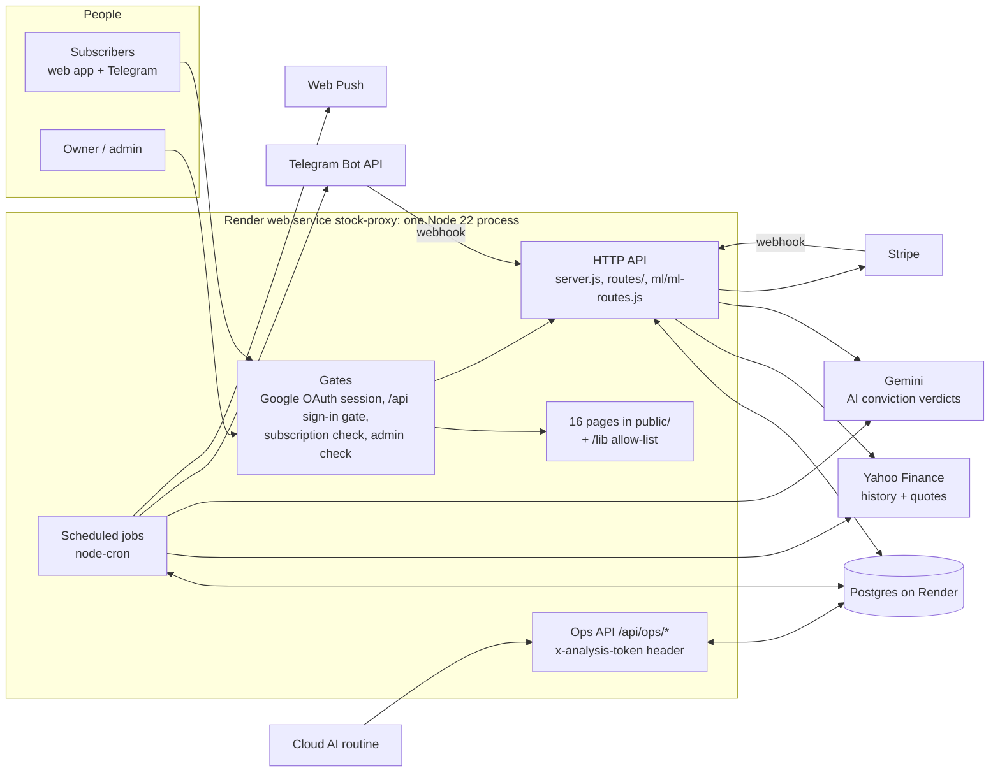
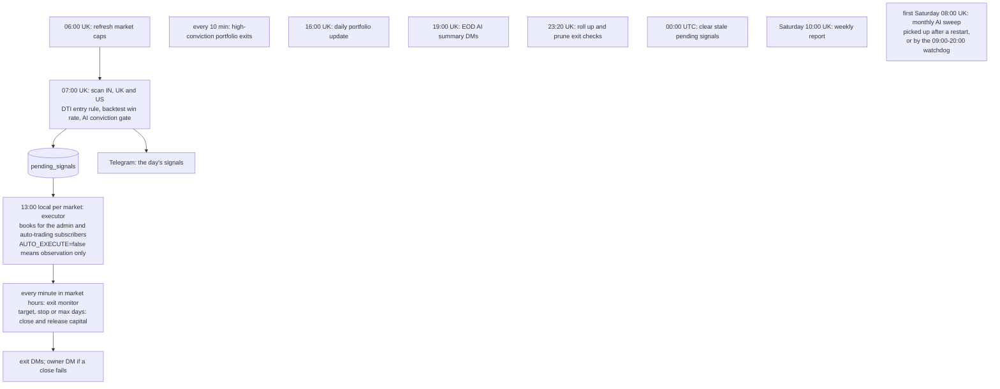

# SignalForge

SignalForge scans the Indian, UK and US markets every weekday morning for DTI-rule buy signals, gates them through backtest win rates and an AI conviction check, and books them into paper portfolios. It then monitors every position until it exits, telling subscribers what happened on Telegram and in the web app.

It runs as a single Node 22 / Express process with Postgres, on Render (`stock-proxy.onrender.com`). Pushing to `main` deploys it.

**This file is the single source of truth.** It holds, in this order:
1. the feature table: what exists, its version, when it was last tested and its status;
2. the changelog;
3. how the system works;
4. the rules every change must follow;
5. the file structure.

Update it in the same commit as the change it describes. See rule 1.

---

## 1. Features

**Legend**
- **Version** is the feature's own version. Every row starts at `1.0` on the 2026-09-23 baseline (`e2774d5`). A fix adds `0.1`; a rework adds `1.0`. The changelog names the commit.
- **Last tested** is the date and kind of the last green automated run that exercised the feature. *Unit* = jest unit suites; *endpoint* = the HTTP harness; *browser* = page smoke tests.
- **Status**:

| Status | Meaning |
|---|---|
| ✅ Working | Every route of the feature answers as specified (status, access rules, basic shape) in the endpoint harness on that commit, and its unit tests pass. |
| 🟢 Unit-tested | The core logic is covered by unit tests; endpoint tests are pending. |
| 🟡 Untested | No automated test yet. |
| ⚠️ Faulty | Verified bug(s); a fix is queued. |
| ❌ Broken | The failure is user-visible. |
| 🗑️ Dead | Nothing calls it; its removal is queued. |
| 🧪 Detect-only | Built but switched off. |
| ⏳ Owner | Waits for an owner decision (running cost, feature output, or owner-only access). |

### Accounts & access

| Feature | Version | Last tested | Status |
|---|---|---|---|
| Sign-in & session (Google OAuth: `/login`, `/auth/google*`, `/logout`, `GET /api/user`) | 1.2 | 2026-09-24 · endpoint | ✅ Working: sessions live in Postgres (`user_sessions`), so a deploy or a restart no longer signs anyone out; the harness proves it on every run by reading a session from a second server. Fixed on 2026-09-23: `GET /api/user` reports `isAdmin`, so the Admin link shows for the admin; an OAuth error returns to the login page instead of a JSON 502; the anonymous `/auth/debug` configuration page is gone, and the callback no longer logs session ids. |
| Free trial & subscription access (`/api/user/subscription/*`, `ensureSubscriptionActive`) | 1.2 | 2026-09-24 · unit + endpoint + browser | ✅ Working: the trial page reads its status (day 0, counting down, cancelled, ended) and starts the trial through the always-mounted `POST /api/user/subscription/start-trial`, showing the server's own error text; the app header shows the countdown chip the trial page promises (from 14 days left, amber at 5, one link to the plans, shortened to fit a phone). Fixed on 2026-09-24: one free trial per account (a cancelled or ended trial could be restarted for a fresh 90 days); a cancelled trial or plan keeps access until its end date, as the cancel message promises, and can be reactivated until then (a trial comes back as a trial, never as a paid plan); an account that never started a trial reads "none", not "expired"; a checkout attempt no longer ends a running trial; the Account page sent every cancel and reactivate twice, and both went through (a request that loses such a race now gets 409); no page loaded the countdown chip. Fixed on 2026-09-23: on a database built from the repo, the subscription check locked out every non-admin (four missing `users` columns); boot now adds them. |
| Paid checkout (Stripe: `/api/stripe/*`) | 1.2 | 2026-09-24 · endpoint (unmounted) | ❌ Broken end to end: the checkout page misreads the envelope, the billing period is missing, the webhook sits behind the sign-in gate (the harness pins it: Stripe would get 401), and a renewal never extends the paid period (the invoice and subscription-update webhooks only log). ⏳ Owner: the advertised price (£24/$29/₹999) ≠ the billed price (£9.99/$12.99/₹799). The discount-code stub (`POST /api/stripe/validate-discount`), which rejected every code and was called only by the unloaded `checkout.js`, is gone. Fixed on 2026-09-24: the receipt page reads the envelope and never names the free trial as the plan paid for; `POST /api/stripe/start-free-trial`, an unused second trial route without the one-trial rule, is gone. |
| Privacy & GDPR (data summary, download, delete account, consent) | 1.2 | 2026-09-24 · endpoint | ✅ Working: delete-account deletes every row the account owns and every copy the audit triggers made, archives only real payment records, ends the account's sessions on every device and refuses the admin account; the summary and the download include settings, push subscriptions (without keys), paper capital, every subscription and its history, access grants and refunds. Fixed on 2026-09-24: delete-account returned 500 and deleted nothing (a CHECK violation, swallowed, aborted the transaction), and where a delete did get through, ending the session crashed the server; the cookie banner no longer POSTs to a consent route that never existed, and the never-mounted `routes/gdpr.js` is gone. |

### Signals & trading

| Feature | Version | Last tested | Status |
|---|---|---|---|
| 7 AM scan → signals (07:00 UK, weekdays; `POST /api/scanner/run` token) | 1.1 | 2026-09-23 · unit + endpoint | 🟢 Unit-tested (signal store). The endpoint harness verifies only access rules: the scan triggers are never run there (probe-only). The anonymous `POST /api/signals/from-scan` is gone. |
| 1 PM trade executor (13:00 local for IN, UK, US; `AUTO_EXECUTE` kill switch) | 1.1 | 2026-09-23 · endpoint | 🟡 The harness verifies access rules and the execution logs; the execution itself is never run there (probe-only). The any-account manual trigger and two duplicates are gone. |
| Scanner page: signals feed & auto-trading opt-in (`/api/signals/recent`, `/api/user/auto-trading`) | 1.0 | 2026-09-23 · endpoint | ✅ Working |
| Positions: trade journal (`/api/trades*`) | 1.1 | 2026-09-24 · unit + endpoint | ✅ Working. Fixed on 2026-09-24: create and bulk import validate their input (400, never a 500) and only ever make manual trades; an edit changes only the price paid and the notes, and only while the position is open, so a save from a stale dialog can no longer reopen a closed trade (409); a close needs an exit price, works out its own P/L and keeps the Sell dialog's notes, and a second close is refused (409) instead of rewriting the exit; a delete takes an automatic trade out of the capital ledger in the same statement; the edit dialog shows the exit rule read-only; the old app's localStorage trades import once instead of on every load. |
| Positions: pending-signals panel (`GET /api/signals/pending`) | 1.1 | 2026-09-23 · endpoint | ✅ Working (read-only; the any-account add and dismiss routes are gone) |
| Paper capital ledger (`/api/portfolio/capital`, `/api/ops/reconcile-capital`) | 1.2 | 2026-09-24 · unit + endpoint | ⚠️ Faulty: nothing checks for drift nightly (GAPS #6), and capital that deletes leaked before 2026-09-24 stays in the ledger until a reconcile is applied. Fixed on 2026-09-24: a delete settles the ledger in the same statement (an open automatic trade hands back its allocation and its slot, a closed one its realized P/L); the boot position recount counts only open automatic trades, as the reconcile does, so manual trades no longer take automatic-trading slots after a restart; every harness run ends with a reconcile dry run that must show zero drift. The dead `initialize-capital`, `migrate-capital` and `fix-position-count` routes are gone; `/api/ops/reconcile-capital` is the repair tool. |
| Exit monitor & close-failure alerts (every minute in market hours) | 1.2 | 2026-09-24 · unit | 🟢 Unit-tested (same-day exit, close failure, a failed pass). A pass that fails outright now reaches the owner: at once, then hourly at most, with a count. The any-account exit-check routes are gone. |
| Exit-check retention (23:20 UK; `/api/ops/exit-checks-stats`, GAPS #13 closed) | 1.0 | 2026-09-23 · unit + endpoint | ✅ Working: unit-tested, its stats probe answers in the harness (the prune trigger is probe-only), verified on prod 2026-09-19. |
| High-conviction portfolio & weekly report (every 10 min; Sat 10:00 UK) | 1.2 | 2026-09-24 · unit + endpoint | 🟢 Unit-tested (re-entry, close failure). An exit alert or weekly report that reaches nobody now reaches the owner, and the manual close reports whether its alert was delivered. ⚠️ Updates are keyed by symbol with no unique index; the exit alert is sent at most once. Its admin API answers 400 for a malformed date or price (it crashed with 500 until 2026-09-24). |
| EOD AI summary (19:00 UK weekdays) | 1.1 | 2026-09-23 · unit + endpoint | 🟢 Unit-tested: the day move and the signed percentage (a tiny loss printed `-0.00%` until 2026-09-23). The harness verifies access rules only; the summary itself is never run there (probe-only). |
| AI conviction check, on demand (`/api/ml/conviction/*`) | 1.1 | 2026-09-24 · endpoint | ✅ Working: only symbols in the scan universe are scored, always under the universe's own name, so no caller can spend Gemini calls on arbitrary symbols or steer the verdict everyone shares; a GET on the batch path answers 405. |
| Monthly AI sweep (first Saturday 08:00 UK; picked up after a restart and by a 09:00–20:00 watchdog; GAPS #20/#21 fixed) | 1.2 | 2026-09-24 · unit + endpoint | 🟢 Unit-tested; first real run Sat 2026-10-03. A pick-up needs at least max(50, 1%) of the universe left and scores only what is not stored; the watchdog starts at most 3 runs a day (§4.7). The stats probe ignores an impossible day, as it does a malformed one. ⏳ Owner: the fresh re-score (~5,029 Gemini calls a month) roughly doubles the actual AI spend. |
| AI analysis routine feed (`GET /api/signals/screened-today`) | 1.0 | 2026-09-23 · endpoint | ✅ Working (the routine should send its token as a header, not in the URL) |
| Market data: Yahoo proxy & live prices (`/yahoo/*`, `POST /api/prices`) | 1.2 | 2026-09-24 · endpoint | ⚠️ Faulty: anonymous, with a wildcard CORS header; `/api/prices` is unbounded. Fixed: the scanner and the Simulator read the Adj Close column as volume (2026-09-23); a non-string symbol crashed `/api/prices` with 500 (2026-09-24). |
| Data repairs: pence/pounds flips (GAPS #18), stale fills (GAPS #19) | 1.0 | 2026-09-23 · unit | 🧪 Detect-only. ⏳ Owner: `PRICE_UNIT_REPAIR=true` changes which UK stocks qualify. Stale fills stay off until GAPS #1. |
| Market caps (06:00 UK weekdays + Sat 08:00, not on sweep day) | 1.2 | 2026-09-24 · unit + endpoint | 🟢 Unit-tested (the schedule): the Saturday refresh stands aside on sweep day, so it no longer overlaps the monthly sweep. The harness verifies the stats route and the refresh route's access rules; the refresh itself is probe-only. The two caller-less market-cap routes are gone. |
| Simulator (`portfolio-backtest.html`) | 1.0 | 2026-09-23 · endpoint | ⚠️ Faulty in the page (the harness only sees its routes, which pass): exit-reason colours are assigned by position; it uses a different engine from the live scan (GAPS #7); a missing close books a NaN P/L. |
| Positions chart dialog | 1.0 | 2026-09-23 · endpoint | ⚠️ Faulty in the page (its routes pass): dark-mode legend colours are hard-coded; a dead parameter path. |
| Trailing stop (−5% → break-even at +4% → +1% for each further +1%) | 0.9 | 2026-09-18 · unit (WIP) | ⏳ Owner: built, not shipped. The backtest shows expectancy +1.56 → +1.44 %/trade. |

### Notifications

| Feature | Version | Last tested | Status |
|---|---|---|---|
| Telegram bot & account linking (`/api/telegram/webhook`, link/unlink) | 1.1 | 2026-09-24 · unit + endpoint | ✅ Working: the webhook always requires a secret (`TELEGRAM_WEBHOOK_SECRET`, set on prod, or one derived from the bot token), a non-production boot never touches prod's webhook, and the logs no longer carry users' names, message text or account-link tokens. |
| Alerts preferences page (`/api/alerts/preferences`) | 1.2 | 2026-09-24 · endpoint | ⚠️ Faulty: the switches are decorative (the wiring is built but not shipped). The row is always the caller's own, and a value of the wrong type answers 400 (it crashed with 500 until 2026-09-24). |
| Web push notifications & the installable app (`/api/push/*`, `GET /account`, service worker, manifest) | 1.2 | 2026-09-24 · unit + endpoint | ⚠️ Faulty: any signed-in account can register any number of arbitrary URLs as push endpoints, and every broadcast POSTs to each of them in turn. Fixed on 2026-09-24: a notification click opens the Account page (`/account.html`; the old `/account` links redirect there); notifications and the manifest use the v3 app icon; the five app pages link the manifest, which opens on the Scanner in the v3 colours; a subscription without keys answers 400 instead of 500; each send times out after 10 s, so an endpoint that never answers no longer stalls a broadcast, and with it the 7 AM scan and the EOD summary until the next restart. Unsubscribe removes only the caller's own subscription. |

### Admin portal (`/admin`)

| Feature | Version | Last tested | Status |
|---|---|---|---|
| Dashboard | 1.1 | 2026-09-24 · endpoint | ⚠️ Faulty: the routes answer, but the audit log is always empty and payment figures are hard-coded. The live-events stream (SSE), which nothing ever published to, is gone with its two routes and the dashboard's EventSource; the metrics load each time the tab opens. |
| Users & complimentary access | 1.1 | 2026-09-24 · endpoint | ⚠️ Faulty: a deleted user is re-created by their next request. Fixed on 2026-09-24: the Users tab sent a temporary grant's expiry under a name the API never read, so every temporary grant was refused; a malformed expiry answers 400 instead of 500. |
| Plans & subscriptions | 1.3 | 2026-09-24 · endpoint | ⚠️ Faulty: counts and MRR miss Stripe rows; the trends are hard-coded. Deleting a plan that any subscription still uses answers 409 (it passed trial-only plans through to a misleading 400 until 2026-09-24). An unknown region or currency, a non-numeric price or negative trial days answer 400 (they crashed with 500 until 2026-09-24). The caller-less extend route is gone. |
| Payments | 1.1 | 2026-09-24 · endpoint | ✅ Working: a refund is recorded in one transaction (the payment becomes refunded, `payment_refunds` gets the reason and time; the money itself moves in the payment provider), and verify decides only a pending payment: an unknown one is 404, one already decided is 422. Fixed on 2026-09-24: every refund failed with 500 (it wrote refund columns `payment_transactions` does not have), and verify answered success for missing or already-decided payments. |
| Analytics | 1.1 | 2026-09-24 · endpoint | ⚠️ Faulty: the routes answer, but invented numbers are shown as data. The caller-less `/analytics/overview` placeholder is gone. |
| Database tools & system health | 1.2 | 2026-09-24 · endpoint | ⚠️ Faulty: stubs report success for things they never do; the SQL console's read-only mode is bypassable. 3 known bugs pinned in the harness. Removed on 2026-09-24, none of them called by any page: the Run-tests button (it ran test scripts against the live database), `/database/status` (500 on every call), `/database/health`, the injectable `analyze-table` and the trigger-scan stub; the health check no longer lists the dead event stream. |
| Settings | 1.1 | 2026-09-24 · endpoint | ⚠️ Faulty: 8 buttons report success without doing anything; an unknown email template returns 200. 1 known bug pinned in the harness. The caller-less legacy `GET /api/admin/settings` is gone. |
| Signal testing & diagnostics | 1.1 | 2026-09-23 · endpoint | ⚠️ Faulty: diagnostics show every signal as `MARKET_NOT_FOUND`; test-scan reports success on errors. The caller-less dismiss-old-signals route is gone. |
| Telegram subscribers | 1.1 | 2026-09-24 · endpoint | ✅ Working: link, unlink and remove answer 400 for a chat id that is not a whole number (they crashed with 500 until 2026-09-24). |

### Platform

| Feature | Version | Last tested | Status |
|---|---|---|---|
| Ops probes & health (`/api/ops/*`, `/health`) | 1.3 | 2026-09-24 · unit + endpoint | ✅ Working: `/health` shows the right UK time and next scan all year (unit-tested on both sides of the clock change) and names the real session store. The subscription schema probe is admin-only. |
| Access control: sign-in gate, subscription gate, one admin guard for all of `/api/admin` | 1.1 | 2026-09-24 · unit + endpoint | ✅ Working: the access matrix of every route (anonymous 401, non-subscriber 403, non-admin 403, token-only ops) passes in the harness; the admin guard is unit-tested. Since 2026-09-24 the guard is session-only: the admin JWT path (a Bearer header or cookie that nothing issued or sent) and its 2 routes are gone. |
| Pages, static files & `/lib` allow-list (16 pages) | 1.0 | 2026-09-23 · unit + endpoint | ✅ Working |
| Process reliability (crash handlers, shutdown, sessions, DB pools) | 1.7 | 2026-09-24 · unit + endpoint | ✅ Working: the server runs on one database pool (`database-postgres.js`). ⏳ Owner: every deploy takes the site down for about 45 s (Render stops the old instance before the new one is up); zero-downtime deploys need a health-check path (`/health`) in the Render dashboard. Fixed on 2026-09-24: sessions live in Postgres, so a deploy no longer signs everyone out (`/api/ops/sessions-stats` counts them); trade export, the boot user recovery, the subscription-setup probe, the subscription middleware and routes and the Stripe routes use the app's one pool instead of opening their own; an unhandled rejection is reported to the owner instead of crashing the server; a crash reports before it exits; a deploy's SIGTERM closes the server and exits within 20 s (`lib/shared/process-guards.js`), and the dead SSE module, whose listeners kept the process alive, is gone. geoip-lite (146 MiB of memory at boot) is gone. |
| Endpoint test harness (every route, every page contract) | 1.1 | 2026-09-24 · endpoint | ✅ Working: 206 specs (144 live routes, 3 unmounted Stripe routes, 59 removed routes), 864 cases; 860 pass and 4 known bugs fail as expected. The run ends with a reconcile dry run that must show zero ledger drift. Fresh scratch database and server per run, cron stubbed, no network. |

### Strategy & data quality: the GAPS register (from the 2026-08-07 audit; full evidence in `git show e2774d5:docs/GAPS.md`)

| Feature | Version | Last tested | Status |
|---|---|---|---|
| #1 Selection = Wilson lower bound ≥ target and ≥ 15 backtest trades | — | — | ❌ Open (critical). Shadow study first; switching live selection is ⏳ owner. |
| #2 Honest backtest fills (high/low, stop wins, gaps at open, fees) | — | — | ❌ Open (critical) |
| #3 Walk-forward, out-of-sample selection | — | — | ❌ Open (high) |
| #4 Entry threshold study (0 vs −25 vs −40) | — | — | ❌ Open (high) |
| #5 Market-regime gate | — | — | ❌ Open (medium) |
| #6 Capital ledger derived or reconciled nightly | 1.1 | 2026-09-24 · unit + endpoint | ⚠️ Partly fixed: close-and-release and the reconcile endpoint (2026-08-29); deletes settle the ledger, the boot recount agrees with the reconcile, and every harness run ends with zero drift (2026-09-24). The nightly drift check is pending |
| #7 One backtest engine for scan, Simulator and research | — | — | ❌ Open |
| #8 Anchored 7-day DTI buckets | — | — | ❌ Open |
| #9 Strategy parameters in one module, not hard-coded (the settings UI was removed in `885a46a`) | — | — | ❌ Open |
| #10 Universe refresh and dead-ticker pruning | — | — | ❌ Open |
| #11 Dated FX rates | — | — | ❌ Open |
| #12 Telegram delivery failures counted | — | — | ❌ Open |
| #14 `strategy_version` stamped on every trade | — | — | ❌ Open |
| #15 Benchmark return per trade | — | — | ❌ Open |
| #16 Kill switch | 1.0 | — | 🟡 Closed, untested: `AUTO_EXECUTE=false` puts the system in observation mode. The executor's endpoint tests will cover it. |
| #17 Unit tests for strategy maths and ledger invariants | 1.0 | 2026-09-24 · unit + endpoint | ⚠️ Partly: the ledger invariants are tested (a stale save cannot reopen a trade or release its capital twice; a delete settles with the reconcile's amounts; zero drift after every harness run); the strategy maths are not |

---

## 2. Changelog

Newest first. Each line is one commit on `main`; `git show <sha>` has the full reasoning.

**2026-09-24**
- *(this commit)* Free-trial lifecycle. The trial page misread its status (it always showed day 0) and started the trial through a Stripe route that exists only with Stripe keys, showing "[object Object]" for an error; it now reads the API's answer and uses the always-mounted route. One free trial per account: a cancelled or ended trial could be restarted for a fresh 90 days. A cancelled trial or plan keeps access until its end date, as the cancel message promises, and can be reactivated until then (a trial comes back as a trial, never as a paid plan); cancelling ended access at once, the message gave a trial the date 01-01-1970, and reactivate never found a cancelled trial. An account that never started a trial reads "none" instead of "expired", and a checkout attempt no longer ends a running trial. The Account page sent every cancel and reactivate twice and both went through; it binds its buttons once, and a request that loses such a race gets 409. The countdown chip the trial page promises is in the app header (`trial-countdown.js`, which no page loaded, is gone). The receipt page reads the API's envelope, the unused duplicate `/api/stripe/start-free-trial` is gone, and the subscription middleware and routes and the Stripe routes use the app's one database pool. Rule 13 gains the weekday deploy windows
- `9945584` Positions integrity. An edit writes only the price paid and the notes, and only while the position is open: the dialog used to save its whole cached copy of the trade, so a save that landed after the exit monitor had closed the position reopened it, and its capital was released twice. A delete takes an automatic trade out of the ledger in the same statement (an open one's allocation and slot, a closed one's realized P/L). Create and bulk import validate their input and only make manual trades; a close needs an exit price, works out its own P/L and keeps the Sell dialog's notes, and a second close is refused instead of rewriting the exit. The boot position recount counts only automatic trades, as the reconcile does. The edit dialog shows the exit rule read-only, and the old app's localStorage trades import once instead of on every load. The harness flips 3 pinned bugs and ends with a reconcile dry run that must show zero drift
- `077421d` Admin money routes answer truthfully: a refund is recorded in one transaction (it always failed with 500, writing columns the payments table does not have), verify decides only a pending payment (404 for an unknown one, 422 for one already decided, where it used to answer success), and deleting a plan that any subscription still uses answers 409. 8 known bugs remain
- `cd0210e` Web push and the app manifest: every notification linked to `/account`, a 404, and used the retired 418 KB logo as its icon (declared as 192 and 512 px); they now open the Account page with the app icon, and `GET /account` redirects for notifications already delivered. The manifest opens the Scanner, uses the app icon (any and maskable) and is linked from the five app pages. A subscription without keys answers 400, a long user agent no longer crashes the save, and each push send times out after 10 s, so one endpoint that never answers can no longer stall a broadcast, the 7 AM scan or the EOD summary. Five unused push methods go
- `9306976` GDPR: delete-account works. It returned 500 and deleted nothing (an invalid status UPDATE, swallowed, aborted the transaction), and where a delete got through, destroying the session during passport's logout crashed the server. It now deletes every per-user table in foreign-key order plus the audit-trigger copies, archives only real payment records, ends the account's sessions on every device and refuses the admin account; the summary and the download cover everything it deletes. The three GDPR routes use the app's one pool
- `df295e7` Remove dead admin code: the audit log viewer (6 routes and `admin-audit.js`, which no page loaded), the admin JWT path (2 routes, the Bearer and cookie branches of the admin guard, and `jsonwebtoken`), the SSE stream that nothing published to (2 routes, `lib/admin/sse-handler.js` and the dashboard's EventSource), 6 caller-less stubs and legacy routes (analytics overview, database health and status, `analyze-table`, legacy settings, trigger-scan) and the extend route. Also gone: the Stripe discount-code stub, the cookie banner's POST to a route that never existed, and three files nothing loads (`routes/gdpr.js`, `config/security.js`, `middleware/validation.js`). The SSE module's SIGTERM and SIGINT listeners go with it, so the process guards alone handle a shutdown. The harness keeps all 58 removed routes gone
- `050210e` Trade export, the boot user recovery and the subscription-setup probe use the app's one database pool: each opened a pool of its own per call (a fresh TLS connection every time) and closed it only on success. `GET /api/ops/sessions-stats` (read-only, header token) counts the stored sessions
- `217e08a` Sessions live in Postgres (`user_sessions`, `lib/shared/pg-session-store.js`) instead of the server's memory, so a deploy or a restart no longer signs every user out; expired rows are pruned every 15 minutes. A harness self-check starts a second server on the same database and reads the session there
- `27a12c6` Sweep schedule for the 2026-10-03 run: the Saturday 08:00 market-cap refresh stands aside on sweep day (it walked the same Yahoo chart endpoint as the sweep, for 40–55 minutes); a sweep-day watchdog picks up a run that ended short in a live process, every 30 minutes from 09:00 to 20:00 UK (at most 3 runs a day; `CONVICTION_SWEEP_WATCHDOG=false` turns it off); a pick-up, after a restart or by the watchdog, needs at least max(50, 1%) of the universe left. The three policies left for the owner (`shouldResumeSweep`, `shouldNotifyOwner`, `chooseRetentionDays`) are settled and written down in §4.7
- `f697eb5` Malformed input answers 400 instead of reaching Postgres and failing with 500, on nine routes: the high-conviction admin API's dates and exit price, the sweep stats probe's day, `/api/prices` symbols, the Alerts switches, Telegram chat ids, a complimentary grant's expiry, and a plan's region, currency, price and trial days (`lib/shared/input.js`). The Users tab could never grant temporary access: it sent the expiry under a name the API did not read. The harness flipped all 10 pinned cases; 24 remain
- `5c87a13` Remove the one-off residue probe: prod read clean, so the Run-tests buttons left no rows to delete. Tidy the test set-up: the integration "suite" only asserted its own fetch mock and the benchmark file ran nothing; both go with their npm scripts, as does a `diagnose` script whose file was deleted earlier. `package.json` named a missing `main`, and jest warned about an unknown option on every run
- `ab35b5f` Remove the admin Run-tests feature: the Database tab's button and runner, its 3 routes (they spawned test scripts against the live database, wrote rows there and always failed), `GET /api/test` and the 4 scripts behind them. A read-only token probe, `GET /api/ops/test-residue-stats`, counts the rows they left. The harness keeps all 40 removed routes gone
- `e5a3e6d` Reliability rails: an unhandled promise rejection is logged and reported to the owner (throttled) instead of crashing the server and signing everyone out; an uncaught exception reports before it exits; a deploy's SIGTERM closes the HTTP server and exits within 20 s (the old instance used to keep sweeping until Render killed it). The owner also hears when an exit-monitor pass fails outright (hourly at most) and when a high-conviction exit alert or weekly report reaches nobody. The owner-alert sender never rejects
- `cceab88` On-demand AI conviction checks score only symbols in the scan universe, under the universe's own name. Any trial account could spend Gemini calls on arbitrary symbols, or pass a misleading company name that steered the news search behind a verdict the 7 AM gate, the executor and the Simulator share for up to 37 days. A GET on the batch path answers 405 instead of scoring a stock called "BATCH"
- `49b7b62` Telegram safety: a non-production boot no longer polls or deletes the webhook (with the real token it deleted prod's, and prod stopped receiving bot commands until its next boot); polling is opt-in with `TELEGRAM_POLLING=true`. Production always registers the webhook with a secret, derived from the bot token when `TELEGRAM_WEBHOOK_SECRET` is unset, and enforces a derived one only after Telegram accepts it. The webhook log no longer records users' names, message text or account-link tokens

**2026-09-23**
- `c284c69` Remove the legacy ML toolkit: 7 caller-less `/api/ml` routes, `ml-integration.js` and its 6 analysers, which loaded models at every boot, fabricated news headlines and let any user "train" them. Also remove 6 packages that only it used or that nothing used (`natural`, `node-fetch`, `simple-statistics`, `technicalindicators`, `connect-sqlite3`, `@testing-library/jest-dom`). The conviction routes stay. The harness keeps all 36 removed routes gone
- `3e884c3` Fix four small correctness defects. `/health` showed UK time an hour ahead all summer, and the 7 AM scan as 08:00, and it named a "SQLite" session store that does not exist. The EOD summary printed `-0.00%`. The scanner and the Simulator read the Adj Close column as volume, which nothing consumed yet. The history proxy now reads the price-unit switch through the module's own `isRepairEnabled()`
- `ccbbd32` Remove 13 dead routes from server.js (legacy v1 admin, finished one-off migrations, stubs, duplicates of `/health`), 2 shadowed duplicate handlers, `/auth/debug`, and geoip-lite (146 MiB of memory at boot, for one dead route). Also gone: two orphaned helpers, a boot query that failed on every start, `public/js/pricing.js` and `fix-india-position-count.js`. Fix sign-in: `GET /api/user` reports `isAdmin`, an OAuth error returns to the login page, and the callback stops logging session ids. The harness keeps all 29 removed routes gone
- `6990ee0` Restore the Express 4 `req.body = {}` default: 22 routes that crashed with 500 on a body-less POST or PUT now answer as specified (the harness flipped all 22 pinned cases)
- `6c0c1ef` Add the endpoint test harness: all 183 live routes (plus 5 unmounted Stripe routes and 15 removed ones) are specified and run against a real server on a scratch database; 839 of 901 cases pass and 62 known bugs are pinned as expected failures. Fix the four `users` columns whose absence locked every non-admin out on a database built from the repo
- `5ef1168` Close the any-account holes: remove 14 caller-less routes that any signed-in account could use (executor, exit checks, global signal add/dismiss, user email dump, DDL); guard all of `/api/admin` in one place; fix the Alerts IDOR; scope push unsubscribe to the caller
- `24b6aa2` Close the anonymous signal injection: the 7 AM scan stores its signals in process, and `POST /api/signals/from-scan` is removed
- `e24bcf3` `README.md` becomes the single source of truth. `docs/GAPS.md` is folded into §1, `CLAUDE.md` now points here, and plan documents are retired.
- `e2774d5` Remove 12 dead one-off scripts from the repo root
- `e1180fa` Say in the AI sweep report when Gemini failed; record how the 08-22 and 08-29 sweeps stopped (GAPS #21)
- `45d0abf` Pick a dead AI sweep up after a restart, and tell the owner how each run ended (GAPS #21)
- `18fff2c` Stop serving server source under `/lib`: only the pages' files, signed in
- `38da32b` Tell the owner when a high-conviction close fails
- `885a46a` Remove `/api/settings` and `settings-manager.js`
- `740f5e8` Remove the two caller-less `/api/alerts` test routes and their helpers
- `1ec33b1` Remove `POST /api/debug-dti-scan`
- `b4683a3` Remove `POST /api/test-7am-scan`
- `c6d5ef8` Remove `telegram-button-test.html`

**2026-09-20**
- `7b34bd4` CLAUDE.md: stop pointing sessions at `main.css`
- `f9ef31b` Stop loading the dead alerts-modal script on the Positions page
- `d3fd3ee` Stop loading two scripts the Positions page never uses
- `8f475a0` Retire `main.css` and the settings stub, the last of the v1 front end
- `0c64efa` Remove the performance-modal CSS block

**2026-09-19**
- `07a111d` Make the monthly AI sweep re-score (GAPS #20)
- `3915d14` Tell the owner when the exit monitor cannot close a position
- `15380a9`, `6ed7eb3`, `cb83855`, `f7fe8e5`, `7fc18ae`, `d9fb8ea`, `200518f`, `e54a8e9` Remove the dead second layer of client code (CSV upload path, the unused `>75%` copies, dead CSS ids)
- `234d59f` Read-only probe for the Alerts page switches
- `23a5100` Route the direct Yahoo readers through the price-unit repair (GAPS #18)
- `1159327` Let the exit monitor close a position on the day it was booked
- `43a2b3f`, `b166500` Remove two Telegram relay endpoints (open relays through the official bot)
- `230b232` Detect Yahoo's pence/pounds flips, detect-only (GAPS #18)
- `9bafd54` Drop the dead high-conviction alert guard
- `998253e`, `4fc001e`, `a1dff40`, `34f9014`, `20e7551` Remove the dead pre-v3 Scanner scripts and their hooks
- `f9742cd` Retire the legacy `checkTradeAlerts` loop: the exit monitor is the only closer
- `cc6a35d`, `86fa059` Exit-check retention job and its probe (GAPS #13)
- Merges: `80b6baf`, `1a8ff1f`, `c65fc45`, `cc3dac6`

**2026-08-31**
- `729e415` Run the AI conviction sweep monthly instead of weekly (cost)

**2026-08-29**
- `934deef` Show which DTI rule fired
- `7f9da93` Scanner mobile nav, per-market chart currency, visible entry triggers
- `3325abf` Positions page density pass
- `c39595c` Position chart dialog gets full chart controls
- `b56d4b9` Per-user auto-trading: the 7 AM signals book to every subscriber's own portfolio
- `4e57c69` Fix the calculation layer: win rate, capital ledger and duplicates, plus candlesticks, DD-MM-YYYY dates and the ntfy QR code

**2026-08-15**
- `9a4adb6` Weekend AI sweep scores the full universe
- `bc45554` Daily shared verdict cache for the Simulator's AI check
- `86c3853` AI conviction gate in the Simulator
- `4f8f3d0` Anchor trades to the real entry price; live Positions page

**2026-08-10**
- `24723b5` Day-reset ops endpoint + nightly 7 PM UK EOD AI summary
- `70036b5` Gate trade execution on AI conviction

**2026-08-09**
- `219a14d`, `d8a2b32`, `0588d5a`, `c835fe2`, `365c84a` Admin consolidated at `/admin`; admin and owner-review fixes

**2026-08-08**
- `28acec8` v3.1 surface: checkout flow, trial lifecycle, data page, legal docs
- `8c56fc6`, `e4dd3e3`, `aa32ea7`, `bae2cdf`, `4999e0a` Migrate Alerts, Simulator, Account, Positions and Scanner to the v3 "Poster" design
- `c2917a2`, `94dc5ab` Adopt the v3 design system; rebuild landing, pricing and login

**2026-08-07** (reset baseline: live trades archived, observation mode)
- `8adecdc`, `a7c8724` Token-guarded `GET /api/signals/screened-today` for the AI routine
- `a983ddd` `AUTO_EXECUTE` observation mode and the gap register
- `19a3fc4` Fix the scanner crash on zero-result scans; 1-minute exit monitoring

---

## 3. How the system works



**The trading day (all times are the job's own time zone):**



---

## 4. Strict rules

These rules bind every contributor and every Claude session; `CLAUDE.md` points here.

### 4.1 This document
1. **README.md is the single source of truth.** Update it in the same commit as the change it describes:
   - the feature row (version, last tested, status);
   - the changelog line;
   - §5 when files move.
2. **No plan documents.** Never create `PLAN-*.md`, TODO lists or scratch docs in the repo. Keep working notes in your own scratch space; the outcome lands here.
3. A feature is **✅ Working** only when a test that exercises it passed on that commit. Never mark a row from reading code.

### 4.2 Decisions (owner's standing orders, 2026-09-23)
4. Act on your own best recommendation; do not wait for the owner.
5. Ask the owner **only** when:
   - you genuinely cannot decide;
   - a change **raises running cost** (Render plan, Gemini or other paid-API volume, database tier);
   - a change **diminishes output or features** (removes something users get, or lowers signal quality or expectancy).

   Gather those into one report. Improvements, cost cuts and clutter removal need no approval.
6. Credentials live only in Render's environment and the local `.env`. Never commit, print or log them, or put them in a URL. Rotating a credential is an owner-only action.
7. Trading-output switches stay as they are until the owner says otherwise:
   - `PRICE_UNIT_REPAIR` and `STALE_FILL_REPAIR` stay detect-only;
   - `SELECTION_STOP_MODE` stays `fixed`;
   - the GAPS #1–#5 selection rules run in shadow only.

### 4.3 Shared working tree (several sessions work in this one clone at once)
8. **Never** run `git add`, `git rm`, `git commit`, `git stash` or `git checkout <file>` in the shared tree. Instead:
   - build commits in a private index: `GIT_INDEX_FILE=<scratch> git read-tree <main>`, then `update-index`, `write-tree` and `commit-tree -p <main>`;
   - hash blobs with `hash-object -w --no-filters`, because several files are CRLF;
   - publish with a compare-and-swap, `git update-ref refs/heads/main <new> <old>`;
   - sync only your own paths into the shared index.
9. Re-derive BASE from `refs/heads/main` at build time; another session may have moved it. Build blobs from the BASE blob plus your own hunks, never from a working file someone else has edited.
10. **No git worktrees.** That also rules out `isolation: worktree` and follow-up chips, which open worktrees. To test an exact commit, `git archive <sha> | tar -x` into a scratch folder, symlink `node_modules`, run the tests, then delete the folder.
11. Before you push:
    - `git log origin/main..main` must list only your commits;
    - the previous Render deployment must have finished;
    - push a pinned sha: `git push origin ${SHA}:refs/heads/main`.
12. Every change goes live, because Render deploys `main` on push. Confirm it with `GET /api/ops/version` and the `x-analysis-token` header, never a query string. Watch deploys and logs with the Render MCP when it is connected; otherwise use the GitHub deployment statuses.
13. **Deploy windows:** no pushes on the first Saturday of a month between 08:00 and 12:00 UK (the monthly AI sweep runs in-process, and a deploy kills it), and none on weekdays between 06:50 and 07:15 or between 12:50 and 13:15 UK (the 7 AM scan and the 1 PM trade executor). Every deploy takes the site down for about 45 s (measured on 2026-09-24: Render stops the old instance before the new one is up), and a scheduled run that falls inside that gap is lost. The push script refuses all three windows.

### 4.4 Safety
14. Never run a script, route or handler that touches production data, messages users or spends paid-API budget just to see what it does. Scan triggers, broadcasts and the sweep are off-limits for probing.
15. **Signed in is not an authorisation boundary**: anyone can start a free trial. Anything that acts on other users, the whole system or paid services is either admin-only (`requireAdmin` guards all of `/api/admin`) or token-guarded (`/api/ops/*`, header `x-analysis-token`). A user may only ever touch their own rows, and the session decides whose, never the body.
16. Probe the database read-only. Schema changes are idempotent SQL: boot DDL in `database-postgres.js`, or a file in `migrations/` (file names are migration keys, so never rename them). The session store creates its own `user_sessions` table the same way (`lib/shared/pg-session-store.js`). Verify the result on the target database.
17. Local runs use the local Postgres and stub `node-cron`. On weekdays 02:00–22:00 UK, an unstubbed boot runs the exit monitor every minute. A local boot never polls Telegram or deletes its webhook; `TELEGRAM_POLLING=true` turns polling on (and deletes the webhook), so use it only with a separate test bot's token.

### 4.5 Evidence & commits
18. Every "nothing uses X" claim needs a positive control through the same command, and every search runs from a bash script file. Known traps on the dev Mac:
    - zsh globbing and the `$VAR:x` modifiers;
    - `git grep -E` has no `\b`;
    - `\x27` inside double quotes is not a quote;
    - `grep` is aliased to `ugrep`;
    - `grep -q` under `pipefail`.
19. **Test gate**: `npm test` (unit, including the route-spec coverage test) and `npm run test:endpoints` (the HTTP harness: every route, every persona, on a scratch database with no network) must be green on a `git archive` export of the exact commit before it is pushed. Every new route gets a spec in `tests/endpoints/specs/`; a removed route gets an `absent` spec; a known bug is a `bug` case that states the correct status.
20. A commit message explains *why*, lists what was deliberately left alone, and states how the change was verified on that exact tree. Tests must be green on the exact tree before you push.

### 4.6 Front end
21. CSS is the v3 "Poster" design system:
    - tokens and components live in `public/css/design-system/`;
    - every page loads `design-system/index.css` plus one page sheet:
      - `app.css`: index, trades, portfolio-backtest, account, telegram-subscribe (admin-v2 adds `admin.css` on top);
      - `commerce.css`: checkout, trial activation, legal and data pages;
      - `marketing.css`: landing, pricing, login;
    - component specs and tokens are in `design/handoff-v3/README.md`;
    - reuse tokens and classes before adding CSS, and keep only one copy of anything duplicated;
    - never recreate `main.css`;
    - no inline CSS in HTML or JS.
22. Use Google Fonts and Google Material Icons.

### 4.7 Automatic policies (settled 2026-09-24; change one only together with its rule here)
23. **Monthly AI sweep schedule** (`ml/conviction-sweep.js`; its crons are in `lib/scanner/scanner.js`):
    - sweep day is the first Saturday of the month on the UK clock (`isSweepDay()`, the one definition every job uses); the run starts at 08:00 UK;
    - the Saturday 08:00 market-cap refresh stands aside on sweep day, unless `CONVICTION_SWEEP=false`; the weekday 06:00 refresh is unchanged;
    - a run that stopped short is picked up after a restart (from 08:00; off with `CONVICTION_SWEEP_BOOT_RESUME=false`) and by the sweep-day watchdog (every 30 minutes from 09:00 to 20:00 UK, at most 3 runs a day; off with `CONVICTION_SWEEP_WATCHDOG=false`);
    - a pick-up needs at least max(50, 1% of the universe) symbols left (`shouldResumeSweep()`); fewer wait for on-demand scoring;
    - a pick-up scores only symbols with no verdict from the last `CONVICTION_SWEEP_RESUME_DAYS` (14) days, so nothing is paid for twice. It never starts while a sweep runs in the process, within 2 minutes of the newest verdict write (another process may still be sweeping), or when `conviction_daily` cannot be read.
24. **Close-failure alerts** (`shouldNotifyOwner()` in `lib/portfolio/close-failure-alerts.js`): the owner hears about the first failed close of a position at once, whatever its kind, then every `CLOSE_FAILURE_REMINDER_MIN` (60) minutes while it keeps failing. Never more often than every 5 minutes, never silent for more than 24 hours. Subscribers are never told.
25. **Exit-check retention** (`chooseRetentionDays()` in `lib/portfolio/exit-check-retention.js`): a fixed window of `EXIT_CHECK_RETENTION_DAYS` (30) full days of minute-level checks, whatever the table's size. The daily rollup is kept for ever, and alert rows are never deleted. A size-based window would be a new decision: record it here first.

---

## 5. File directory and structure

```
signalforge/
├── server.js                 Express app: gates, most HTTP routes, boot DDL calls, static serving
├── database-postgres.js      TradeDB: the Postgres pool, boot schema (CREATE/ALTER IF NOT EXISTS), every query
├── README.md                 this file, the single source of truth
├── CLAUDE.md                 pointer for Claude sessions to this file
├── package.json              npm start = node server.js; jest scripts
├── render.yaml               Render web service (npm install / npm start)
├── jest.config.js            jest unit config (tests/endpoints has its own)
├── run-single-migration.js   apply one migrations/*.sql file by hand (move to scripts/ queued)
├── setup-bot.sh              the Telegram bot's command menu (move to scripts/ queued)
├── reset-telegram-webhook.sh Telegram webhook recovery (move to scripts/ queued)
├── config/                   auth.js (passport, Google OAuth, sessions), stripe.js
├── middleware/               subscription gate, admin auth, activity log, error handler, /lib allow-list
├── routes/                   auth.js, admin.js (/api/admin), subscription.js, stripe.js
├── lib/
│   ├── scanner/              scanner.js: the 7 AM scan and most cron jobs; signal-store.js: stores its signals
│   ├── scheduler/            trade-executor.js (1 PM runs), market-cap-updater.js
│   ├── portfolio/            exit-monitor, capital-manager, high-conviction-manager, eod-summary, exit-check-retention, close-failure-alerts
│   ├── shared/               backtest engines, DTI calculator, price-unit and stale-fill repairs, stock universe (stock-data.js), date formats, process guards, input checks, the Postgres session store
│   ├── telegram/             telegram-bot.js
│   └── push/                 push-service.js (web push)
├── ml/                       conviction-engine.js + conviction-sweep.js (the AI gate), ml-routes.js (/api/ml/conviction/*)
├── migrations/               NNN_*.sql, applied by hand (names are keys)
├── tests/
│   ├── unit/                 jest unit suites (npm test), including the route-spec coverage test
│   ├── endpoints/            HTTP harness (npm run test:endpoints): harness/ (preload, setup, seed), specs/*.json (one per route)
│   └── setup.js, __mocks__/  jest set-up for the unit suites (browser globals, style and image stubs)
├── public/                   16 pages (*.html), js/ (90 files), css/ (design-system + page sheets), images/brand/
├── design/handoff-v3/        v3 "Poster" design hand-off (tidy-up queued)
└── docs/history/             three stale 2025 audits (removal queued)
```
