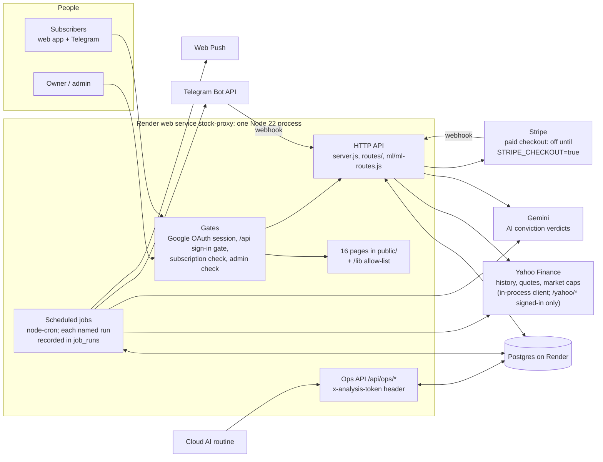
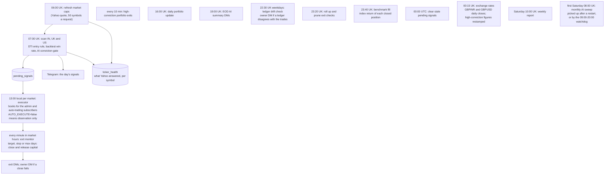

# SignalForge

SignalForge scans the Indian, UK and US markets every weekday morning for DTI-rule buy signals, gates them through backtest win rates and an AI conviction check, and books them into paper portfolios. It then monitors every position until it exits, telling subscribers what happened on Telegram and in the web app.

It runs as a single Node 22 / Express process with Postgres, on Render (`stock-proxy.onrender.com`). Pushing to `main` deploys it.

**This file is the single source of truth.** It holds, in this order:
1. the feature table: what exists, its version, when it was last tested and its status;
2. the changelog;
3. how the system works;
4. the rules every change must follow;
5. the file structure.

Update it in the same commit as the change it describes. See rule 1.

---

## 1. Features

**Legend**
- **Version** is the feature's own version. Every row starts at `1.0` on the 2026-09-23 baseline (`e2774d5`). A fix adds `0.1`; a rework adds `1.0`. The changelog names the commit.
- **Last tested** is the date and kind of the last green automated run that exercised the feature. *Unit* = jest unit suites; *endpoint* = the HTTP harness; *browser* = page smoke tests.
- **Status**:

| Status | Meaning |
|---|---|
| ✅ Working | Every route of the feature answers as specified (status, access rules, basic shape) in the endpoint harness on that commit, and its unit tests pass. |
| 🟢 Unit-tested | The core logic is covered by unit tests; endpoint tests are pending. |
| 🟡 Untested | No automated test yet. |
| ⚠️ Faulty | Verified bug(s); a fix is queued. |
| ❌ Broken | The failure is user-visible. |
| 🗑️ Dead | Nothing calls it; its removal is queued. |
| 🧪 Detect-only | Built but switched off. |
| ⏳ Owner | Waits for an owner decision (running cost, feature output, or owner-only access). |

### Accounts & access

| Feature | Version | Last tested | Status |
|---|---|---|---|
| Sign-in & session (Google OAuth: `/login`, `/auth/google*`, `/logout`, `GET /api/user`) | 1.2 | 2026-09-24 · endpoint | ✅ Working: sessions live in Postgres (`user_sessions`), so a deploy or a restart no longer signs anyone out; the harness proves it on every run by reading a session from a second server. Fixed on 2026-09-23: `GET /api/user` reports `isAdmin`, so the Admin link shows for the admin; an OAuth error returns to the login page instead of a JSON 502; the anonymous `/auth/debug` configuration page is gone, and the callback no longer logs session ids. |
| Free trial & subscription access (`/api/user/subscription/*`, `ensureSubscriptionActive`) | 1.4 | 2026-09-25 · unit + endpoint + browser | ✅ Working: the trial page reads its status (day 0, counting down, cancelled, ended) and starts the trial through the always-mounted `POST /api/user/subscription/start-trial`, showing the server's own error text; the app header shows the countdown chip the trial page promises (from 14 days left, amber at 5, one link to the plans, shortened to fit a phone). Fixed on 2026-09-24: one free trial per account (a cancelled or ended trial could be restarted for a fresh 90 days); a cancelled trial or plan keeps access until its end date, as the cancel message promises, and can be reactivated until then (a trial comes back as a trial, never as a paid plan); an account that never started a trial reads "none", not "expired"; a checkout attempt no longer ends a running trial; the Account page sent every cancel and reactivate twice, and both went through (a request that loses such a race now gets 409); no page loaded the countdown chip. Fixed on 2026-09-23: on a database built from the repo, the subscription check locked out every non-admin (four missing `users` columns); boot now adds them. Since 2026-09-25 a plan Stripe bills is cancelled or reactivated in Stripe first (its renewals stop, or start again); when Stripe cannot be told, nothing changes and the page says so (502). Fixed on 2026-09-25: the Account page's payment history threw for any account with a payment (it called `toFixed` on the amount, which Postgres returns as text), so it showed no history at all. |
| Paid checkout (Stripe: `/api/stripe/*`) | 1.4 | 2026-09-25 · unit + endpoint + browser | ⏳ Owner: built and tested end to end, and switched off until the owner sets the price. One switch, off by default (`config/stripe.js`): with `STRIPE_CHECKOUT=true`, `STRIPE_SECRET_KEY` and `STRIPE_WEBHOOK_SECRET` all set, the checkout page sends the buyer to Stripe's own payment page (Stripe Checkout: a subscription billed every month, quarter or year at the plan's own price in `subscription_plans`), and Stripe's webhook, mounted before the JSON parser and the sign-in gate, is signature-checked and applies each event once (`stripe_webhook_events`, `lib/shared/stripe-billing.js`): `checkout.session.completed` records the plan with its billing period, `invoice.paid` moves the paid-up end on (never back) and records the payment, `invoice.payment_failed` is recorded, and `customer.subscription.updated` and `.deleted` cancel, renew or end the plan, all through the access rule in `middleware/subscription.js`. Cancelling or reactivating on the Account page, the admin's cancel and account deletion tell Stripe first, and change nothing when Stripe cannot be told (502). A payment that gives no access (for time after the plan ended, a second paid plan, or a customer no account holds) is sent to the owner. The harness runs the webhook on a second server with the switch on and events signed in the test (`tests/endpoints/stripe-webhook.test.js`); `/api/ops/version` shows the switch (`stripeCheckout`). ⏳ Owner: the advertised price (£24/$29/₹999) ≠ the price in `subscription_plans` (£9.99/$12.99/₹799), which is what Stripe would charge. Switching on takes a Stripe webhook endpoint `https://stock-proxy.onrender.com/api/stripe/webhook` for `checkout.session.completed`, `checkout.session.async_payment_succeeded`, `invoice.paid`, `invoice.payment_failed`, `customer.subscription.updated` and `customer.subscription.deleted`, then `STRIPE_SECRET_KEY`, `STRIPE_WEBHOOK_SECRET` (that endpoint's signing secret) and `STRIPE_CHECKOUT=true` on Render; `STRIPE_PUBLISHABLE_KEY` is no longer used. Fixed on 2026-09-24: the checkout page misread the envelope and sent no billing period; the webhook sat behind the sign-in gate and after the JSON parser (Stripe got 401, and no signature could have verified); a renewal never extended the paid period (the checkout took a one-off payment, and the invoice and subscription-update webhooks only logged); the receipt page reads the envelope, never names the free trial as the plan paid for, and shows the billing period and the paid-up date. The discount-code stub (`POST /api/stripe/validate-discount`) and an unused second trial route (`POST /api/stripe/start-free-trial`) are gone. Fixed on 2026-09-25: the receipt page (`checkout-success.html`) showed a paid receipt dated today, with example figures, to anyone who opened it; it now shows only the account's own records: the receipt of a paid plan in force, "Confirming your payment" after Stripe's page (it checks again every few seconds until the webhook has recorded the payment), or "No paid plan on this account". |
| Privacy & GDPR (data summary, download, delete account, consent) | 1.4 | 2026-09-25 · unit + endpoint | ✅ Working: delete-account deletes every row the account owns and every copy the audit triggers made, archives only real payment records, ends the account's sessions on every device and refuses the admin account; since 2026-09-24 the deletion is `lib/shared/account-deletion.js`, which the admin's delete runs too. The summary and the download include settings, push subscriptions (without keys), paper capital, every subscription and its history, access grants and refunds. Fixed on 2026-09-24: delete-account returned 500 and deleted nothing (a CHECK violation, swallowed, aborted the transaction), and where a delete did get through, ending the session crashed the server; the cookie banner no longer POSTs to a consent route that never existed, and the never-mounted `routes/gdpr.js` is gone. Since 2026-09-25 a paid plan Stripe still renews is ended in Stripe before the account is deleted, the admin's delete included; when Stripe cannot be told, nothing is deleted (502), so a deleted account is never charged again. |

### Signals & trading

| Feature | Version | Last tested | Status |
|---|---|---|---|
| 7 AM scan → signals (07:00 UK, weekdays; `POST /api/scanner/run` token) | 1.4 | 2026-09-25 · unit + endpoint + prod probe | ✅ Working on prod: `/api/ops/schedule-stats` shows each weekday's run - on 23 September 6 India and 3 US signals stored at 07:03, on 24 September 4 India and 1 UK at 07:03, on 25 September 1 India signal (the run took 07:00:00 to 07:02:50, `job_runs`). Unit-tested (signal store; since 2026-09-25 also its backtest engine's rules, `tests/unit/strategy-backtest.test.js`). ⏳ Owner: that engine (`lib/shared/frontend-backtest-calculator.js`) books a time exit on a bar without a close (Yahoo sends null) as a NaN P/L, which its win rate counts as a loss, and a trade entered on such a bar has no entry price; the Simulator's engine skips such bars since 2026-09-25, and the same guard here would change which stocks clear the 75% bar. The endpoint harness verifies only access rules: the scan triggers are never run there (probe-only). The anonymous `POST /api/signals/from-scan` is gone. The scan notes every symbol's Yahoo answer for the dead-ticker record (GAPS #10), and leaves dead tickers out only with `SKIP_DEAD_TICKERS=true`, which is off. Fixed on 2026-09-24: the scan reads Yahoo in process (`lib/shared/yahoo-client.js`) instead of through the server's own `/yahoo/history`, and the ten Indian symbols with `&` (M&M.NS, J&KBANK.NS, ...) are scanned on their own charts: `?symbol=M&M.NS` reached Express as `M` (Macy's). |
| 1 PM trade executor (13:00 local for IN, UK, US; `AUTO_EXECUTE` kill switch) | 1.3 | 2026-09-25 · unit + endpoint + prod probe | ✅ Working on prod: on 23 September the India run booked 4 trades into the house book and 6 into a subscriber's (the community pass), with no symbol booked twice into one account; on 24 September, the first run with the rollback and the unique index, it booked 3 India trades for a subscriber, again with none twice, and the ledger dry run read no drift afterwards (`/api/ops/schedule-stats`, `/api/ops/reconcile-capital`). On 25 September it booked 1 India trade for a subscriber, stamped with the rules' version `v1` (GAPS #14), and the UK (13:00) and US (13:00 New York) runs found no signal to book (`job_runs`). The harness verifies access rules and the execution logs; the execution itself is never run there (probe-only). The any-account manual trigger and two duplicates are gone. Fixed on 2026-09-24: a booking whose trade insert fails hands its capital allocation back (it stayed allocated with no trade behind it), and a unique index allows one open automatic position per account and symbol. |
| Scanner page: signals feed & auto-trading opt-in (`/api/signals/recent`, `/api/user/auto-trading`) | 1.0 | 2026-09-23 · endpoint | ✅ Working |
| Positions: trade journal (`/api/trades*`) | 1.2 | 2026-09-25 · unit + endpoint | ✅ Working. Every trade it returns carries `strategyVersion`, `benchmarkSymbol` and `benchmarkReturnPercent` (GAPS #14, #15), and the CSV export ends with the same three columns. Fixed on 2026-09-24: create and bulk import validate their input (400, never a 500) and only ever make manual trades; an edit changes only the price paid and the notes, and only while the position is open, so a save from a stale dialog can no longer reopen a closed trade (409); a close needs an exit price, works out its own P/L and keeps the Sell dialog's notes, and a second close is refused (409) instead of rewriting the exit; a delete takes an automatic trade out of the capital ledger in the same statement; the edit dialog shows the exit rule read-only; the old app's localStorage trades import once instead of on every load. |
| Positions: pending-signals panel (`GET /api/signals/pending`) | 1.1 | 2026-09-23 · endpoint | ✅ Working (read-only; the any-account add and dismiss routes are gone) |
| Paper capital ledger (`/api/portfolio/capital`, `/api/ops/reconcile-capital`) | 1.4 | 2026-09-24 · unit + endpoint + prod probe | ✅ Working: the prod dry run on 24 September showed zero drift on all 48 ledger rows (16 accounts × 3 markets), and so did the first nightly check on prod at 22:30 that day (`nightlyCheck.lastRun`, recorded in `job_runs`). Fixed on 2026-09-24: a drift check (22:30 UK, Monday to Friday; GAPS #6) runs the reconcile's own dry run and messages the owner when a ledger is out by more than 0.01 of realized, allocated or available capital, or counts a different number of open positions; it never writes the ledger, `LEDGER_DRIFT_CHECK=false` turns it off, and the reconcile's answer shows its last run as `nightlyCheck`; the reconcile reports drift in available capital too, and its computation is `CapitalManager.reconcileReport()`, shared with the check; four caller-less methods are gone from `capital-manager.js`, two of them ledger writes that bypassed the trades table; the Positions page's capital card threw for an account without its own trading signals (it has no ledger), so the page said "Failed to refresh capital data" every 30 seconds; it now says there is no paper capital yet and points to the Scanner, and a ledger with only some markets shows those; a delete settles the ledger in the same statement (an open automatic trade hands back its allocation and its slot, a closed one its realized P/L); the boot position recount counts only open automatic trades, as the reconcile does, so manual trades no longer take automatic-trading slots after a restart; every harness run ends with a reconcile dry run that must show zero drift. The dead `initialize-capital`, `migrate-capital` and `fix-position-count` routes are gone; `/api/ops/reconcile-capital` is the repair tool. |
| Exit monitor & close-failure alerts (every minute in market hours) | 1.5 | 2026-09-24 · unit + prod probe | ✅ Working on prod: 17,636 checks on 23 September until 21:59 UK, and on 24 September it closed an India position at its stop (−5.18%) (`/api/ops/schedule-stats`, `/api/ops/exit-checks-stats`). Unit-tested (same-day exit, close failure, a failed pass). A pass that fails outright now reaches the owner: at once, then hourly at most, with a count. The any-account exit-check routes are gone. The owner's exit DM answers to their Alerts page switches; the position closes either way. A trade already sold or deleted elsewhere when a pass reaches its close is no longer logged as a failed close. Since 2026-09-24 it reads the live price in process (`lib/shared/yahoo-client.js`), not through the server's own `/yahoo/quote`; a position in one of the ten Indian symbols with `&` was priced from another company's chart (`M&M.NS` read as `M`, Macy's). |
| Exit-check retention (23:20 UK; `/api/ops/exit-checks-stats`, GAPS #13 closed) | 1.1 | 2026-09-24 · unit + endpoint | ✅ Working: unit-tested, its stats probe answers in the harness (the prune trigger is probe-only), verified on prod 2026-09-19. The probe also counts duplicate open positions (`duplicateActive`: one symbol held twice in one portfolio, in `trades` and in the high-conviction book), which read 0 on prod on 24 September, so unique indexes now forbid them for high-conviction rows and automatic positions; the harness seeds one and checks that it is counted, and that a symbol two users hold once each is not. Since 2026-09-24 the job and the probe no longer look for a high-conviction exit-check table that never existed. It also lists open positions in a symbol containing "&" (`ampersandOpen`), which were priced on another company's chart until the in-process Yahoo client. It also says whether the two unique indexes on open positions exist (`uniqueIndexes`). |
| High-conviction portfolio & weekly report (every 10 min; Sat 10:00 UK) | 1.6 | 2026-09-25 · unit + endpoint | ✅ Working on prod (on 23 September it entered 3 positions and exited 1; 16 open on 24 September, updated every 10 minutes: `/api/ops/schedule-stats`) and is unit-tested (re-entry, close failure, price refresh). An exit alert or weekly report that reaches nobody now reaches the owner, and the manual close reports whether its alert was delivered. Fixed on 2026-09-24: the price refresh is keyed by the position's row, like the close; keyed by symbol, two open rows in one symbol both showed the last one's P&L. A unique index allows one open row per symbol (prod read no duplicates on 24 September); the exit alert is sent at most once. Its admin API answers 400 for a malformed date or price (it crashed with 500 until 2026-09-24). Since 2026-09-24 its price refresh reads Yahoo in process (`lib/shared/yahoo-client.js`), and the ten Indian symbols with `&` are priced from their own chart (they were read as another company's). Since 2026-09-25 its P&L in the other two currencies is converted at dated rates (GAPS #11): an open position's at the latest close, a closed one's at its exit day's close (restamped each night, positions closed earlier included), so the weekly report's totals across markets add each position at its own day's rate. |
| EOD AI summary (19:00 UK weekdays) | 1.2 | 2026-09-25 · unit + endpoint + prod probe | ✅ Working on prod: on 25 September the 19:00 run took 19 s (`job_runs`) and its messages reached the 3 live chats (`/api/ops/telegram-stats`: 6 sent; the 5 chats that blocked the bot or no longer exist refused 10). Unit-tested: the day move and the signed percentage (a tiny loss printed `-0.00%` until 2026-09-23). The harness verifies access rules only; the summary itself is never run there (probe-only). |
| AI conviction check, on demand (`/api/ml/conviction/*`) | 1.1 | 2026-09-24 · endpoint | ✅ Working: only symbols in the scan universe are scored, always under the universe's own name, so no caller can spend Gemini calls on arbitrary symbols or steer the verdict everyone shares; a GET on the batch path answers 405. |
| Monthly AI sweep (first Saturday 08:00 UK; picked up after a restart and by a 09:00–20:00 watchdog; GAPS #20/#21 fixed) | 1.2 | 2026-09-24 · unit + endpoint | 🟢 Unit-tested; first real run Sat 2026-10-03. A pick-up needs at least max(50, 1%) of the universe left and scores only what is not stored; the watchdog starts at most 3 runs a day (§4.7). The stats probe ignores an impossible day, as it does a malformed one. ⏳ Owner: the fresh re-score (~5,029 Gemini calls a month) roughly doubles the actual AI spend. |
| AI analysis routine feed (`GET /api/signals/screened-today`) | 1.1 | 2026-09-24 · unit + endpoint | ✅ Working: the full ops token only, through the shared guard (`lib/shared/ops-auth.js`); the read-only token is refused. It still takes the token from the URL (`?token=`) for the owner's routine, which should send it as the `x-analysis-token` header instead; then the URL form can go. |
| Market data: Yahoo proxy & live prices (`/yahoo/*`, `POST /api/prices`) | 1.4 | 2026-09-24 · unit + endpoint | ✅ Working: `/yahoo/history` answers the signed-in pages only (the Positions chart, the Simulator); signed out, or with only the ops token, it is 401 JSON, and no answer carries a CORS header (`cors()` is gone: every caller is same-origin). The server's own readers (the 7 AM scan, the high-conviction book, the exit monitor, the 1 PM executor, the AI gate's chart) call Yahoo in process through `lib/shared/yahoo-client.js`, never the proxy over HTTP; a differential run against the old path gave the same Yahoo requests and the same results, both repairs included. `POST /api/prices` takes at most 100 symbols (the Positions page asks 100 at a time), fetches a repeated symbol once and URL-encodes each. Fixed on 2026-09-24: `GET /yahoo/quote` is gone (no page asked for it once `dti-data.js` lost two helpers nothing called; the harness keeps it absent); the proxy was anonymous, with a wildcard CORS header, and `/api/prices` unbounded; the ten Indian symbols with `&` (M&M.NS, J&KBANK.NS, ...) were read from another company's chart by the scan, the high-conviction book, the exit monitor, the Positions chart and the Simulator (`?symbol=M&M.NS` reaches Express as `M`, Macy's). Earlier: the scanner and the Simulator read the Adj Close column as volume (2026-09-23); a non-string symbol crashed `/api/prices` with 500 (2026-09-24). |
| Data repairs: pence/pounds flips (GAPS #18), stale fills (GAPS #19) | 1.0 | 2026-09-23 · unit | 🧪 Detect-only. ⏳ Owner: `PRICE_UNIT_REPAIR=true` changes which UK stocks qualify. Stale fills stay off until GAPS #1. |
| Market caps (06:00 UK weekdays + Sat 08:00, not on sweep day) | 1.5 | 2026-09-25 · unit + endpoint + prod probe | ❌ Broken on prod: the first real run (2026-09-25 06:00) was refused by Yahoo. All three quote requests (150 symbols) answered 429 (`request-throttled` in `ticker_health`), so the run stopped after three failures, as designed, and stored nothing, while the 07:00 scan's chart requests from the same server were served for 4,838 of 5,029 symbols. Until the quote is reachable from the server, every signal stays unranked by size. The same code, run from a home network the same evening, got a crumb from both hosts and caps for AAPL and VOD.L, so Yahoo is throttling the server's network, not the request. Since 2026-09-25 a throttled request waits and asks again twice (60 s, then 120 s) before it counts as failed, the handshake falls back from query1 to query2 for its crumb, a failure names the step Yahoo refused (cookie, crumb or quote: `errorStep`), each run's counts reach `job_runs` (`/api/ops/schedule-stats`), and `POST /api/ops/yahoo-check` (full token) runs one handshake and one quote on demand. Fixed on 2026-09-24: the refresh read the cap from Yahoo's chart endpoint, whose answer has no market-cap field, so it never stored a row (every signal went unranked by size, the executor took them in win-rate order, the trade dialog showed no cap). It now reads Yahoo's v7 quote, 50 symbols a request (about 100 requests and 2 minutes instead of ~5,000 requests and 50 minutes), with the cookie and crumb the conviction engine uses (one shared session; a 401 gets a new crumb and one retry; three failed requests in a row end the run). A London line's cap is stored in pounds: Yahoo quotes the price in pence and the cap in pounds (VOD.L, 2026-09-24). Each run ends with one line counting, by market, what it stored and why the rest was not (no cap, not quoted, unknown currency, failed, skipped); `GET /api/admin/market-cap/stats` keeps it as `updater.lastUpdate`, a failed run included, and `/api/ops/schedule-stats` shows the rows stored that day. ⚠️ India may stay empty: on 2026-09-24 Yahoo's quote carried a cap for AAPL and VOD.L but none for RELIANCE.NS; the first run's count line says how many Indian symbols got one. The schedule itself is unit-tested (the Saturday refresh stands aside on sweep day). Each run also notes, for the dead-ticker record (GAPS #10), which symbols Yahoo's quote leaves out and the day of each quoted one's last trade. ⏳ Owner: with caps stored, the executor books a market's signals largest company first (see I24 owner decision). |
| Simulator (`portfolio-backtest.html`) | 1.4 | 2026-09-25 · unit + endpoint + browser | ⚠️ Faulty in the backtest engine only (the page was checked in a browser, its routes in the harness): the Simulator runs a different backtest engine from the live scan (GAPS #7, a research item). Since 2026-09-25 each trade converts at its exit day's rate (GAPS #11): the portfolio value, P/L by market, the completed-trades table and the CSV, from `GET /api/fx/rates`, with the fixed rates only when the server has none; the details card names the rates a run used. Fixed on 2026-09-25: a bar without a close (Yahoo sends null) no longer books a NaN P/L in the Simulator's engine (`lib/shared/backtest-calculator.js`; the scan does not use it for its win rates): such a bar opens and closes nothing, a trade whose time exit or 7-day exit falls on it exits at the next close, and an open trade is valued at the last close there is (`tests/unit/strategy-backtest.test.js`). Fixed on 2026-09-24: the exit-reason doughnut coloured its slices by position, so with no stop-loss exits "Max Days" took the stop's red (each reason now has one colour, `ChartTheme.exitReasonColor`: the target `--gain`, the stop `--loss`, the 30-day clock `--warn`, anything else `--text-3`, the same token in light and dark); after a theme toggle the charts kept the old theme's colours (they are built again); a symbol with `&` (M&M.NS, J&KBANK.NS, ...) loaded another company's history (the symbol went into the URL unencoded). |
| Positions chart dialog | 1.2 | 2026-09-24 · unit + endpoint + browser | ✅ Working: every colour comes from the theme (`public/js/chart-theme.js`). Legends, axes, grid and tooltips follow a theme toggle at once; the series, candles, wicks, markers, notes and the trade-details chart are built from the tokens at every open and every Line/Candlestick switch. Checked in a browser on the harness, both modes, light and dark. Fixed on 2026-09-24: in dark mode the legend was slate on ink and the wicks nearly invisible (hard-coded colours); the parameter path is gone (`updateChartsAfterParameterChange`, wrong in both chart modes and reachable only through hidden inputs, with its listeners, `DTIBacktest.validateParameters` and `window.DTIChartHelpers`), as are 13 `DTIData` exports and `DTIUI.calculateStockWinRates`, which nothing called; Annotate works: in candlestick mode (the default) a note stored a whole candle as its price and every later chart build failed with "Error creating charts", a note never showed its text, and a note appeared on both DTI charts and on every other stock at the same date; a zoom on either DTI chart snapped back to the price chart's range; a symbol with `&` loaded another company's chart (the symbol went into the URL unencoded). |
| Trailing stop (−5% → break-even at +4% → +1% for each further +1%) | 0.9 | 2026-09-18 · unit (WIP) | ⏳ Owner: built, not shipped. The backtest shows expectancy +1.56 → +1.44 %/trade. |

### Notifications

| Feature | Version | Last tested | Status |
|---|---|---|---|
| Telegram bot & account linking (`/api/telegram/webhook`, link/unlink) | 1.3 | 2026-09-25 · unit + endpoint | ✅ Working: the webhook always requires a secret (`TELEGRAM_WEBHOOK_SECRET`, set on prod, or one derived from the bot token), a non-production boot never touches prod's webhook, and the logs no longer carry users' names, message text or account-link tokens. Since 2026-09-25 every message the bot sends is counted, its answers to commands (account linking included) among them: sent, or Telegram's reason for refusing it (GAPS #12, `GET /api/ops/telegram-stats`). Fixed on 2026-09-25: the welcome, account-link and help messages put the user's name, email address, a link parameter and the bot's own name into Telegram's Markdown unescaped, so an underscore made Telegram refuse the message (after a link the user read "Error setting up your subscription" although the link was stored); they are escaped now (`lib/telegram/markdown.js`, shared with the owner alerts). |
| Alerts preferences page (`/api/alerts/preferences`) | 1.3 | 2026-09-24 · unit + endpoint | ✅ Working: the switches decide the subscriber's personal Telegram DMs - exits (target, stop, time exit), the 1 PM bookings ("Trades booked for you") and the evening summary (the master switch, "Your own alerts"); the public broadcast never reads them (`/stop` in the bot mutes that). Everything ambiguous sends (no row, a failed read, an exit type nobody mapped); only an explicit off withholds. The row is always the caller's own, and a value of the wrong type answers 400. Fixed on 2026-09-24: all eight switches were decorative (no sender read them); saving any switch stored a master opt-out the user never chose (the page posts the whole object and the API defaulted it to off), and the master switch now starts on; "Sold by hand", "Market opens" and "Market closes" are gone (no such messages exist). |
| Web push notifications & the installable app (`/api/push/*`, `GET /account`, service worker, manifest) | 1.4 | 2026-09-24 · unit + endpoint + browser | ✅ Working. The admin's broadcast (`POST /api/admin/push/broadcast`, from the Settings tab) needs a title and a message, opens only a page of this site, and no longer also requires an `ADMIN_EMAILS` variable that nothing else reads (the `/api/admin` guard decides). Fixed on 2026-09-24: an endpoint must be a browser push service (Google, Mozilla, Apple or Microsoft), checked on subscribe and again before every send, and an account keeps its newest 10 subscriptions; any signed-in account could register any number of arbitrary URLs, and every broadcast POSTed to each of them; a notification click opens the Account page (`/account.html`; the old `/account` links redirect there); notifications and the manifest use the v3 app icon; the five app pages link the manifest, which opens on the Scanner in the v3 colours; a subscription without keys answers 400 instead of 500; each send times out after 10 s, so an endpoint that never answers no longer stalls a broadcast, and with it the 7 AM scan and the EOD summary until the next restart. Unsubscribe removes only the caller's own subscription. |

### Admin portal (`/admin`)

| Feature | Version | Last tested | Status |
|---|---|---|---|
| Dashboard | 1.2 | 2026-09-24 · endpoint + browser | ✅ Working: the four figures are counted from the database (users, paying subscriptions, trades, and MRR per currency from every paying subscription, Stripe's included); a figure that cannot be read shows —. The audit log lists `admin_activity_log`, where every account deletion is recorded (the account's own and the admin's). Fixed on 2026-09-24: every figure read 0 (the page read the wrong level of the answer), the changes under them (+0%) were hard-coded, a revenue chart plotted random numbers, and the audit log was a placeholder that always answered an empty list. The live-events stream (SSE), which nothing ever published to, is gone with its two routes and the dashboard's EventSource; the metrics load each time the tab opens. |
| Users & complimentary access | 1.2 | 2026-09-24 · unit + endpoint + browser | ✅ Working: the admin's delete is the account's own GDPR delete (`lib/shared/account-deletion.js`, shared with delete-account): in one transaction it archives real payment records for 6 years and deletes every row the account owns, then ends the account's sessions on every device, so its next request cannot bring it back; the deletion goes to the audit log, the admin account is refused (403) and an unknown account is 404. The search box and the Telegram-linked filter reach the query. Fixed on 2026-09-24: a deleted user was re-created by their next request (only the `users` row went, and its sessions stayed signed in); the API ignored the search and the filters; the Export and bulk Suspend, Activate and Delete buttons did nothing and are gone; names are shown as text. The Users tab sent a temporary grant's expiry under a name the API never read, so every temporary grant was refused; a malformed expiry answers 400 instead of 500. |
| Plans & subscriptions | 1.5 | 2026-09-25 · endpoint + browser | ✅ Working: plan counts (subscriptions with access now, trials included), MRR and the subscriptions list include Stripe checkouts, which name their plan by `plan_code` with no `plan_id`; MRR is per currency and never adds currencies together; churn counts cancellations of the last 30 days (dated by `cancellation_date`, which the Stripe webhook writes, else `end_date`) against the subscriptions paying now. Fixed on 2026-09-24: counts and MRR missed every Stripe row and the list showed "Plan null" for them; the trends (+12%, −2%, +15%) and the lifetime value were hard-coded or invented; the growth chart plotted sample numbers when there were none; the Edit, View and cohort-retention placeholders are gone. Deleting a plan that any subscription still uses answers 409 (it passed trial-only plans through to a misleading 400 until 2026-09-24). An unknown region or currency, a non-numeric price or negative trial days answer 400 (they crashed with 500 until 2026-09-24). The caller-less extend route is gone. Since 2026-09-25 the admin's cancel of a plan Stripe bills ends it in Stripe first (502, and nothing changed, when Stripe cannot be told). |
| Payments | 1.2 | 2026-09-24 · endpoint + browser | ✅ Working: a refund is recorded in one transaction (the payment becomes refunded, `payment_refunds` gets the reason and time; the money itself moves in the payment provider, and the button, "Record refund", says so), and verify decides only a pending payment: an unknown one is 404, one already decided is 422. Revenue is per currency. Fixed on 2026-09-24: every refund failed with 500 (it wrote refund columns `payment_transactions` does not have), and verify answered success for missing or already-decided payments; the refund said "Refund processed successfully" though no money moved; revenue added pounds, dollars and rupees as pounds, the changes under the figures (+15%, +23, +2%, −1%) were hard-coded and the charts plotted made-up numbers when there were no payments; the Analytics sub-tab stayed blank once the Subscriptions tab had been opened (both used the element id `analytics-tab`); the Export and refund View buttons did nothing and are gone. |
| Analytics | 1.2 | 2026-09-24 · endpoint + browser | ✅ Working: every figure comes from the database: MRR per currency (Stripe subscriptions included) with the run rate and revenue per subscriber derived from it, MRR by plan, completed payments per month, sign-ins by day, trial conversion per account (the Stripe checkout adds a paid row beside the trial row), churn, and the trading figures. Fixed on 2026-09-24: invented numbers were shown as data: MRR growth (12%), week and month growth (7.6%, 12.2%), feature usage, upgrades (12) and downgrades (3), a "profile completed" stage (88% of trials) and a lifetime value that was MRR divided by the churn rate; revenue added currencies together; the sign-in chart plotted nothing (it read a field the API does not send); the Generate Report button opened nothing and its route only answered "Report generation started": both are gone. The caller-less `/analytics/overview` placeholder is gone. |
| Database tools & system health | 1.3 | 2026-09-24 · unit + endpoint + browser | ✅ Working: the SQL console's read mode runs exactly one statement in a `READ ONLY` transaction that is always rolled back (`lib/shared/sql-console.js`): Postgres refuses a write (403) and a second statement (400), a SQL error is the admin's to read (400), and results and errors are shown as text. The health check asks the database (`SELECT 1`, 5 s) and measures memory against the container's limit (or the heap's); REINDEX names the tables it could not rebuild; the migration list says which files `schema_migrations` records (they are applied by hand; nothing here applies one). Removed on 2026-09-24 with their buttons: the Backups sub-tab (list, create, download, restore) and the two run-migration routes, placeholders that did nothing and reported success, and a "Connected" badge that checked nothing. Fixed on 2026-09-24: read mode judged the text by its first word, so `WITH … DELETE`, `TRUNCATE` or a second statement ran as reads; a query result was inserted as HTML; the memory check compared the heap with the heap V8 had reserved so far and read "fail" on a healthy server. Removed earlier, none called by any page: the Run-tests button (it ran test scripts against the live database), `/database/status` (500 on every call), `/database/health`, the injectable `analyze-table` and the trigger-scan stub; the health check no longer lists the dead event stream. |
| Settings | 1.2 | 2026-09-24 · endpoint + browser | ✅ Working: the tab shows what the server runs with, read-only (the environment, `AUTO_EXECUTE`, which keys are set), and does three things for real: a Telegram test message to the admin's own linked chat (503 without a bot token, 422 when no chat is linked, 502 when Telegram refuses), a web push broadcast to every subscribed browser through `POST /api/admin/push/broadcast` (503 without VAPID keys; a click opens a page of this site only), and clearing the AI verdicts held in memory. Removed on 2026-09-24 with their pages: email templates (the app sends no email; an unknown template answered 200), feature flags (nothing reads one), maintenance mode (nothing reads it), the PayPal and Razorpay settings (the app has no code for either) and a broadcast stub that reported a made-up count. Ten buttons reported success without doing anything and sixteen more said "coming soon"; all are gone. The caller-less legacy `GET /api/admin/settings` is gone. |
| Signal testing & diagnostics | 1.2 | 2026-09-24 · endpoint + browser | ✅ Working: diagnostics check today's signals against the house book (`ADMIN_EMAIL`, the account the 1 PM executor books to), as the executor does. Test-scan is the real 7 AM scan with its Telegram and push broadcasts: the button says so and asks first, and the route answers 500 with the scanner's reason when a scan is already running or fails (read in `server.js`; the harness never runs a scan). Fixed on 2026-09-24: diagnostics showed every signal as `MARKET_NOT_FOUND` (they passed no account, so the ledger read empty); test-scan reported "Signal scan completed" on errors; the tab's tables widened the page on a phone. The caller-less dismiss-old-signals route is gone. |
| Telegram subscribers | 1.2 | 2026-09-24 · endpoint + browser | ✅ Working: link, unlink and remove answer 400 for a chat id that is not a whole number (they crashed with 500 until 2026-09-24). Fixed on 2026-09-24: the subscribers table widened the page on a phone; it scrolls inside its card. |

### Platform

| Feature | Version | Last tested | Status |
|---|---|---|---|
| Ops probes & health (`/api/ops/*`, `/health`) | 1.12 | 2026-09-25 · unit + endpoint | ✅ Working: `/api/ops/schedule-stats` shows what each scheduled job left in the database on a UK day (the scan's signals by market and status, automatic trades booked (house and subscriber accounts, by strategy version, and any symbol booked twice into one account) and closed, exit checks, market caps, the high-conviction book), so a run can be checked on prod without its logs; it also lists the day's runs of every named scheduled job - scan, executors, market caps, daily update, EOD summary, ledger drift check, exit-check prune, benchmark fill, exchange rates, weekly report, the AI sweep and its watchdog - with start, end and whether it threw (`job_runs`, kept 90 days, `lib/shared/job-runs.js`). `/api/ops/telegram-stats` counts the bot's Telegram messages per UK day and kind, sent and not delivered, with Telegram's reason for each failure (GAPS #12; `?day=`, and `?days=` up to 90; `telegram_delivery_counts`, kept 90 days). `/api/ops/version` also shows the paid checkout's switch (`stripeCheckout`: on or off, which of its three settings are set, and whether the Stripe key is a live or a test one; never a key). `/health` shows the right UK time and next scan all year (unit-tested on both sides of the clock change) and names the real session store. The subscription schema probe is admin-only. Since 2026-09-24 every token route goes through one constant-time guard (`lib/shared/ops-auth.js`): `ANALYSIS_API_TOKEN` opens them all, and the optional `ANALYSIS_READ_TOKEN` opens only the eight read-only GET probes (`version`, `sessions-stats`, `schedule-stats`, `telegram-stats`, `conviction-stats`, `alert-prefs-stats`, `exit-checks-stats`, `dead-tickers`), from the `x-analysis-token` header only: never a POST, never the AI routine feed, never from the URL. Eleven routes still read the full token from `?token=` until the owner's routine sends the header (`sessions-stats`, `schedule-stats` and `telegram-stats` never did, and `dead-tickers` never has). `/api/ops/version` reports `adminEmailConfigured` (whether `ADMIN_EMAIL` is set) and `adminEmailMatchesFallback` (whether it names the built-in account, so the fallback can go without moving the admin), never the address. `POST /api/ops/yahoo-check` (the full token only: it asks Yahoo) runs one fresh Yahoo handshake and one quote and reports each step's answer. `/api/ops/dead-tickers` lists the symbols Yahoo has stopped serving, with the evidence, from what the 7 AM scan and the 06:00 market-cap refresh already asked it (GAPS #10); it never calls Yahoo. ⏳ Owner: set `ANALYSIS_READ_TOKEN` on Render if a read-only token is wanted. |
| Access control: sign-in gate, subscription gate, one admin guard for all of `/api/admin` | 1.3 | 2026-09-24 · unit + endpoint + browser | ✅ Working: the access matrix of every route (anonymous 401, non-subscriber 403, non-admin 403, token-only ops) passes in the harness; the admin guard is unit-tested. Since 2026-09-24 the guard is session-only: the admin JWT path (a Bearer header or cookie that nothing issued or sent) and its 2 routes are gone. Since 2026-09-24 `/yahoo/*` is behind the sign-in gate too (it answered anyone), and no answer carries a CORS header. Since 2026-09-24 there is one admin: `ADMIN_EMAIL`, read through `config/admin.js`, whose `isAdmin()` every check uses: the `/api/admin` guard (it used a hard-coded list and ignored `ADMIN_EMAIL`), `/admin` and its static HTML, the high-conviction `/api/portfolio/*` admin routes and `/api/auth/status` (a hard-coded constant), `/api/user` and `/api/user/subscription`, the subscription bypass, the sign-in redirect and account-deletion protection; the house book, the owner's alerts and the probes use its `adminEmail()`. The owner's address is spelled only there, as the fallback while `ADMIN_EMAIL` is unset; a unit test fails if it appears anywhere else (the eight one-time data fixes in `migrations/` that already ran keep it as history). Prod reads `adminEmailConfigured: false` (24 September): Render does not set `ADMIN_EMAIL`, so the built-in account is the admin, as before the change. ⏳ Owner (optional): set `ADMIN_EMAIL` on Render to the owner's sign-in address; once `/api/ops/version` also reads `adminEmailMatchesFallback: true`, the fallback goes and nothing moves. |
| Pages, static files & `/lib` allow-list (16 pages) | 1.6 | 2026-09-25 · unit + endpoint + browser | ✅ Working. Rule 21 (no inline CSS): every HTML page complies since 2026-09-24 (landing, pricing and login first, then the data, checkout, trial, terms and privacy pages) (their computed styles are unchanged, except the two sample names on the landing card, which now use the design system's own position-name style). Since 2026-09-25 no script under `public/js` sets a style inline either, vendor code aside (`tests/unit/inline-style-scripts.test.js` fails otherwise, and `tests/unit/positions-inline-style.test.js` also holds the Positions page's ten scripts, their export sheet and their state classes): the scripts add classes or set `hidden` or an attribute a sheet selects on, the chart export and the report load their own sheet (`export.css`) instead of writing one into their windows, and the numbers only a script can know (a position's rail fill and 30-day bar, a market's capital bar, where the floating P&L change appears, the Account page's days-left bar, the Simulator's progress bar) reach the stylesheet as CSS custom properties. The Account, admin, data and Simulator pages and the Positions page's signals card look exactly as before (checked element by element in light, dark and at 375 px); so does the rest of the Positions page, except that its empty states keep the design system's centred layout (the scripts had switched them to a block, which put the icon at the left edge), the clear-search button keeps its centred icon, and the market pills show the pointer from the start. The earlier count of 20 such files included `accessibility-enhancer.js`, which only reads a style. Since 2026-09-24 every script under `public/js` is loaded by a page, and every file a page asks for exists as spelled (a unit test fails otherwise): 27 scripts that did nothing are gone (15 that no page loaded, 11 that pages loaded but nothing called, and the AI check modal, which nothing could open), with the retired logo and the CSS only they used. |
| Process reliability (crash handlers, shutdown, sessions, DB pools) | 1.7 | 2026-09-24 · unit + endpoint | ✅ Working: the server runs on one database pool (`database-postgres.js`). ⏳ Owner: every deploy takes the site down for about 45 s (Render stops the old instance before the new one is up); zero-downtime deploys need a health-check path (`/health`) in the Render dashboard. Fixed on 2026-09-24: sessions live in Postgres, so a deploy no longer signs everyone out (`/api/ops/sessions-stats` counts them); trade export, the boot user recovery, the subscription-setup probe, the subscription middleware and routes and the Stripe routes use the app's one pool instead of opening their own; an unhandled rejection is reported to the owner instead of crashing the server; a crash reports before it exits; a deploy's SIGTERM closes the server and exits within 20 s (`lib/shared/process-guards.js`), and the dead SSE module, whose listeners kept the process alive, is gone. geoip-lite (146 MiB of memory at boot) is gone. |
| Endpoint test harness (every route, every page contract) | 1.9 | 2026-09-25 · endpoint | ✅ Working: 211 specs (132 live routes, 3 Stripe routes that exist only with the paid checkout switched on, 76 removed routes), 975 cases, all passing; no known bug is pinned. Checks include `csv` (the content type), `noCors` (no Access-Control-Allow-Origin header), `provenanceList`, `provenanceOne`, `provenanceStamped` and `csvProvenance` (every trade answer carries its strategy version and benchmark, and a request body cannot forge the stamp) and `versionProbe` (`/api/ops/version` says `ADMIN_EMAIL` is set, and not to the built-in account, and never shows the address). The `readtoken` persona carries the read-only ops token: 200 on the eight read-only GET probes, 401 on every ops POST, on the AI routine feed, on session routes and from the URL; the full token still works in the URL where it did. The admin persona is `harness-admin@e2e.invalid`, set as `ADMIN_EMAIL` (it used to sign in as the owner's real address), so every admin check is proven to follow `ADMIN_EMAIL`, and the preload refuses to start without a `.invalid` `ADMIN_EMAIL`. The run ends with a reconcile dry run that must show zero ledger drift, available capital included, with the nightly check idle. `tests/endpoints/benchmark-fill.test.js` runs the nightly benchmark fill against the scratch database, with index series made in the test. `tests/endpoints/fx-rates.test.js` runs the exchange-rate refresh and the high-conviction restamp there too, with currency series made in the test (the harness server itself never refreshes: `FX_RATES_REFRESH=false`), and the `fxRates` check holds `GET /api/fx/rates` to one entry per calendar day. Fresh scratch database and server per run, cron stubbed, no network. The paid checkout runs switched on in a second server on the same database, with made-up Stripe secrets the preload accepts (any other Stripe secret still stops it) and events signed in the test: the signature check, each event applied once, the plan with its billing period, renewals, a failed payment, cancel, renew and end, and access through the subscription gate (`stripe-webhook.test.js`, 12 tests). |

### Strategy & data quality: the GAPS register (from the 2026-08-07 audit; full evidence in `git show e2774d5:docs/GAPS.md`)

| Feature | Version | Last tested | Status |
|---|---|---|---|
| #1 Selection = Wilson lower bound ≥ target and ≥ 15 backtest trades | — | — | ❌ Open (critical). Shadow study first; switching live selection is ⏳ owner. |
| #2 Honest backtest fills (high/low, stop wins, gaps at open, fees) | — | — | ❌ Open (critical) |
| #3 Walk-forward, out-of-sample selection | — | — | ❌ Open (high) |
| #4 Entry threshold study (0 vs −25 vs −40) | — | — | ❌ Open (high) |
| #5 Market-regime gate | — | — | ❌ Open (medium) |
| #6 Capital ledger derived or reconciled nightly | 1.2 | 2026-09-24 · unit + endpoint + prod probe | ✅ Closed: close-and-release and the reconcile endpoint (2026-08-29); deletes settle the ledger, the boot recount agrees with the reconcile, every harness run ends with zero drift, and a check at 22:30 UK every weekday messages the owner on any drift (2026-09-24). Prod read zero drift on all 48 ledger rows on 24 September, and the first nightly check at 22:30 that day found none |
| #7 One backtest engine for scan, Simulator and research | — | — | ❌ Open. The differences are pinned in `tests/unit/strategy-backtest.test.js`: the scan's engine enters on any day of a 7-bar block whose 7-day DTI beats the block before; the Simulator's compares each day with the day before, so it enters only on a block's first day, and it has a fourth exit, the 7-day DTI turning down. |
| #8 Anchored 7-day DTI buckets | — | — | ❌ Open. Pinned in `tests/unit/strategy-dti.test.js`: the blocks are 7 bars counted from the first bar of the download, so a day's 7-day value changes with where the download starts, and every day carries its whole block's value, so both backtest engines judge a day with up to 6 later bars' highs and lows already in its 7-day DTI (the live scan's last block holds only bars up to today). ⏳ Owner: changing either changes which stocks clear the 75% bar. |
| #9 Strategy parameters in one module, not hard-coded (the settings UI was removed in `885a46a`) | 1.0 | 2026-09-25 · unit + endpoint + browser | ✅ Closed: every number the trading rules run on is in `lib/shared/strategy-params.js`, each with its meaning and unit: the DTI periods (14, 10, 5) and the 7-day DTI's 7-bar blocks, the entry threshold (0), the 6-month warm-up, the 5 years of history the win rate is measured over, the >75% win-rate bar, the 2-trading-day signal window, the AI gate's weights (45/30/25) and bands (GO above 6, WATCH from 5), the drift guard's default (3%), the position limits (10 a market, 30 in all), the standard trade sizes and the floor of a tenth of them, the high-conviction book's fixed investments, and the +8% target, −5% stop and 30-day limit. The 7 AM scan, the 1 PM executor, the capital ledger, the high-conviction book, the AI gate, the version stamp, the DTI and both backtest engines require it; the Simulator and the Positions page load it through `/lib` (signed in only). No rule changed, so `STRATEGY_VERSION` stays `v1`: the strategy suites pass unchanged, both engines and the DTI gave identical results before and after over 60 random series, the AI gate's Gemini prompt is byte-identical, and both pages computed the same settings, backtests and exit rule in a browser. `MAX_ENTRY_DRIFT_PERCENT` works as before and stays a switch in the stamp. `tests/unit/strategy-params.test.js` fails when a server file or page script writes a parameter out again, and holds every copy still written out to the module's value: the lines beside the trailing-stop work, not yet shipped (see the Trailing stop row) (the exit monitor's target, stop and limit, the scan's and the engines' stop and limit, the high-conviction book's stop and exit reasons, the booking and evening-summary texts), the drift default that `tests/unit/strategy-version.test.js` reads, and the Positions page's own copies (its hidden inputs, its DTI copy, its fallbacks for a trade stored without a target, stop or square-off date). ⏳ Owner: three readers use another number on purpose until reconciled: the Simulator picks a stock only with at least 5 backtest trades (the scan has no minimum), the Positions page fills a missing target at +10% and a missing square-off date at one month, and the DTI calculator's own default threshold is Blau's −40 (no live caller uses it). |
| #10 Universe refresh and dead-ticker pruning | 1.0 | 2026-09-25 · unit + endpoint + prod probe | 🧪 Detect-only. The scan universe is a static list (`lib/shared/stock-data.js`: 2,187 India, 842 UK and 2,000 US symbols, last refreshed 2025-10-27); on 2026-09-19 only 756 of the 842 UK symbols returned data (GAPS #18). The 7 AM scan and the 06:00 market-cap refresh now note, from the Yahoo requests they already make, what came back for each symbol (`ticker_health`, `lib/shared/ticker-health.js`): the newest bar (from the quote, the last trade), and the answers in a row without data with their kind: not found (HTTP 404, Yahoo's "No data found, symbol may be delisted"), no bars, not quoted, or a passing failure (a timeout, a 429, a 5xx, a failed quote request), which neither adds to nor ends the evidence. `GET /api/ops/dead-tickers` (header token; the read token too) lists the dead candidates (5 such answers in a row over at least 7 days, no bar since) with that evidence, the lines whose newest bar is over 14 days old, and those failing for another reason. Recording never fails a job: every write is caught and capped at 15 s. The first scan it recorded (2026-09-25) had 186 symbols Yahoo answered 404 and 5 with no bars, and 30 lines whose newest bar is over 14 days old; none counts as dead yet (5 answers over at least 7 days). ⏳ Owner: `SKIP_DEAD_TICKERS=true` would stop the scan asking Yahoo about the dead ones (each is still asked once a week, and a market where over 20% of the list reads dead is scanned in full); pruning the list and adding new listings (a universe refresh) are still open. |
| #11 Dated FX rates | 1.0 | 2026-09-25 · unit + endpoint + browser | ✅ Closed: every figure the system converts between pounds, rupees and dollars uses the rate of its own day. `fx_rates` keeps each London day's final close of GBPINR=X and GBPUSD=X (the other four rates are derived from those two, so all six agree), refreshed at 00:15 UK every day by the in-process Yahoo client, one request per pair (job `fx-rates` in `/api/ops/schedule-stats`; a boot fills an empty or stale store; `FX_RATES_REFRESH=false` stops it), and `lib/shared/fx-rates.js` reads the last close on or before a day. The high-conviction book converts its P&L at the day of the price, so its exit alerts, the weekly report's totals across markets and its admin API carry dated figures, and each refresh restamps closed positions' P&L at the exit day's close and every position's investment at the entry day's (positions closed before this change included; the column in the position's own currency is never written). The Simulator's portfolio value, P/L by market, trade table and CSV convert each trade at its exit day's rate from `GET /api/fx/rates` (every calendar day of a window; signed in and subscribed), and its details card names the rates a run used. Nothing that decides a trade reads a rate, and the old fixed rates remain only as the fallback while nothing is stored. ⏳ Owner: the market caps' dollar values stay on fixed rates, because the 1 PM executor books a market's signals in market-cap order. Not a conversion and not fixed here: the Positions page's "From sold trades" colour and sparkline, "Deepest fall" and its equity chart add ₹, £ and $ together as one number. |
| #12 Telegram delivery failures counted | 1.0 | 2026-09-25 · unit + endpoint + prod probe | ✅ Closed: every message the bot sends is counted per UK day, per kind (the 7 AM scan, the 1 PM report and booking messages, exits and exit DMs, the evening summary and its DMs, high-conviction exits, the weekly report, owner alerts, the admin test message, the bot's answers to commands) and per outcome: sent, or Telegram's reason (403 blocked, 400 chat not found, 400 unparseable Markdown, any other 400, 429, no answer from Telegram, any other code). Counts only, no chat id and no text, kept 90 days (`telegram_delivery_counts`, `lib/telegram/delivery-counts.js`); each failure also logs one line with its kind and reason. The tally is kept in memory and written in the background, one write at a time with a 2 s timeout, so counting never breaks or delays a send; a database that refuses keeps the counts for the next write. `GET /api/ops/telegram-stats` reads them. On 2026-09-25 each broadcast (the 7 AM scan, the 1 PM booking, a high-conviction exit) reached 3 chats and was refused by 5, 2 that had blocked the bot and 3 that no longer exist: 20 of the day's first 32 messages. The weekly report does not carry them: it goes to every subscriber. ⏳ Owner: whether a subscriber whose chat blocked the bot keeps being sent to. |
| #14 `strategy_version` stamped on every trade | 1.0 | 2026-09-25 · unit + endpoint | ✅ Closed: every row that enters `trades` or `high_conviction_portfolio` is stamped with the trading rules' version, `strategy_version` (`lib/shared/strategy-version.js`: `v1`, plus the name of any rule switch that is on - `+unit-repair`, `+stale-fill`, `+no-ai-gate`, `+drift=N`, `+skip-dead` - so a switch flipped on Render shows in the data from that day). The three INSERTs in `database-postgres.js`, the only statements that create a trade or a position, write it, so every path is stamped: the 1 PM executor's house and subscriber books, the Positions page's add and import, and the high-conviction book; a request body cannot set it. The version is raised by hand with any change to the entry, the selection, the booking, the exits or the bars the rules read (rule 7; the file lists what counts). It is not the deploy's commit, which changes with every deploy. Rows booked before it hold NULL: the rules changed more than once after the 2026-08-07 reset. A unit test fails if anything else inserts a trade or a stamp goes missing, and the harness checks that `POST /api/trades` answers the stamp whatever the body claims. `/api/ops/schedule-stats` shows the executor's bookings by version |
| #15 Benchmark return per trade | 1.0 | 2026-09-25 · unit + endpoint | ✅ Closed per trade: every closed position in `trades` and `high_conviction_portfolio` gets its market index's return over the same holding window, `benchmark_return_percent`, with the index in `benchmark_symbol` (India ^NSEI, UK ^FTSE, US ^GSPC; a Positions-page trade's market is read from its symbol). The return is the index's close on the exit day over its close on the entry day, minus 1, in percent to 4 places: each day in the market's own time zone, each close the last one on or before that day (a weekend or holiday uses the session before it; a same-day exit reads 0), index levels without dividends, like the trade's own P/L. A nightly job fills it at 23:40 UK (`lib/portfolio/benchmark-fill.js`) once the exit day's close is final, with at most one Yahoo request per market; no close waits for it, a failed request leaves the rows for the next night, an entry before the index's first trading day is marked with the symbol and no return, and `BENCHMARK_FILL=false` turns it off. Its first run fills the positions closed before it. The trade API and the CSV export return both fields, and each run's counts show in `/api/ops/schedule-stats`. Unit-tested, and run against the harness's Postgres. Still open from the gap's definition: the weekly report does not show alpha |
| #16 Kill switch | 1.1 | 2026-09-24 · unit | ✅ Closed and tested: `AUTO_EXECUTE=false` puts the system in observation mode. The 1 PM executor books nothing and reads no signal in any market, and the 7 AM scan's one portfolio add is behind the switch (`tests/unit/kill-switch.test.js`); the scan still stores and announces its signals |
| #17 Unit tests for strategy maths and ledger invariants | 1.1 | 2026-09-25 · unit + endpoint | ✅ Closed and tested: the ledger invariants (a stale save cannot reopen a trade or release its capital twice; a delete settles with the reconcile's amounts; zero drift after every harness run) and, since 2026-09-25, the strategy maths, each with numbers worked out by hand: the DTI and 7-day DTI against a written-out definition, for `lib/shared/dti-calculator.js` and the Positions page's own copy (`tests/unit/strategy-dti.test.js`); both backtest engines' entries at the threshold, target, stop, time exit, win rate and expectancy, and a bar without a close (`tests/unit/strategy-backtest.test.js`); the exit monitor's exit rules, position sizing and what the 1 PM executor books (`tests/unit/strategy-exits-sizing.test.js`); the AI gate's pillar points, 45/30/25 blend and verdict bands (`tests/unit/strategy-conviction.test.js`) |

---

## 2. Changelog

Newest first. Each line is one commit on `main`; `git show <sha>` has the full reasoning.

**2026-09-25**
- *(this commit)* Market caps against Yahoo's throttling (I46). This morning's 06:00 refresh met a 429 on all three quote requests from the server, while the same code got a crumb and caps from a home network that evening and the chart endpoint still answers the server: Yahoo throttles the server's network. A throttled request now waits and asks again twice (60 s, then 120 s) before it counts as failed; the handshake falls back from query1 to query2 for its crumb; a failure names the step Yahoo refused (cookie, crumb or quote), with its status where the dead-ticker record reads it; both market-cap jobs hand their counts to `job_runs`; and `POST /api/ops/yahoo-check` (the full token only, never the read token) runs one fresh handshake and one quote and reports each step. Also recorded from prod: the 19:00 EOD summary ran (19 s) and reached the 3 live chats, and the UK and US executors ran with nothing to book
- `14750c7` Strategy parameters in one module (I44, GAPS #9). Every number the trading rules run on now lives in `lib/shared/strategy-params.js`, with its meaning and unit: the DTI periods and the 7-day DTI's 7-bar blocks, the entry threshold, the warm-up, the years of history a win rate is measured over, the >75% bar, the recent-signal window, the AI gate's weights and bands, the drift guard's default, the position limits, the trade sizes and their floor, the high-conviction book's investments, and the target, stop and holding limit. The 7 AM scan, the 1 PM executor, the capital ledger, the high-conviction book, the AI gate, the version stamp, the DTI and both backtest engines require it, and the Simulator and the Positions page load it through `/lib` (`middleware/browser-lib.js`); the same numbers were written out on about 120 lines in 17 files, so a change had to find every one. Nothing the rules do changed, so `STRATEGY_VERSION` stays `v1`: the strategy suites pass unchanged; a differential run of both backtest engines and the DTI, before against after, over 60 random series gave identical results (1,020 comparisons, with default and explicit parameters); the AI gate's Gemini prompt and payload, captured on both trees, are byte-identical (the target, stop, limit and weights in the prompt now come from the module); and the Simulator and the Positions page, checked in a browser against the previous commit, computed the same settings, backtests and exit rule with no console errors. `MAX_ENTRY_DRIFT_PERCENT` is read through the module by the version stamp exactly as the executor reads it. `tests/unit/strategy-params.test.js` pins the values, fails when a server file or page script writes a parameter out again, checks that a page running a script that reads the module loads it first, and holds every copy still written out to the module's value. Deliberately left alone: the copies beside the trailing-stop work, not yet shipped (the exit monitor's target, stop and limit, the scan's and the engines' stop and limit, the high-conviction book's stop and exit reasons, the booking and evening-summary texts), the executor's and the high-conviction book's drift line (`tests/unit/strategy-version.test.js` reads it as written), the Positions page's own DTI copy and its fallbacks for a trade stored without a target, stop or square-off date (their tests run them with nothing else loaded), the pages' wording, the unread `user_settings` seed rows, and three readers that use another number on purpose until the owner reconciles them: the Simulator's minimum of 5 backtest trades, the Positions page's +10% and one-month fallbacks, and the DTI calculator's −40 default. Verified on the exact tree: unit 1090/1090 (58 suites), endpoints 996/996.
- `f700aa6` Dated exchange rates (GAPS #11, I45). Every converter carried its own fixed rates (105 rupees and 1.27 dollars to the pound, 83 rupees to the dollar): the high-conviction book's P&L and investment in the other two currencies, so its exit alerts, the weekly report's totals across markets and its admin API, and the Simulator's portfolio value, P/L by market, trade table and CSV. Each figure now uses the rate of its own day. `fx_rates` keeps each London day's final close of GBPINR=X and GBPUSD=X (the other rates are derived from those two), refreshed at 00:15 UK every day with one in-process Yahoo request per pair (job `fx-rates`; a boot fills an empty or stale store a minute after it starts; `FX_RATES_REFRESH=false` stops it), and `lib/shared/fx-rates.js` reads the last close on or before a day. The high-conviction pass and the admin's manual close convert at the day of the price, and each refresh restamps closed positions' P&L at their exit day's close and every position's investment at its entry day's, positions closed before this change included, never writing the column in the position's own currency. The Simulator loads a daily series from the new `GET /api/fx/rates` (signed in and subscribed; every calendar day of a window with the rates in force that day) and converts each trade at its exit day, falling back to its fixed rates only when the server has none; the details card names the rates used, and the three duplicate converters in the analytics, trade table and CSV scripts are gone. Nothing that decides a trade reads a rate, so the strategy version is unchanged. Deliberately left: the market caps' dollar values stay on fixed rates, because the 1 PM executor books a market's signals in market-cap order (an owner decision); the Positions page's cross-market views, which add rupees, pounds and dollars as one number without any rate, need a fix of their own; migration 005's exchange-rate columns on `trades`, which nothing writes or reads. Verified on the exact tree: unit tests (57 suites, 1,078 tests; `tests/unit/fx-rates.test.js` is new), the endpoint harness (5 suites, 996 tests: the new route's 12 cases, and `tests/endpoints/fx-rates.test.js` running the refresh and the restamp on the scratch Postgres), and in a browser on the harness with rates seeded: the Simulator's trade table, P/L by market and CSV at each exit day's rate (a Sunday exit on the Friday's close), and the admin's manual close of a £50 gain stored as ₹5,888 and $66.94 at the latest close, which the weekly report preview then showed.
- `4c8545e` Inline styles out of the Account, admin, data and Simulator scripts and the Positions page's signals card (rule 21, I43). Nine scripts under `public/js` set 18 styles inline; they now use classes (`app.css`, `admin.css`, `commerce.css`), the `hidden` attribute or an attribute a sheet selects on: the Account page's text size is a class on `<html>`, the admin's success note fades through `data-fading` (an attribute, so a note shown during the fade stays hidden, as before), ApiClient's loading and error notes and the data page's signed-out panels take classes, and the signals count badge and the Simulator's CSV link use `hidden`. Two widths known only at run time, the Account page's days-left bar and the Simulator's progress bar, reach their class as a CSS custom property (`--ac-statbar`, `--sim-progress`), since no fixed class can hold a run-time number. Four admin component builders that nothing called (`AdminComponentsV2.skeleton`, `.dropdown`, `.dateRangePicker` and its date helper) held six of the inline styles and are gone; the admin alert's inline `slideOut` animation named keyframes that no sheet defines, so nothing ever moved, and it goes too. Checked on two harness servers, the old tree and the new, comparing every computed property element by element in light, dark and at 375 px on the Account, admin, data, Simulator and Positions pages (94 captures, 10,074 element comparisons): no difference apart from two that nothing draws, a dismissed alert's animation name and duration during its last 300 ms and the CSV link, now display none instead of visibility hidden for the one task it exists in. A new unit test fails if any script under `public/js` sets a style inline, or sets a custom property it does not list with the sheet that reads it (all seven, the Positions page's five from I42 included): after this commit no script there sets a style inline. `accessibility-enhancer.js`, counted among the earlier 20, only reads a style and is unchanged; the Positions page's own 10 scripts moved in the previous commit (I42). Verified on the exact tree: unit 1055/1055 (56 suites), endpoints 980/980. Also fixed, found in the browser check: the Account page's payment history threw for any account with a payment (it called `toFixed` on the amount, which Postgres returns as text), so it showed no history at all.
- `98d2f5d` The Positions page's scripts carry no inline CSS (rule 21, I42). The ten scripts behind trades.html (TradeUI-Trades, TradeUI-Core, TradeUI-Dialogs, TradeUI-Export-Metrics, trade-filters, trade-modal, dti-core, market-status-manager, capital-display and utils/notifications, which the Simulator and the admin portal load too) wrote 113 inline styles. Now they add classes (the entry, press, leave and dismiss animations, in a new block at the end of app.css), set the hidden attribute, and hand the three numbers only a script can know (a position's stop-to-target rail and 30-day bar, a market's bar on the capital card, where the floating P&L change appears) to the stylesheet as CSS custom properties; the chart export and the report load public/css/export.css instead of writing two <style> sheets into their windows. Code no page could reach goes instead of gaining CSS: the calendar heatmap and its tooltip (no page has #calendar-heatmap), a price-movement badge no position card has, an animation for parameter sections that do not exist, and a fallback toast's fadeOut, which no sheet defines. Every element's computed style matches the old page in light, dark and at 375 px, and in the chart export and the report, with five named exceptions: an empty state keeps the design system's centred column (the scripts switched it to a block, which put its icon at the left edge; it is now 16 to 24 px taller), the clear-search button keeps its centred icon (1.75 px lower), the market pills show the pointer cursor from the start rather than after the first hover, the next-open line drops an opacity transition that never ran, and the import status's error colour is --loss instead of a token that never existed (that status block is never shown). A unit test fails if one of these scripts sets an inline style again. Left alone: signals-display.js (the page's other script with an inline style), the Import trades and Export buttons, which fail with or without this change, and the other pages' scripts. Verified on the exact tree: unit 1052/1052, endpoints 980/980, and 8.8 million computed values across 82 page states compared between the old and new trees, every difference one of the five. Also recorded from prod this morning: the first real market-cap refresh was refused by Yahoo (429 on all three quote requests; nothing stored), the scan and the India executor ran (the booking stamped `v1`), the first dead-ticker record (186 symbols answered 404), and 20 of the day's first 32 Telegram messages refused by chats that blocked the bot or no longer exist
- `2194802` Two fixes found while checking round 6. The bot's welcome, account-link and help messages put a user's name, email address, a link parameter and the bot's own name into Telegram's legacy Markdown unescaped: an underscore made Telegram refuse the message, and after an account link the user read "Error setting up your subscription" although the link had been stored. They are escaped now; the helpers move to `lib/telegram/markdown.js`, shared with the owner alerts (`tests/unit/telegram-markdown.test.js` drives /start and /help with underscores). The receipt page showed a paid receipt dated today, with example figures, to anyone who opened it: it now shows the receipt of a paid plan in force from the account's own records, "Confirming your payment" after Stripe's page (Stripe's return address carries the session id), or "No paid plan on this account"
- `94f635c` Paid checkout mechanics (I35), switched off until the owner sets the price. The checkout could not have worked: the page read the publishable key and the errors at the wrong level of the answer and sent no billing period, the webhook was mounted after the JSON parser and behind the sign-in gate (Stripe would get 401, and no signature could verify), and the checkout took a one-off payment that nothing renewed, while the invoice and subscription-update webhooks only logged. Now one switch, off by default, decides everything Stripe (`config/stripe.js`: `STRIPE_CHECKOUT=true` with `STRIPE_SECRET_KEY` and `STRIPE_WEBHOOK_SECRET`; `/api/ops/version` shows it, never a key). Switched on, the checkout page sends the buyer to Stripe Checkout for a subscription at the plan's own price in `subscription_plans` (no price changes here), and `lib/shared/stripe-billing.js` applies each signed event once, in one transaction (`stripe_webhook_events`): the checkout records the plan with its billing period, each paid invoice moves the paid-up end on (never back) and records the payment, a failed payment is recorded, and subscription updates cancel at the period end, renew or end the plan, through the same access rule as a trial. The Account page's cancel and reactivate, the admin's cancel and account deletion tell Stripe first and change nothing when they cannot. The page loads no Stripe script and sets no inline style. Left alone: the prices (owner, E6), which plan a region is sent to, and the pricing page. The harness runs a second server with the switch on, which takes events signed in the test (no network; 11 of its 12 tests fail against the old code)
- `2c9b00b` Trade provenance (I38, GAPS #14 and #15). Every trade and high-conviction position is stamped when it is inserted with the version of the trading rules that booked it, `strategy_version` (`lib/shared/strategy-version.js`: `v1`, plus the name of any rule switch that is on, such as `+unit-repair`, `+no-ai-gate` or `+skip-dead`, so a switch flipped on Render shows from that day). The three INSERTs in `database-postgres.js` are the only statements that create one, so the 1 PM executor's house and subscriber books, the Positions page's add and import and the high-conviction book are all stamped, and a request body cannot set it; rows booked before hold NULL, because the rules changed more than once after the reset. Rule 7 now asks for the version to be raised with any change to the entry, the selection, the booking, the exits or the bars the rules read. Each closed position also gets its market index's return over the same holding window, `benchmark_return_percent` with `benchmark_symbol` (NIFTY 50, FTSE 100, S&P 500: the index close on the exit day over its close on the entry day, each the last close on or before that day in the market's own time zone), from a nightly job at 23:40 UK (`lib/portfolio/benchmark-fill.js`, off with `BENCHMARK_FILL=false`) that makes at most one Yahoo request per market; no close waits for it, a failed request leaves the rows for the next night, and its first run fills the positions closed before it. The trade API and the CSV export return both fields, and `/api/ops/schedule-stats` shows the executor's bookings by version and each fill's counts. `tests/unit/strategy-version.test.js` fails if anything else inserts a trade or a stamp goes missing; `tests/endpoints/benchmark-fill.test.js` runs the fill against the harness's Postgres with index series made in the test. Left alone: the weekly report does not show alpha yet, and the Positions page does not display either field
- `38361ee` Dead tickers, detect-only (GAPS #10). The scan universe is a static list from 2025-10-27, and a delisted symbol failed silently in every scan: on 2026-09-19 only 756 of the 842 UK symbols returned data. The 7 AM scan and the 06:00 market-cap refresh now note, from the requests they already make, what Yahoo answered for each symbol (`ticker_health`, `lib/shared/ticker-health.js`; no extra Yahoo calls): the newest bar or last trade, and the answers in a row without data with their kind (not found, no bars, not quoted), while a passing failure such as a timeout or a 429 is evidence neither way. The new read-only probe `GET /api/ops/dead-tickers` (header token, the read token too) lists the dead candidates (5 such answers over at least 7 days, no bar since), the lines whose newest bar is over 14 days old and those failing for other reasons, each with its evidence. `SKIP_DEAD_TICKERS=true` would leave the dead out of the scan (each asked again weekly; a market over 20% dead is scanned in full); it stays off, the owner's call (rule 7). Left alone: the monthly AI sweep (the same chart endpoint a month apart, from inside the conviction engine), pruning the list and adding new listings. `tests/unit/ticker-health.test.js` (29); 957 harness cases
- `eb10b59` Telegram delivery failures are counted (GAPS #12, I37). Every send swallowed its error: `sendTelegramAlert()` answered false and logged nothing, the exit monitor logged an owner's exit DM as sent whatever Telegram said, and the bot's answers to commands, account linking included, were not seen at all, so a subscriber who had blocked the bot, a chat that no longer exists or a message whose Markdown Telegram refused went unnoticed. Every message the bot sends is now counted per UK day, per kind (13 kinds, from the 7 AM scan to the bot's answers to commands) and per outcome: sent, or Telegram's reason (403 blocked, 400 chat not found, 400 unparseable Markdown, any other 400, 429, no answer from Telegram, any other code), in `telegram_delivery_counts` (counts only, no chat id and no text, kept 90 days; `lib/telegram/delivery-counts.js`, the table created at boot), and each failure logs one line with its kind and reason. Counting adds to a tally in memory that is written in the background, one write at a time with a 2 s timeout, so it never breaks or delays a send; a database that refuses keeps the counts for the next write, and one that never answers holds up no other write. `GET /api/ops/telegram-stats` (read token, header only) shows a UK day by kind and the daily totals of up to 90 days. The exit monitor's log says when Telegram refused an owner's exit DM. `tests/unit/telegram-delivery-counts.test.js` (44 tests) and 12 harness cases. Whether a subscriber whose chat blocked the bot keeps being sent to is left to the owner.
- `e667be8` Strategy maths under test (GAPS #17 closed). Four suites, 61 tests, every expected number worked out by hand: the DTI and 7-day DTI against a written-out definition, for `lib/shared/dti-calculator.js` and the Positions page's own copy; both backtest engines' entries at the threshold, target, stop, time exit, win rate and expectancy; the exit monitor's exit rules; position sizing and what the 1 PM executor books; the AI gate's pillar points, blend and verdict bands. The engines' differences (GAPS #7), and the 7-day blocks' dependence on the first bar and look-ahead within a block (GAPS #8), are pinned as they stand. The Simulator's engine (`lib/shared/backtest-calculator.js`) no longer books a NaN P/L on a bar without a close (Yahoo sends null): such a bar opens and closes nothing, an exit that falls on it comes at the next close, and an open trade is valued at the last close there is. The scan's engine has the same defect; guarding it would change which stocks clear the 75% bar, so it waits for the owner. Also: the first nightly ledger check on prod (22:30 on 24 September) found no drift; prod does not set `ADMIN_EMAIL`, so the built-in account stays the admin; the deploy windows include the 06:00 market-cap refresh

**2026-09-24**
- `c0002f1` One admin and a read-only ops token (I26). Who the admin is comes from `ADMIN_EMAIL` through `config/admin.js`, whose `isAdmin()` is now the only definition: the `/api/admin` guard used a hard-coded list that ignored `ADMIN_EMAIL`, and `/admin`, the high-conviction admin routes and `/api/auth/status` a hard-coded constant, while the house book, owner alerts, the subscription bypass and the probes read `ADMIN_EMAIL`; all of them, and the boot data migrations, ask the module now. The owner's address is spelled only there, as the fallback until prod's `/api/ops/version` reads `adminEmailConfigured: true`, and `adminEmailMatchesFallback` says whether that setting names the same account, so the fallback can go without moving the admin (a unit test fails if it appears anywhere else, bar the eight one-time `migrations/` files that already ran). `ANALYSIS_READ_TOKEN` (new, optional) opens the six read-only GET `/api/ops` probes from the `x-analysis-token` header and nothing else: never a POST, never the AI routine feed, never from the URL. Every token route goes through one constant-time guard, `lib/shared/ops-auth.js`; the eleven that read `?token=` still do until the owner's routine sends the header. The harness's admin is `harness-admin@e2e.invalid` set as `ADMIN_EMAIL` (it signed in as the real address), with a `readtoken` persona: 937 cases
- `a1406ac` Chart colours come from the theme, in light and dark. The Positions chart dialog hard-coded its legend (slate on ink in dark mode), axes, grid, tooltips, wicks and series; the Simulator's exit-reason doughnut coloured slices by position, so with no stop-loss exits "Max Days" took the stop's red (one fixed colour per reason now, `ChartTheme.exitReasonColor`); the Simulator's and the Positions page's charts keep up with a theme toggle (the Positions charts listened for an event nothing sends). Annotate works in the dialog: in candlestick mode a note broke every later chart build, a note never showed its text, and notes leaked onto the DTI charts and other stocks; a zoom on a DTI chart is no longer undone. Dead code goes: the unreachable parameter path (wrong in both chart modes), 13 caller-less `DTIData` exports, `DTIUI.calculateStockWinRates`, `DTIBacktest.validateParameters`, and `GET /yahoo/quote`, which no page called once they went. `tests/unit/chart-theme.test.js` (18). The admin SQL console's read mode names a second statement as such (it read as a syntax error), and the system diagram shows the Yahoo client and the job-run log
- `acd862a` A durable job-run log: every named scheduled job (the scan, the three executors, market caps, the daily update, the EOD summary, the ledger drift check, the exit-check prune, the weekly report, the AI sweep and its watchdog) records each run in `job_runs` (start, end, whether it threw, a short summary; 90 days) through `lib/shared/job-runs.js`, and `/api/ops/schedule-stats` lists a UK day's runs. The evening summary left no trace in the database, and the executor's own log is in memory, which a deploy wipes. `/api/ops/exit-checks-stats` also says whether the unique indexes on open positions exist
- `6423f29` Yahoo in one in-process client, `lib/shared/yahoo-client.js`. The 7 AM scan, the high-conviction book and the exit monitor fetched Yahoo through this server's own `/yahoo/*` over HTTP, which is why the proxy answered anyone; they call the client now (a differential run against the old path: the same Yahoo requests and the same results, both repairs included), so `/yahoo/*` serves signed-in pages only (401 otherwise) and `cors()` is gone (every caller is same-origin; it let any website's scripts use the proxy). `POST /api/prices` takes at most 100 symbols (the Positions page asks 100 at a time), fetches a repeated symbol once and URL-encodes each. The ten Indian symbols with `&` were read from another company's chart: `?symbol=M&M.NS` reaches Express as `M` (Macy's). Market caps work at last: the refresh reads Yahoo's v7 quote, 50 symbols a request, with the conviction engine's cookie and crumb (moved into the client, renewed once on a 401), stores a London cap in pounds, and ends with a count line by market that the admin stats keep, a failed run included; the chart answer it read has no market-cap field, so it never stored a row. The unused `cors` package is gone
- `d360f49` `GET /api/ops/exit-checks-stats` lists open positions in a symbol containing "&" (`ampersandOpen`: book, row id, ticker, market, entry price). The server's own Yahoo calls sent `?symbol=M&M.NS` unencoded, which parses as `M` (Macy's), so the ten Indian "&" tickers were priced on another company's chart; such a position must be looked at before the fix goes live, since the fix would re-price it at once
- `21bd734` Admin portal honesty (I12b): the portal shows only what the database holds or the server did. 16 stub routes go with their buttons and tabs (backups, run-migration, analytics reports, email templates, feature flags, maintenance mode, payment-provider settings, the Settings broadcast stub), taking the harness's four pinned bugs with them; every invented or hard-coded figure is gone (trends, growth, feature usage, upgrades/downgrades, LTV, random and sample chart data); counts and MRR include Stripe rows and never add currencies; the audit log reads admin_activity_log; the SQL console's read mode is one statement in a READ ONLY transaction; the Telegram test, the push broadcast and clear-cache do what they say; the health check pings the database; diagnostics check the house book (every signal read MARKET_NOT_FOUND); test-scan answers 500 on a scanner error; the admin's user delete is the GDPR delete (lib/shared/account-deletion.js, shared with delete-account), so a deleted account stays deleted.. `tests/unit/kill-switch.test.js` proves the kill switch (GAPS #16): with `AUTO_EXECUTE=false` nothing books
- `8568c84` Structure: the three root tools move to `scripts/`, with LF line endings (CRLF broke both shell scripts) and the shell scripts executable. `run-single-migration.js` needs a file name (with none it applied migration 008 to whatever `DATABASE_URL` named), and `setup-bot.sh` reads the token from the environment and never prints it. `docs/history/` (three stale 2025 audits) and the one tracked Claude skill go; the skill told sessions to offer options and wait for the owner. `design/handoff-v3/` drops 21 files (12 byte-identical copies of `public/` tokens and wordmarks, an older components export, its entry sheet and 7 demo pages that needed a bundle never in the repo), and its guides and screen specs move to `docs/design/`
- `be4cd2c` The data, checkout, checkout-success, checkout-failure, trial, terms and privacy pages carry no inline CSS (rule 21): their 102 `style` attributes became classes in `commerce.css`. Only `style` and `class` attributes changed, and every element's computed style matches the old pages in light, dark and at 375 px. No HTML page has inline CSS left
- `6ad7b61` Unique indexes allow one open high-conviction row per symbol and one open automatic position per account and symbol (prod read no duplicates of either on 24 September; a second manual position stays allowed). The 1 PM executor hands a capital allocation back when the trade insert after it fails, in the house pass and the subscriber pass: the allocation stayed in the ledger with no trade behind it
- `f869afe` High-conviction and exit-check tidy. A high-conviction price refresh is keyed by the position's row, as its close already was: keyed by symbol, two open rows in one symbol both ended every pass showing the last one's P&L. `GET /api/ops/exit-checks-stats` counts duplicate open positions per portfolio (`duplicateActive`, row ids only), which must read 0 on prod before a unique index can forbid them; the harness seeds one. The retention job, the probe, the comments and the tests stop naming a high-conviction exit-check table that never existed on prod (the probe's `highConvictionExitChecks` and `hcStaleGuards` go). The exit monitor no longer logs a trade sold elsewhere as a failed close
- `ee9d7c3` Nightly ledger drift check (GAPS #6): at 22:30 UK on weekdays `lib/portfolio/ledger-drift-check.js` runs the reconcile's own dry run and messages the owner when a paper-capital ledger is out by more than 0.01 or counts a different number of open positions; it never writes the ledger (`LEDGER_DRIFT_CHECK=false` turns it off). The reconcile's computation moves from `server.js` to `CapitalManager.reconcileReport()` so both share it; it now reports drift in available capital too, and its answer shows the check's last run as `nightlyCheck`; the harness's closing dry run also requires zero drift in available capital and an idle check. Four caller-less methods leave `capital-manager.js`, two of them ledger writes that bypassed the trades table. The prod dry run read zero drift on all 48 ledger rows, so there is nothing to apply
- `d144fa2` Remove 27 front-end scripts that did nothing: 15 that no page loaded (admin 2FA, RBAC, query builder, schema viewer, communication hub, analytics v2 and user management v2 - admin screens whose routes, bar two, were never built - plus the pre-v3 navbar, user menu and mobile nav, the old checkout, advanced charts, live prices, performance analytics and a config stub), 11 that pages loaded but nothing called (XSS helper, export manager, network retry, loading states, form validation, chart performance, trade management, and the admin performance, virtual-scroll, charts-v2 and tables-v2 modules), and the AI check modal, which nothing could open after the pre-v3 Scanner scripts went. Also gone: the retired logo, the CSS only they used, 3 mock-only test suites with the jest set-up and stubs they needed, and 3 comments naming the modal. A unit test now fails when a script under public/js is loaded by no page or a page asks for a file that does not exist. No page changed: an offline boot of six pages shows the same styles on every element in light and dark, and no new error. Rule 13 names every weekday job's deploy window (the India and US executors were unguarded), and the scan, executor, exit-monitor and high-conviction rows carry prod evidence from `/api/ops/schedule-stats`
- `cd00801` `schedule-stats` counts the admin's account as the house book (the executor books there, not under `default`), adds the subscriber accounts, same-day duplicate bookings, and the market-cap table's size and last refresh. Its first prod reading found that the market-cap refresh has never stored a row: Yahoo's chart answer has no market-cap field. The README says so
- `f170d2e` `GET /api/ops/schedule-stats` (read-only, header token): what each scheduled job left in the database on a UK day - the 7 AM scan's signals by market and status, the automatic trades the 1 PM executor booked and the exit monitor closed, the day's exit checks, the market-cap refresh and the high-conviction book - so a prod run can be checked without its logs (the executor keeps its log in memory, and a deploy wipes it)
- `55602a1` Web push accepts only the browsers' own push services as endpoints (Google, Mozilla, Apple, Microsoft; `lib/push/endpoint-policy.js`), on subscribe and again before every send, and an account keeps its newest 10 subscriptions. Every send is a POST from the server to the endpoint, and any signed-in account could register any number of arbitrary URLs for every broadcast to POST to
- `0b17cdf` The landing, pricing and login pages carry no inline CSS (rule 21): their `style` attributes became `mk-*` classes in `marketing.css`. Only `style` and `class` attributes changed. Every element's computed style matches the old pages in light, dark and at 375 px, except one intended change: the two sample company names on the landing card now use the design system's own `.sa-pos__name`, which adds its 3 px top margin
- `ad198e1` The Alerts page switches work: an exit DM (target, stop, time exit), the 1 PM booking DM and the evening summary each answer to the subscriber's own switches, through one fail-open rule (`lib/shared/alert-policy.js`: only an explicit off withholds; no row or a failed read sends). They were all decorative. Saving any switch stored a master opt-out the user never chose (the page posts the whole object and the API defaulted it to off); the default, the save and the column now start on. Three switches for messages that do not exist are gone. The public broadcast never reads preferences
- `7553508` The Positions page's capital card no longer fails for an account without its own trading signals: it threw on the empty ledger, so the page said "Failed to refresh capital data" every 30 seconds. It now says there is no paper capital yet and points to the Scanner; a ledger with only some markets shows those
- `6b09fdc` Free-trial lifecycle. The trial page misread its status (it always showed day 0) and started the trial through a Stripe route that exists only with Stripe keys, showing "[object Object]" for an error; it now reads the API's answer and uses the always-mounted route. One free trial per account: a cancelled or ended trial could be restarted for a fresh 90 days. A cancelled trial or plan keeps access until its end date, as the cancel message promises, and can be reactivated until then (a trial comes back as a trial, never as a paid plan); cancelling ended access at once, the message gave a trial the date 01-01-1970, and reactivate never found a cancelled trial. An account that never started a trial reads "none" instead of "expired", and a checkout attempt no longer ends a running trial. The Account page sent every cancel and reactivate twice and both went through; it binds its buttons once, and a request that loses such a race gets 409. The countdown chip the trial page promises is in the app header (`trial-countdown.js`, which no page loaded, is gone). The receipt page reads the API's envelope, the unused duplicate `/api/stripe/start-free-trial` is gone, and the subscription middleware and routes and the Stripe routes use the app's one database pool. Rule 13 gains the weekday deploy windows
- `9945584` Positions integrity. An edit writes only the price paid and the notes, and only while the position is open: the dialog used to save its whole cached copy of the trade, so a save that landed after the exit monitor had closed the position reopened it, and its capital was released twice. A delete takes an automatic trade out of the ledger in the same statement (an open one's allocation and slot, a closed one's realized P/L). Create and bulk import validate their input and only make manual trades; a close needs an exit price, works out its own P/L and keeps the Sell dialog's notes, and a second close is refused instead of rewriting the exit. The boot position recount counts only automatic trades, as the reconcile does. The edit dialog shows the exit rule read-only, and the old app's localStorage trades import once instead of on every load. The harness flips 3 pinned bugs and ends with a reconcile dry run that must show zero drift
- `077421d` Admin money routes answer truthfully: a refund is recorded in one transaction (it always failed with 500, writing columns the payments table does not have), verify decides only a pending payment (404 for an unknown one, 422 for one already decided, where it used to answer success), and deleting a plan that any subscription still uses answers 409. 8 known bugs remain
- `cd0210e` Web push and the app manifest: every notification linked to `/account`, a 404, and used the retired 418 KB logo as its icon (declared as 192 and 512 px); they now open the Account page with the app icon, and `GET /account` redirects for notifications already delivered. The manifest opens the Scanner, uses the app icon (any and maskable) and is linked from the five app pages. A subscription without keys answers 400, a long user agent no longer crashes the save, and each push send times out after 10 s, so one endpoint that never answers can no longer stall a broadcast, the 7 AM scan or the EOD summary. Five unused push methods go
- `9306976` GDPR: delete-account works. It returned 500 and deleted nothing (an invalid status UPDATE, swallowed, aborted the transaction), and where a delete got through, destroying the session during passport's logout crashed the server. It now deletes every per-user table in foreign-key order plus the audit-trigger copies, archives only real payment records, ends the account's sessions on every device and refuses the admin account; the summary and the download cover everything it deletes. The three GDPR routes use the app's one pool
- `df295e7` Remove dead admin code: the audit log viewer (6 routes and `admin-audit.js`, which no page loaded), the admin JWT path (2 routes, the Bearer and cookie branches of the admin guard, and `jsonwebtoken`), the SSE stream that nothing published to (2 routes, `lib/admin/sse-handler.js` and the dashboard's EventSource), 6 caller-less stubs and legacy routes (analytics overview, database health and status, `analyze-table`, legacy settings, trigger-scan) and the extend route. Also gone: the Stripe discount-code stub, the cookie banner's POST to a route that never existed, and three files nothing loads (`routes/gdpr.js`, `config/security.js`, `middleware/validation.js`). The SSE module's SIGTERM and SIGINT listeners go with it, so the process guards alone handle a shutdown. The harness keeps all 58 removed routes gone
- `050210e` Trade export, the boot user recovery and the subscription-setup probe use the app's one database pool: each opened a pool of its own per call (a fresh TLS connection every time) and closed it only on success. `GET /api/ops/sessions-stats` (read-only, header token) counts the stored sessions
- `217e08a` Sessions live in Postgres (`user_sessions`, `lib/shared/pg-session-store.js`) instead of the server's memory, so a deploy or a restart no longer signs every user out; expired rows are pruned every 15 minutes. A harness self-check starts a second server on the same database and reads the session there
- `27a12c6` Sweep schedule for the 2026-10-03 run: the Saturday 08:00 market-cap refresh stands aside on sweep day (it walked the same Yahoo chart endpoint as the sweep, for 40–55 minutes); a sweep-day watchdog picks up a run that ended short in a live process, every 30 minutes from 09:00 to 20:00 UK (at most 3 runs a day; `CONVICTION_SWEEP_WATCHDOG=false` turns it off); a pick-up, after a restart or by the watchdog, needs at least max(50, 1%) of the universe left. The three policies left for the owner (`shouldResumeSweep`, `shouldNotifyOwner`, `chooseRetentionDays`) are settled and written down in §4.7
- `f697eb5` Malformed input answers 400 instead of reaching Postgres and failing with 500, on nine routes: the high-conviction admin API's dates and exit price, the sweep stats probe's day, `/api/prices` symbols, the Alerts switches, Telegram chat ids, a complimentary grant's expiry, and a plan's region, currency, price and trial days (`lib/shared/input.js`). The Users tab could never grant temporary access: it sent the expiry under a name the API did not read. The harness flipped all 10 pinned cases; 24 remain
- `5c87a13` Remove the one-off residue probe: prod read clean, so the Run-tests buttons left no rows to delete. Tidy the test set-up: the integration "suite" only asserted its own fetch mock and the benchmark file ran nothing; both go with their npm scripts, as does a `diagnose` script whose file was deleted earlier. `package.json` named a missing `main`, and jest warned about an unknown option on every run
- `ab35b5f` Remove the admin Run-tests feature: the Database tab's button and runner, its 3 routes (they spawned test scripts against the live database, wrote rows there and always failed), `GET /api/test` and the 4 scripts behind them. A read-only token probe, `GET /api/ops/test-residue-stats`, counts the rows they left. The harness keeps all 40 removed routes gone
- `e5a3e6d` Reliability rails: an unhandled promise rejection is logged and reported to the owner (throttled) instead of crashing the server and signing everyone out; an uncaught exception reports before it exits; a deploy's SIGTERM closes the HTTP server and exits within 20 s (the old instance used to keep sweeping until Render killed it). The owner also hears when an exit-monitor pass fails outright (hourly at most) and when a high-conviction exit alert or weekly report reaches nobody. The owner-alert sender never rejects
- `cceab88` On-demand AI conviction checks score only symbols in the scan universe, under the universe's own name. Any trial account could spend Gemini calls on arbitrary symbols, or pass a misleading company name that steered the news search behind a verdict the 7 AM gate, the executor and the Simulator share for up to 37 days. A GET on the batch path answers 405 instead of scoring a stock called "BATCH"
- `49b7b62` Telegram safety: a non-production boot no longer polls or deletes the webhook (with the real token it deleted prod's, and prod stopped receiving bot commands until its next boot); polling is opt-in with `TELEGRAM_POLLING=true`. Production always registers the webhook with a secret, derived from the bot token when `TELEGRAM_WEBHOOK_SECRET` is unset, and enforces a derived one only after Telegram accepts it. The webhook log no longer records users' names, message text or account-link tokens

**2026-09-23**
- `c284c69` Remove the legacy ML toolkit: 7 caller-less `/api/ml` routes, `ml-integration.js` and its 6 analysers, which loaded models at every boot, fabricated news headlines and let any user "train" them. Also remove 6 packages that only it used or that nothing used (`natural`, `node-fetch`, `simple-statistics`, `technicalindicators`, `connect-sqlite3`, `@testing-library/jest-dom`). The conviction routes stay. The harness keeps all 36 removed routes gone
- `3e884c3` Fix four small correctness defects. `/health` showed UK time an hour ahead all summer, and the 7 AM scan as 08:00, and it named a "SQLite" session store that does not exist. The EOD summary printed `-0.00%`. The scanner and the Simulator read the Adj Close column as volume, which nothing consumed yet. The history proxy now reads the price-unit switch through the module's own `isRepairEnabled()`
- `ccbbd32` Remove 13 dead routes from server.js (legacy v1 admin, finished one-off migrations, stubs, duplicates of `/health`), 2 shadowed duplicate handlers, `/auth/debug`, and geoip-lite (146 MiB of memory at boot, for one dead route). Also gone: two orphaned helpers, a boot query that failed on every start, `public/js/pricing.js` and `fix-india-position-count.js`. Fix sign-in: `GET /api/user` reports `isAdmin`, an OAuth error returns to the login page, and the callback stops logging session ids. The harness keeps all 29 removed routes gone
- `6990ee0` Restore the Express 4 `req.body = {}` default: 22 routes that crashed with 500 on a body-less POST or PUT now answer as specified (the harness flipped all 22 pinned cases)
- `6c0c1ef` Add the endpoint test harness: all 183 live routes (plus 5 unmounted Stripe routes and 15 removed ones) are specified and run against a real server on a scratch database; 839 of 901 cases pass and 62 known bugs are pinned as expected failures. Fix the four `users` columns whose absence locked every non-admin out on a database built from the repo
- `5ef1168` Close the any-account holes: remove 14 caller-less routes that any signed-in account could use (executor, exit checks, global signal add/dismiss, user email dump, DDL); guard all of `/api/admin` in one place; fix the Alerts IDOR; scope push unsubscribe to the caller
- `24b6aa2` Close the anonymous signal injection: the 7 AM scan stores its signals in process, and `POST /api/signals/from-scan` is removed
- `e24bcf3` `README.md` becomes the single source of truth. `docs/GAPS.md` is folded into §1, `CLAUDE.md` now points here, and plan documents are retired.
- `e2774d5` Remove 12 dead one-off scripts from the repo root
- `e1180fa` Say in the AI sweep report when Gemini failed; record how the 08-22 and 08-29 sweeps stopped (GAPS #21)
- `45d0abf` Pick a dead AI sweep up after a restart, and tell the owner how each run ended (GAPS #21)
- `18fff2c` Stop serving server source under `/lib`: only the pages' files, signed in
- `38da32b` Tell the owner when a high-conviction close fails
- `885a46a` Remove `/api/settings` and `settings-manager.js`
- `740f5e8` Remove the two caller-less `/api/alerts` test routes and their helpers
- `1ec33b1` Remove `POST /api/debug-dti-scan`
- `b4683a3` Remove `POST /api/test-7am-scan`
- `c6d5ef8` Remove `telegram-button-test.html`

**2026-09-20**
- `7b34bd4` CLAUDE.md: stop pointing sessions at `main.css`
- `f9ef31b` Stop loading the dead alerts-modal script on the Positions page
- `d3fd3ee` Stop loading two scripts the Positions page never uses
- `8f475a0` Retire `main.css` and the settings stub, the last of the v1 front end
- `0c64efa` Remove the performance-modal CSS block

**2026-09-19**
- `07a111d` Make the monthly AI sweep re-score (GAPS #20)
- `3915d14` Tell the owner when the exit monitor cannot close a position
- `15380a9`, `6ed7eb3`, `cb83855`, `f7fe8e5`, `7fc18ae`, `d9fb8ea`, `200518f`, `e54a8e9` Remove the dead second layer of client code (CSV upload path, the unused `>75%` copies, dead CSS ids)
- `234d59f` Read-only probe for the Alerts page switches
- `23a5100` Route the direct Yahoo readers through the price-unit repair (GAPS #18)
- `1159327` Let the exit monitor close a position on the day it was booked
- `43a2b3f`, `b166500` Remove two Telegram relay endpoints (open relays through the official bot)
- `230b232` Detect Yahoo's pence/pounds flips, detect-only (GAPS #18)
- `9bafd54` Drop the dead high-conviction alert guard
- `998253e`, `4fc001e`, `a1dff40`, `34f9014`, `20e7551` Remove the dead pre-v3 Scanner scripts and their hooks
- `f9742cd` Retire the legacy `checkTradeAlerts` loop: the exit monitor is the only closer
- `cc6a35d`, `86fa059` Exit-check retention job and its probe (GAPS #13)
- Merges: `80b6baf`, `1a8ff1f`, `c65fc45`, `cc3dac6`

**2026-08-31**
- `729e415` Run the AI conviction sweep monthly instead of weekly (cost)

**2026-08-29**
- `934deef` Show which DTI rule fired
- `7f9da93` Scanner mobile nav, per-market chart currency, visible entry triggers
- `3325abf` Positions page density pass
- `c39595c` Position chart dialog gets full chart controls
- `b56d4b9` Per-user auto-trading: the 7 AM signals book to every subscriber's own portfolio
- `4e57c69` Fix the calculation layer: win rate, capital ledger and duplicates, plus candlesticks, DD-MM-YYYY dates and the ntfy QR code

**2026-08-15**
- `9a4adb6` Weekend AI sweep scores the full universe
- `bc45554` Daily shared verdict cache for the Simulator's AI check
- `86c3853` AI conviction gate in the Simulator
- `4f8f3d0` Anchor trades to the real entry price; live Positions page

**2026-08-10**
- `24723b5` Day-reset ops endpoint + nightly 7 PM UK EOD AI summary
- `70036b5` Gate trade execution on AI conviction

**2026-08-09**
- `219a14d`, `d8a2b32`, `0588d5a`, `c835fe2`, `365c84a` Admin consolidated at `/admin`; admin and owner-review fixes

**2026-08-08**
- `28acec8` v3.1 surface: checkout flow, trial lifecycle, data page, legal docs
- `8c56fc6`, `e4dd3e3`, `aa32ea7`, `bae2cdf`, `4999e0a` Migrate Alerts, Simulator, Account, Positions and Scanner to the v3 "Poster" design
- `c2917a2`, `94dc5ab` Adopt the v3 design system; rebuild landing, pricing and login

**2026-08-07** (reset baseline: live trades archived, observation mode)
- `8adecdc`, `a7c8724` Token-guarded `GET /api/signals/screened-today` for the AI routine
- `a983ddd` `AUTO_EXECUTE` observation mode and the gap register
- `19a3fc4` Fix the scanner crash on zero-result scans; 1-minute exit monitoring

---

## 3. How the system works



**The trading day (all times are the job's own time zone):**



---

## 4. Strict rules

These rules bind every contributor and every Claude session; `CLAUDE.md` points here.

### 4.1 This document
1. **README.md is the single source of truth.** Update it in the same commit as the change it describes:
   - the feature row (version, last tested, status);
   - the changelog line;
   - §5 when files move.
2. **No plan documents.** Never create `PLAN-*.md`, TODO lists or scratch docs in the repo. Keep working notes in your own scratch space; the outcome lands here.
3. A feature is **✅ Working** only when a test that exercises it passed on that commit. Never mark a row from reading code.

### 4.2 Decisions (owner's standing orders, 2026-09-23)
4. Act on your own best recommendation; do not wait for the owner.
5. Ask the owner **only** when:
   - you genuinely cannot decide;
   - a change **raises running cost** (Render plan, Gemini or other paid-API volume, database tier);
   - a change **diminishes output or features** (removes something users get, or lowers signal quality or expectancy).

   Gather those into one report. Improvements, cost cuts and clutter removal need no approval.
6. Credentials live only in Render's environment and the local `.env`. Never commit, print or log them, or put them in a URL. Rotating a credential is an owner-only action. So is switching the paid checkout on (`STRIPE_CHECKOUT` with the Stripe secrets, `config/stripe.js`): it waits on the price.
7. Trading-output switches stay as they are until the owner says otherwise:
   - `PRICE_UNIT_REPAIR` and `STALE_FILL_REPAIR` stay detect-only;
   - `SELECTION_STOP_MODE` stays `fixed`;
   - `SKIP_DEAD_TICKERS` stays unset: the 7 AM scan asks Yahoo about every symbol, dead or not;
   - the GAPS #1–#5 selection rules run in shadow only.

   A change that can alter which trades are taken or how they exit (the entry, the selection, the booking, the exits, or the bars the rules read) raises `STRATEGY_VERSION` in `lib/shared/strategy-version.js` in the same commit, and a new runtime switch of that kind joins its `SWITCHES`, so every trade names the rules that booked it (GAPS #14). Every number those rules run on lives in `lib/shared/strategy-params.js` (GAPS #9): a server reader requires it, a page reads `window.StrategyParams` (served through `/lib`), and no reader writes a value out again (`tests/unit/strategy-params.test.js` fails on any copy it does not hold).

### 4.3 Shared working tree (several sessions work in this one clone at once)
8. **Never** run `git add`, `git rm`, `git commit`, `git stash` or `git checkout <file>` in the shared tree. Instead:
   - build commits in a private index: `GIT_INDEX_FILE=<scratch> git read-tree <main>`, then `update-index`, `write-tree` and `commit-tree -p <main>`;
   - hash blobs with `hash-object -w --no-filters`, because several files are CRLF;
   - publish with a compare-and-swap, `git update-ref refs/heads/main <new> <old>`;
   - sync only your own paths into the shared index.
9. Re-derive BASE from `refs/heads/main` at build time; another session may have moved it. Build blobs from the BASE blob plus your own hunks, never from a working file someone else has edited.
10. **No git worktrees.** That also rules out `isolation: worktree` and follow-up chips, which open worktrees. To test an exact commit, `git archive <sha> | tar -x` into a scratch folder, symlink `node_modules`, run the tests, then delete the folder.
11. Before you push:
    - `git log origin/main..main` must list only your commits;
    - the previous Render deployment must have finished;
    - push a pinned sha: `git push origin ${SHA}:refs/heads/main`.
12. Every change goes live, because Render deploys `main` on push. Confirm it with `GET /api/ops/version` and the `x-analysis-token` header, never a query string. Watch deploys and logs with the Render MCP when it is connected; otherwise use the GitHub deployment statuses.
13. **Deploy windows:** no pushes on the first Saturday of a month between 08:00 and 12:00 UK (the monthly AI sweep runs in-process, and a deploy kills it), and on weekdays none from 10 minutes before to 15 minutes after a fixed-time job, each in its own time zone: the 06:00 UK market-cap refresh, the 07:00 UK scan, the three 13:00 executors (India at 13:00 IST, which is 08:30 UK in summer; the UK; the US at 13:00 New York, 18:00 UK), the 16:00 UK daily update, the 19:00 UK EOD summary and the 22:30 UK ledger drift check. Every deploy takes the site down for about 45 s (measured on 2026-09-24: Render stops the old instance before the new one is up), and node-cron never runs a job whose minute the process was down for. The push script refuses all of these windows.

### 4.4 Safety
14. Never run a script, route or handler that touches production data, messages users or spends paid-API budget just to see what it does. Scan triggers, broadcasts and the sweep are off-limits for probing.
15. **Signed in is not an authorisation boundary**: anyone can start a free trial. Anything that acts on other users, the whole system or paid services is either admin-only (`requireAdmin` guards all of `/api/admin`) or token-guarded (`/api/ops/*`, header `x-analysis-token`). A user may only ever touch their own rows, and the session decides whose, never the body. The admin is `ADMIN_EMAIL`: ask `config/admin.js` (`isAdmin()`, `adminEmail()`), never compare an address yourself, and never write the owner's address anywhere else (a unit test fails). Every token route uses `requireOpsToken` (`lib/shared/ops-auth.js`); only a read-only GET `/api/ops` probe may take `{ read: true }` (`ANALYSIS_READ_TOKEN`), and a new token route never reads `?token=`. The two webhooks carry their sender's secret instead of a session, and sit before the sign-in gate: Telegram's header (`TELEGRAM_WEBHOOK_SECRET`) and Stripe's signature over the raw body (`STRIPE_WEBHOOK_SECRET`).
16. Probe the database read-only. Schema changes are idempotent SQL: boot DDL in `database-postgres.js`, or a file in `migrations/` (file names are migration keys, so never rename them). The session store creates its own `user_sessions` table the same way (`lib/shared/pg-session-store.js`), and the paid checkout its `stripe_webhook_events` table and any missing Stripe column (`lib/shared/stripe-billing.js`, only while switched on). Verify the result on the target database.
17. Local runs use the local Postgres and stub `node-cron`. On weekdays 02:00–22:00 UK, an unstubbed boot runs the exit monitor every minute. A local boot never polls Telegram or deletes its webhook; `TELEGRAM_POLLING=true` turns polling on (and deletes the webhook), so use it only with a separate test bot's token.

### 4.5 Evidence & commits
18. Every "nothing uses X" claim needs a positive control through the same command, and every search runs from a bash script file. Known traps on the dev Mac:
    - zsh globbing and the `$VAR:x` modifiers;
    - `git grep -E` has no `\b`;
    - `\x27` inside double quotes is not a quote;
    - `grep` is aliased to `ugrep`;
    - `grep -q` under `pipefail`.
19. **Test gate**: `npm test` (unit, including the route-spec coverage test) and `npm run test:endpoints` (the HTTP harness: every route, every persona, on a scratch database with no network) must be green on a `git archive` export of the exact commit before it is pushed. Every new route gets a spec in `tests/endpoints/specs/`; a removed route gets an `absent` spec; a known bug is a `bug` case that states the correct status.
20. A commit message explains *why*, lists what was deliberately left alone, and states how the change was verified on that exact tree. Tests must be green on the exact tree before you push.

### 4.6 Front end
21. CSS is the v3 "Poster" design system:
    - tokens and components live in `public/css/design-system/`;
    - every page loads `design-system/index.css` plus one page sheet:
      - `app.css`: index, trades, portfolio-backtest, account, telegram-subscribe (admin-v2 adds `admin.css` on top);
      - `commerce.css`: checkout, trial activation, legal and data pages;
      - `marketing.css`: landing, pricing, login;
      - `export.css`, on its own: the chart export and the trading report, which the Positions page opens in windows of their own;
    - component specs are in `docs/design/README.md` and `docs/design/DESIGN_GUIDE.md`;
    - reuse tokens and classes before adding CSS, and keep only one copy of anything duplicated;
    - never recreate `main.css`;
    - no inline CSS in HTML or JS: a script styles an element through classes, the `hidden` attribute or an attribute a sheet selects on, never through its style. The one exception is a value known only at run time (a bar's fill worked out from a number, a place measured on screen): the script hands it to its class as a CSS custom property (`element.style.setProperty('--name', value)`) that a rule reads, and `tests/unit/inline-style-scripts.test.js` lists each one with the sheet that reads it.
22. Use Google Fonts and Google Material Icons.

### 4.7 Automatic policies (settled 2026-09-24; change one only together with its rule here)
23. **Monthly AI sweep schedule** (`ml/conviction-sweep.js`; its crons are in `lib/scanner/scanner.js`):
    - sweep day is the first Saturday of the month on the UK clock (`isSweepDay()`, the one definition every job uses); the run starts at 08:00 UK;
    - the Saturday 08:00 market-cap refresh stands aside on sweep day, unless `CONVICTION_SWEEP=false`; the weekday 06:00 refresh is unchanged;
    - a run that stopped short is picked up after a restart (from 08:00; off with `CONVICTION_SWEEP_BOOT_RESUME=false`) and by the sweep-day watchdog (every 30 minutes from 09:00 to 20:00 UK, at most 3 runs a day; off with `CONVICTION_SWEEP_WATCHDOG=false`);
    - a pick-up needs at least max(50, 1% of the universe) symbols left (`shouldResumeSweep()`); fewer wait for on-demand scoring;
    - a pick-up scores only symbols with no verdict from the last `CONVICTION_SWEEP_RESUME_DAYS` (14) days, so nothing is paid for twice. It never starts while a sweep runs in the process, within 2 minutes of the newest verdict write (another process may still be sweeping), or when `conviction_daily` cannot be read.
24. **Close-failure alerts** (`shouldNotifyOwner()` in `lib/portfolio/close-failure-alerts.js`): the owner hears about the first failed close of a position at once, whatever its kind, then every `CLOSE_FAILURE_REMINDER_MIN` (60) minutes while it keeps failing. Never more often than every 5 minutes, never silent for more than 24 hours. Subscribers are never told.
25. **Exit-check retention** (`chooseRetentionDays()` in `lib/portfolio/exit-check-retention.js`): a fixed window of `EXIT_CHECK_RETENTION_DAYS` (30) full days of minute-level checks, whatever the table's size. The daily rollup is kept for ever, and alert rows are never deleted. A size-based window would be a new decision: record it here first.

---

## 5. File directory and structure

```
signalforge/
├── server.js                 Express app: gates, most HTTP routes, boot DDL calls, static serving
├── database-postgres.js      TradeDB: the Postgres pool, boot schema (CREATE/ALTER IF NOT EXISTS), every query
├── README.md                 this file, the single source of truth
├── CLAUDE.md                 pointer for Claude sessions to this file
├── package.json              npm start = node server.js; jest scripts
├── render.yaml               Render web service (npm install / npm start)
├── jest.config.js            jest unit config (tests/endpoints has its own)
├── config/                   auth.js (passport, Google OAuth, sessions), stripe.js (the paid checkout's switch), admin.js (who the admin is: ADMIN_EMAIL)
├── middleware/               subscription gate, admin auth, error handler, /lib allow-list
├── routes/                   auth.js, admin.js (/api/admin), subscription.js, stripe.js
├── lib/
│   ├── scanner/              scanner.js: the 7 AM scan and most cron jobs; signal-store.js: stores its signals
│   ├── scheduler/            trade-executor.js (1 PM runs), market-cap-updater.js
│   ├── portfolio/            exit-monitor, capital-manager, high-conviction-manager, eod-summary, exit-check-retention, close-failure-alerts, ledger-drift-check, benchmark-fill (each closed position's index return)
│   ├── shared/               backtest engines, DTI calculator, the Yahoo client (yahoo-client.js), the job-run log (job-runs.js), the dated exchange rates (fx-rates.js: the store, its nightly refresh and every conversion), price-unit and stale-fill repairs, stock universe (stock-data.js), the dead-ticker record (ticker-health.js), date formats, process guards, input checks, the Postgres session store, account deletion (both delete routes), the admin SQL console's read-only runner, the ops-token guard (ops-auth.js), Stripe billing (stripe-billing.js: the webhook's events and the checkout's customer), the trading rules' version stamped on every trade (strategy-version.js), every number the rules run on (strategy-params.js, served to the pages through /lib)
│   ├── telegram/             telegram-bot.js, delivery-counts.js (every message counted: sent or Telegram's reason, per UK day and kind), markdown.js (text made safe for Telegram's Markdown)
│   └── push/                 push-service.js (web push)
├── ml/                       conviction-engine.js + conviction-sweep.js (the AI gate), ml-routes.js (/api/ml/conviction/*)
├── migrations/               NNN_*.sql, applied by hand (names are keys)
├── scripts/                  run-single-migration.js (one migrations/ file by hand), setup-bot.sh (the bot's command menu), reset-telegram-webhook.sh (webhook recovery); tokens come from the environment
├── tests/
│   ├── unit/                 jest unit suites (npm test), including the route-spec coverage test
│   └── endpoints/            HTTP harness (npm run test:endpoints): harness/ (preload, setup, seed), specs/*.json (one per route), stripe-webhook.test.js (the paid checkout switched on, in a second server)
├── public/                   16 pages (*.html), js/ (62 files), css/ (design-system + page sheets), images/brand/
└── docs/design/               the v3 "Poster" hand-off: README, DESIGN_GUIDE and the screen specs (ui_kits/*/*.spec.jsx)
```
