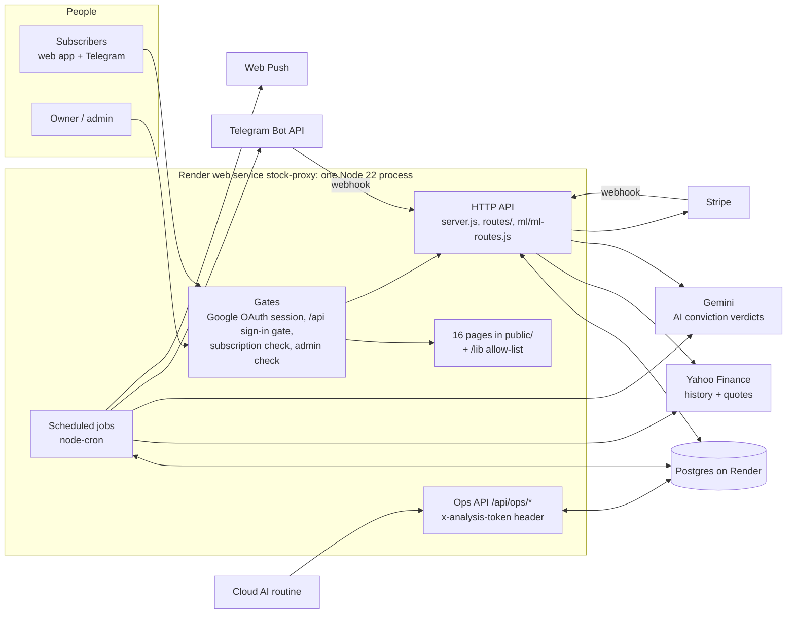
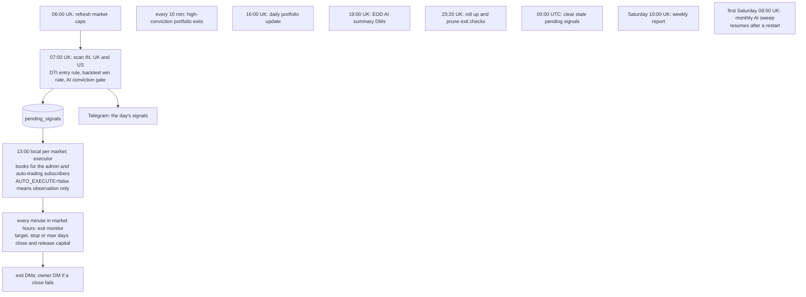

# SignalForge

SignalForge scans the Indian, UK and US markets every weekday morning for DTI-rule buy signals, gates them through backtest win rates and an AI conviction check, and books them into paper portfolios. It then monitors every position until it exits, telling subscribers what happened on Telegram and in the web app.

It runs as a single Node 22 / Express process with Postgres, on Render (`stock-proxy.onrender.com`). Pushing to `main` deploys it.

**This file is the single source of truth.** It holds, in this order:
1. the feature table: what exists, its version, when it was last tested and its status;
2. the changelog;
3. how the system works;
4. the rules every change must follow;
5. the file structure.

Update it in the same commit as the change it describes. See rule 1.

---

## 1. Features

**Legend**
- **Version** is the feature's own version. Every row starts at `1.0` on the 2026-09-23 baseline (`e2774d5`). A fix adds `0.1`; a rework adds `1.0`. The changelog names the commit.
- **Last tested** is the date and kind of the last green automated run that exercised the feature. *Unit* = jest unit suites; *endpoint* = the HTTP harness; *browser* = page smoke tests.
- **Status**:

| Status | Meaning |
|---|---|
| ✅ Working | Every route of the feature answers as specified (status, access rules, basic shape) in the endpoint harness on that commit, and its unit tests pass. |
| 🟢 Unit-tested | The core logic is covered by unit tests; endpoint tests are pending. |
| 🟡 Untested | No automated test yet. |
| ⚠️ Faulty | Verified bug(s); a fix is queued. |
| ❌ Broken | The failure is user-visible. |
| 🗑️ Dead | Nothing calls it; its removal is queued. |
| 🧪 Detect-only | Built but switched off. |
| ⏳ Owner | Waits for an owner decision (running cost, feature output, or owner-only access). |

### Accounts & access

| Feature | Version | Last tested | Status |
|---|---|---|---|
| Sign-in & session (Google OAuth: `/login`, `/auth/google*`, `/logout`, `GET /api/user`) | 1.1 | 2026-09-23 · endpoint | ⚠️ Faulty: sessions live in memory, so every deploy signs everyone out. Fixed on 2026-09-23: `GET /api/user` reports `isAdmin`, so the Admin link shows for the admin; an OAuth error returns to the login page instead of a JSON 502; the anonymous `/auth/debug` configuration page is gone, and the callback no longer logs session ids. |
| Free trial & subscription access (`/api/user/subscription/*`, `ensureSubscriptionActive`) | 1.1 | 2026-09-23 · endpoint | ❌ Broken: the trial page misreads its status (always day 0), and its trial route exists only with Stripe keys; cancelling ends access at once and reactivate never finds the cancelled row; re-trials are unlimited. Fixed on 2026-09-23: on a database built from the repo, the subscription check locked out every non-admin (four missing `users` columns); boot now adds them. 1 known bug pinned in the harness. |
| Paid checkout (Stripe: `/api/stripe/*`) | 1.0 | 2026-09-23 · endpoint (unmounted) | ❌ Broken end to end: the envelope is misread, the billing period is missing, and the webhook sits behind the sign-in gate (the harness pins it: Stripe would get 401). ⏳ Owner: the advertised price (£24/$29/₹999) ≠ the billed price (£9.99/$12.99/₹799). |
| Privacy & GDPR (data summary, download, delete account, consent) | 1.0 | 2026-09-23 · endpoint | ❌ Broken: delete-account returns 500 and deletes nothing (a CHECK violation, swallowed, aborts the transaction). The consent POST gets 404; `user_settings` is missing from the export and the delete. 1 known bug pinned in the harness. |

### Signals & trading

| Feature | Version | Last tested | Status |
|---|---|---|---|
| 7 AM scan → signals (07:00 UK, weekdays; `POST /api/scanner/run` token) | 1.1 | 2026-09-23 · unit + endpoint | 🟢 Unit-tested (signal store). The endpoint harness verifies only access rules: the scan triggers are never run there (probe-only). The anonymous `POST /api/signals/from-scan` is gone. |
| 1 PM trade executor (13:00 local for IN, UK, US; `AUTO_EXECUTE` kill switch) | 1.1 | 2026-09-23 · endpoint | 🟡 The harness verifies access rules and the execution logs; the execution itself is never run there (probe-only). The any-account manual trigger and two duplicates are gone. |
| Scanner page: signals feed & auto-trading opt-in (`/api/signals/recent`, `/api/user/auto-trading`) | 1.0 | 2026-09-23 · endpoint | ✅ Working |
| Positions: trade journal (`/api/trades*`) | 1.0 | 2026-09-23 · endpoint | ⚠️ Faulty: a create or bulk import without a body crashes with 500 and an empty edit returns 404 instead of 400; a stale edit can reopen a closed trade; deletes don't release capital; legacy trades re-import on every load. 3 known bugs pinned in the harness. |
| Positions: pending-signals panel (`GET /api/signals/pending`) | 1.1 | 2026-09-23 · endpoint | ✅ Working (read-only; the any-account add and dismiss routes are gone) |
| Paper capital ledger (`/api/portfolio/capital`, `/api/ops/reconcile-capital`) | 1.1 | 2026-09-23 · endpoint | ⚠️ Faulty: deleting a trade leaks its capital, and nothing checks for drift nightly (GAPS #6). The dead `initialize-capital`, `migrate-capital` and `fix-position-count` routes are gone; `/api/ops/reconcile-capital` is the repair tool. |
| Exit monitor & close-failure alerts (every minute in market hours) | 1.1 | 2026-09-23 · unit | 🟢 Unit-tested (same-day exit, close failure). The any-account exit-check routes are gone. ⚠️ The outer errors are only logged. |
| Exit-check retention (23:20 UK; `/api/ops/exit-checks-stats`, GAPS #13 closed) | 1.0 | 2026-09-23 · unit + endpoint | ✅ Working: unit-tested, its stats probe answers in the harness (the prune trigger is probe-only), verified on prod 2026-09-19. |
| High-conviction portfolio & weekly report (every 10 min; Sat 10:00 UK) | 1.0 | 2026-09-23 · unit + endpoint | 🟢 Unit-tested (re-entry, close failure). ⚠️ Its admin API crashes with 500 on a malformed date or price; updates are keyed by symbol with no unique index; the exit alert is sent at most once. 3 known bugs pinned in the harness. |
| EOD AI summary (19:00 UK weekdays) | 1.1 | 2026-09-23 · unit + endpoint | 🟢 Unit-tested: the day move and the signed percentage (a tiny loss printed `-0.00%` until 2026-09-23). The harness verifies access rules only; the summary itself is never run there (probe-only). |
| AI conviction check, on demand (`/api/ml/conviction/*`) | 1.0 | 2026-09-23 · endpoint | ⚠️ Faulty: the routes answer as specified, but any trial account can spend Gemini calls on arbitrary symbols and seed the shared verdict. |
| Monthly AI sweep (first Saturday 08:00 UK; boot resume; GAPS #20/#21 fixed) | 1.0 | 2026-09-23 · unit + endpoint | 🟢 Unit-tested; first real run Sat 2026-10-03. The stats probe crashes on an impossible date. 1 known bug pinned in the harness. ⏳ Owner: the fresh re-score (~5,029 Gemini calls a month) roughly doubles the actual AI spend. |
| AI analysis routine feed (`GET /api/signals/screened-today`) | 1.0 | 2026-09-23 · endpoint | ✅ Working (the routine should send its token as a header, not in the URL) |
| Market data: Yahoo proxy & live prices (`/yahoo/*`, `POST /api/prices`) | 1.1 | 2026-09-23 · endpoint | ⚠️ Faulty: anonymous, with a wildcard CORS header; `/api/prices` is unbounded and crashes on a non-string symbol. 1 known bug pinned in the harness. Fixed on 2026-09-23: the scanner and the Simulator read the Adj Close column as volume. |
| Data repairs: pence/pounds flips (GAPS #18), stale fills (GAPS #19) | 1.0 | 2026-09-23 · unit | 🧪 Detect-only. ⏳ Owner: `PRICE_UNIT_REPAIR=true` changes which UK stocks qualify. Stale fills stay off until GAPS #1. |
| Market caps (06:00 UK weekdays + Sat 08:00) | 1.1 | 2026-09-23 · endpoint | ⚠️ The Saturday refresh overlaps the monthly sweep. The two caller-less market-cap routes are gone. |
| Simulator (`portfolio-backtest.html`) | 1.0 | 2026-09-23 · endpoint | ⚠️ Faulty in the page (the harness only sees its routes, which pass): exit-reason colours are assigned by position; it uses a different engine from the live scan (GAPS #7); a missing close books a NaN P/L. |
| Positions chart dialog | 1.0 | 2026-09-23 · endpoint | ⚠️ Faulty in the page (its routes pass): dark-mode legend colours are hard-coded; a dead parameter path. |
| Trailing stop (−5% → break-even at +4% → +1% for each further +1%) | 0.9 | 2026-09-18 · unit (WIP) | ⏳ Owner: built, not shipped. The backtest shows expectancy +1.56 → +1.44 %/trade. |

### Notifications

| Feature | Version | Last tested | Status |
|---|---|---|---|
| Telegram bot & account linking (`/api/telegram/webhook`, link/unlink) | 1.1 | 2026-09-24 · unit + endpoint | ✅ Working: the webhook always requires a secret (`TELEGRAM_WEBHOOK_SECRET`, set on prod, or one derived from the bot token), a non-production boot never touches prod's webhook, and the logs no longer carry users' names, message text or account-link tokens. |
| Alerts preferences page (`/api/alerts/preferences`) | 1.1 | 2026-09-23 · endpoint | ⚠️ Faulty: the switches are decorative (the wiring is built but not shipped); a non-boolean switch value crashes the save. The row is always the caller's own. 1 known bug pinned in the harness. |
| Web push notifications (`/api/push/*`) | 1.1 | 2026-09-23 · endpoint | ❌ Broken: every notification click opens `/account`, which is a 404 (in the service worker, outside the harness); the manifest is not linked; a subscription without keys crashes with 500. Unsubscribe removes only the caller's own subscription. 1 known bug pinned in the harness. |

### Admin portal (`/admin`)

| Feature | Version | Last tested | Status |
|---|---|---|---|
| Dashboard & live events | 1.0 | 2026-09-23 · endpoint | ⚠️ Faulty: the routes answer, but the audit log is always empty, the SSE stream has no producer, and payment figures are hard-coded. |
| Users & complimentary access | 1.0 | 2026-09-23 · endpoint | ⚠️ Faulty: malformed input (e.g. a non-date expiry) crashes with 500; a deleted user is re-created by their next request. 1 known bug pinned in the harness. |
| Plans & subscriptions | 1.0 | 2026-09-23 · endpoint | ⚠️ Faulty: invalid input (an unknown region, a non-numeric price) crashes with 500, and deleting a plan still in use reports a misleading 400; counts and MRR miss Stripe rows; the trends are hard-coded. 2 known bugs pinned in the harness. |
| Payments | 1.0 | 2026-09-23 · endpoint | ❌ Broken: refunds always return 500 (wrong table); "verify" never activates the subscription and accepts missing or already-completed transactions. 4 known bugs pinned in the harness. |
| Analytics | 1.0 | 2026-09-23 · endpoint | ⚠️ Faulty: the routes answer, but invented numbers are shown as data. |
| Database tools & system health | 1.0 | 2026-09-23 · endpoint | ⚠️ Faulty: `/database/status` always returns 500; stubs report success for things they never do; `analyze-table` is unvalidated; the SQL console's read-only mode is bypassable. 5 known bugs pinned in the harness. |
| Settings | 1.0 | 2026-09-23 · endpoint | ⚠️ Faulty: 8 buttons report success without doing anything; an unknown email template returns 200. 1 known bug pinned in the harness. |
| Signal testing & diagnostics | 1.1 | 2026-09-23 · endpoint | ⚠️ Faulty: diagnostics show every signal as `MARKET_NOT_FOUND`; test-scan reports success on errors. The caller-less dismiss-old-signals route is gone. |
| Telegram subscribers | 1.0 | 2026-09-23 · endpoint | ⚠️ Faulty: malformed chat ids crash with 500. 2 known bugs pinned in the harness. |
| "Run tests" buttons (`/api/admin/tests/*`) | 1.0 | 2026-09-23 · endpoint | ❌ Broken: they spawn scripts that write test rows into the prod DB and always fail (the harness only probes them). Removal queued. |
| Audit log viewer, JWT token auth | 1.0 | 2026-09-23 · endpoint | 🗑️ Dead: no page loads them, and malformed input crashes them. 7 known bugs pinned in the harness. Removal queued. |

### Platform

| Feature | Version | Last tested | Status |
|---|---|---|---|
| Ops probes & health (`/api/ops/*`, `/health`) | 1.2 | 2026-09-23 · unit + endpoint | ✅ Working: `/health` shows the right UK time and next scan all year (unit-tested on both sides of the clock change) and names the real session store. The subscription schema probe is admin-only. |
| Access control: sign-in gate, subscription gate, one admin guard for all of `/api/admin` | 1.0 | 2026-09-23 · unit + endpoint | ✅ Working: the access matrix of every route (anonymous 401, non-subscriber 403, non-admin 403, token-only ops) passes in the harness; the admin guard is unit-tested. |
| Pages, static files & `/lib` allow-list (16 pages) | 1.0 | 2026-09-23 · unit + endpoint | ✅ Working |
| Process reliability (crash handlers, shutdown, sessions, DB pools) | 1.1 | — | ⚠️ Faulty: no `unhandledRejection` handler, SIGTERM is swallowed, sessions are in memory, and there are 12 extra pg pools. geoip-lite (146 MiB of memory at boot, for one dead route) is gone. |
| Diagnostics & legacy one-off routes | 1.2 | 2026-09-23 · endpoint | 🗑️ Dead: only `GET /api/test` remains; it goes with the Run-tests buttons. Removed on 2026-09-23: the 14 routes any signed-in account could use, then 13 caller-less ones (legacy v1 admin, finished one-off migrations, stubs, duplicates of `/health`) and 2 shadowed duplicate handlers. The harness keeps all of them gone. |
| `routes/gdpr.js` (never mounted) | 1.0 | — | 🗑️ Dead |
| Endpoint test harness (every route, every page contract) | 1.0 | 2026-09-23 · endpoint | ✅ Working: 203 specs (162 live routes, 5 unmounted Stripe routes, 36 removed routes), 841 cases; 807 pass and 34 known bugs fail as expected. Fresh scratch database and server per run, cron stubbed, no network. |

### Strategy & data quality: the GAPS register (from the 2026-08-07 audit; full evidence in `git show e2774d5:docs/GAPS.md`)

| Feature | Version | Last tested | Status |
|---|---|---|---|
| #1 Selection = Wilson lower bound ≥ target and ≥ 15 backtest trades | — | — | ❌ Open (critical). Shadow study first; switching live selection is ⏳ owner. |
| #2 Honest backtest fills (high/low, stop wins, gaps at open, fees) | — | — | ❌ Open (critical) |
| #3 Walk-forward, out-of-sample selection | — | — | ❌ Open (high) |
| #4 Entry threshold study (0 vs −25 vs −40) | — | — | ❌ Open (high) |
| #5 Market-regime gate | — | — | ❌ Open (medium) |
| #6 Capital ledger derived or reconciled nightly | 1.0 | — | ⚠️ Partly fixed on 2026-08-29 (close-and-release, reconcile endpoint); nightly drift check pending |
| #7 One backtest engine for scan, Simulator and research | — | — | ❌ Open |
| #8 Anchored 7-day DTI buckets | — | — | ❌ Open |
| #9 Strategy parameters in one module, not hard-coded (the settings UI was removed in `885a46a`) | — | — | ❌ Open |
| #10 Universe refresh and dead-ticker pruning | — | — | ❌ Open |
| #11 Dated FX rates | — | — | ❌ Open |
| #12 Telegram delivery failures counted | — | — | ❌ Open |
| #14 `strategy_version` stamped on every trade | — | — | ❌ Open |
| #15 Benchmark return per trade | — | — | ❌ Open |
| #16 Kill switch | 1.0 | — | 🟡 Closed, untested: `AUTO_EXECUTE=false` puts the system in observation mode. The executor's endpoint tests will cover it. |
| #17 Unit tests for strategy maths and ledger invariants | — | — | ❌ Open |

---

## 2. Changelog

Newest first. Each line is one commit on `main`; `git show <sha>` has the full reasoning.

**2026-09-24**
- *(this commit)* Telegram safety: a non-production boot no longer polls or deletes the webhook (with the real token it deleted prod's, and prod stopped receiving bot commands until its next boot); polling is opt-in with `TELEGRAM_POLLING=true`. Production always registers the webhook with a secret, derived from the bot token when `TELEGRAM_WEBHOOK_SECRET` is unset, and enforces a derived one only after Telegram accepts it. The webhook log no longer records users' names, message text or account-link tokens

**2026-09-23**
- `c284c69` Remove the legacy ML toolkit: 7 caller-less `/api/ml` routes, `ml-integration.js` and its 6 analysers, which loaded models at every boot, fabricated news headlines and let any user "train" them. Also remove 6 packages that only it used or that nothing used (`natural`, `node-fetch`, `simple-statistics`, `technicalindicators`, `connect-sqlite3`, `@testing-library/jest-dom`). The conviction routes stay. The harness keeps all 36 removed routes gone
- `3e884c3` Fix four small correctness defects. `/health` showed UK time an hour ahead all summer, and the 7 AM scan as 08:00, and it named a "SQLite" session store that does not exist. The EOD summary printed `-0.00%`. The scanner and the Simulator read the Adj Close column as volume, which nothing consumed yet. The history proxy now reads the price-unit switch through the module's own `isRepairEnabled()`
- `ccbbd32` Remove 13 dead routes from server.js (legacy v1 admin, finished one-off migrations, stubs, duplicates of `/health`), 2 shadowed duplicate handlers, `/auth/debug`, and geoip-lite (146 MiB of memory at boot, for one dead route). Also gone: two orphaned helpers, a boot query that failed on every start, `public/js/pricing.js` and `fix-india-position-count.js`. Fix sign-in: `GET /api/user` reports `isAdmin`, an OAuth error returns to the login page, and the callback stops logging session ids. The harness keeps all 29 removed routes gone
- `6990ee0` Restore the Express 4 `req.body = {}` default: 22 routes that crashed with 500 on a body-less POST or PUT now answer as specified (the harness flipped all 22 pinned cases)
- `6c0c1ef` Add the endpoint test harness: all 183 live routes (plus 5 unmounted Stripe routes and 15 removed ones) are specified and run against a real server on a scratch database; 839 of 901 cases pass and 62 known bugs are pinned as expected failures. Fix the four `users` columns whose absence locked every non-admin out on a database built from the repo
- `5ef1168` Close the any-account holes: remove 14 caller-less routes that any signed-in account could use (executor, exit checks, global signal add/dismiss, user email dump, DDL); guard all of `/api/admin` in one place; fix the Alerts IDOR; scope push unsubscribe to the caller
- `24b6aa2` Close the anonymous signal injection: the 7 AM scan stores its signals in process, and `POST /api/signals/from-scan` is removed
- `e24bcf3` `README.md` becomes the single source of truth. `docs/GAPS.md` is folded into §1, `CLAUDE.md` now points here, and plan documents are retired.
- `e2774d5` Remove 12 dead one-off scripts from the repo root
- `e1180fa` Say in the AI sweep report when Gemini failed; record how the 08-22 and 08-29 sweeps stopped (GAPS #21)
- `45d0abf` Pick a dead AI sweep up after a restart, and tell the owner how each run ended (GAPS #21)
- `18fff2c` Stop serving server source under `/lib`: only the pages' files, signed in
- `38da32b` Tell the owner when a high-conviction close fails
- `885a46a` Remove `/api/settings` and `settings-manager.js`
- `740f5e8` Remove the two caller-less `/api/alerts` test routes and their helpers
- `1ec33b1` Remove `POST /api/debug-dti-scan`
- `b4683a3` Remove `POST /api/test-7am-scan`
- `c6d5ef8` Remove `telegram-button-test.html`

**2026-09-20**
- `7b34bd4` CLAUDE.md: stop pointing sessions at `main.css`
- `f9ef31b` Stop loading the dead alerts-modal script on the Positions page
- `d3fd3ee` Stop loading two scripts the Positions page never uses
- `8f475a0` Retire `main.css` and the settings stub, the last of the v1 front end
- `0c64efa` Remove the performance-modal CSS block

**2026-09-19**
- `07a111d` Make the monthly AI sweep re-score (GAPS #20)
- `3915d14` Tell the owner when the exit monitor cannot close a position
- `15380a9`, `6ed7eb3`, `cb83855`, `f7fe8e5`, `7fc18ae`, `d9fb8ea`, `200518f`, `e54a8e9` Remove the dead second layer of client code (CSV upload path, the unused `>75%` copies, dead CSS ids)
- `234d59f` Read-only probe for the Alerts page switches
- `23a5100` Route the direct Yahoo readers through the price-unit repair (GAPS #18)
- `1159327` Let the exit monitor close a position on the day it was booked
- `43a2b3f`, `b166500` Remove two Telegram relay endpoints (open relays through the official bot)
- `230b232` Detect Yahoo's pence/pounds flips, detect-only (GAPS #18)
- `9bafd54` Drop the dead high-conviction alert guard
- `998253e`, `4fc001e`, `a1dff40`, `34f9014`, `20e7551` Remove the dead pre-v3 Scanner scripts and their hooks
- `f9742cd` Retire the legacy `checkTradeAlerts` loop: the exit monitor is the only closer
- `cc6a35d`, `86fa059` Exit-check retention job and its probe (GAPS #13)
- Merges: `80b6baf`, `1a8ff1f`, `c65fc45`, `cc3dac6`

**2026-08-31**
- `729e415` Run the AI conviction sweep monthly instead of weekly (cost)

**2026-08-29**
- `934deef` Show which DTI rule fired
- `7f9da93` Scanner mobile nav, per-market chart currency, visible entry triggers
- `3325abf` Positions page density pass
- `c39595c` Position chart dialog gets full chart controls
- `b56d4b9` Per-user auto-trading: the 7 AM signals book to every subscriber's own portfolio
- `4e57c69` Fix the calculation layer: win rate, capital ledger and duplicates, plus candlesticks, DD-MM-YYYY dates and the ntfy QR code

**2026-08-15**
- `9a4adb6` Weekend AI sweep scores the full universe
- `bc45554` Daily shared verdict cache for the Simulator's AI check
- `86c3853` AI conviction gate in the Simulator
- `4f8f3d0` Anchor trades to the real entry price; live Positions page

**2026-08-10**
- `24723b5` Day-reset ops endpoint + nightly 7 PM UK EOD AI summary
- `70036b5` Gate trade execution on AI conviction

**2026-08-09**
- `219a14d`, `d8a2b32`, `0588d5a`, `c835fe2`, `365c84a` Admin consolidated at `/admin`; admin and owner-review fixes

**2026-08-08**
- `28acec8` v3.1 surface: checkout flow, trial lifecycle, data page, legal docs
- `8c56fc6`, `e4dd3e3`, `aa32ea7`, `bae2cdf`, `4999e0a` Migrate Alerts, Simulator, Account, Positions and Scanner to the v3 "Poster" design
- `c2917a2`, `94dc5ab` Adopt the v3 design system; rebuild landing, pricing and login

**2026-08-07** (reset baseline: live trades archived, observation mode)
- `8adecdc`, `a7c8724` Token-guarded `GET /api/signals/screened-today` for the AI routine
- `a983ddd` `AUTO_EXECUTE` observation mode and the gap register
- `19a3fc4` Fix the scanner crash on zero-result scans; 1-minute exit monitoring

---

## 3. How the system works



**The trading day (all times are the job's own time zone):**



---

## 4. Strict rules

These rules bind every contributor and every Claude session; `CLAUDE.md` points here.

### 4.1 This document
1. **README.md is the single source of truth.** Update it in the same commit as the change it describes:
   - the feature row (version, last tested, status);
   - the changelog line;
   - §5 when files move.
2. **No plan documents.** Never create `PLAN-*.md`, TODO lists or scratch docs in the repo. Keep working notes in your own scratch space; the outcome lands here.
3. A feature is **✅ Working** only when a test that exercises it passed on that commit. Never mark a row from reading code.

### 4.2 Decisions (owner's standing orders, 2026-09-23)
4. Act on your own best recommendation; do not wait for the owner.
5. Ask the owner **only** when:
   - you genuinely cannot decide;
   - a change **raises running cost** (Render plan, Gemini or other paid-API volume, database tier);
   - a change **diminishes output or features** (removes something users get, or lowers signal quality or expectancy).

   Gather those into one report. Improvements, cost cuts and clutter removal need no approval.
6. Credentials live only in Render's environment and the local `.env`. Never commit, print or log them, or put them in a URL. Rotating a credential is an owner-only action.
7. Trading-output switches stay as they are until the owner says otherwise:
   - `PRICE_UNIT_REPAIR` and `STALE_FILL_REPAIR` stay detect-only;
   - `SELECTION_STOP_MODE` stays `fixed`;
   - the GAPS #1–#5 selection rules run in shadow only.

### 4.3 Shared working tree (several sessions work in this one clone at once)
8. **Never** run `git add`, `git rm`, `git commit`, `git stash` or `git checkout <file>` in the shared tree. Instead:
   - build commits in a private index: `GIT_INDEX_FILE=<scratch> git read-tree <main>`, then `update-index`, `write-tree` and `commit-tree -p <main>`;
   - hash blobs with `hash-object -w --no-filters`, because several files are CRLF;
   - publish with a compare-and-swap, `git update-ref refs/heads/main <new> <old>`;
   - sync only your own paths into the shared index.
9. Re-derive BASE from `refs/heads/main` at build time; another session may have moved it. Build blobs from the BASE blob plus your own hunks, never from a working file someone else has edited.
10. **No git worktrees.** That also rules out `isolation: worktree` and follow-up chips, which open worktrees. To test an exact commit, `git archive <sha> | tar -x` into a scratch folder, symlink `node_modules`, run the tests, then delete the folder.
11. Before you push:
    - `git log origin/main..main` must list only your commits;
    - the previous Render deployment must have finished;
    - push a pinned sha: `git push origin ${SHA}:refs/heads/main`.
12. Every change goes live, because Render deploys `main` on push. Confirm it with `GET /api/ops/version` and the `x-analysis-token` header, never a query string. Watch deploys and logs with the Render MCP when it is connected; otherwise use the GitHub deployment statuses.
13. **Deploy freeze:** no pushes on the first Saturday of a month between 08:00 and 12:00 UK. The monthly AI sweep runs in-process, and a deploy kills it.

### 4.4 Safety
14. Never run a script, route or handler that touches production data, messages users or spends paid-API budget just to see what it does. Scan triggers, broadcasts, the sweep and admin test runners are off-limits for probing.
15. **Signed in is not an authorisation boundary**: anyone can start a free trial. Anything that acts on other users, the whole system or paid services is either admin-only (`requireAdmin` guards all of `/api/admin`) or token-guarded (`/api/ops/*`, header `x-analysis-token`). A user may only ever touch their own rows, and the session decides whose, never the body.
16. Probe the database read-only. Schema changes are idempotent SQL: boot DDL in `database-postgres.js`, or a file in `migrations/` (file names are migration keys, so never rename them). Verify the result on the target database.
17. Local runs use the local Postgres and stub `node-cron`. On weekdays 02:00–22:00 UK, an unstubbed boot runs the exit monitor every minute. A local boot never polls Telegram or deletes its webhook; `TELEGRAM_POLLING=true` turns polling on (and deletes the webhook), so use it only with a separate test bot's token.

### 4.5 Evidence & commits
18. Every "nothing uses X" claim needs a positive control through the same command, and every search runs from a bash script file. Known traps on the dev Mac:
    - zsh globbing and the `$VAR:x` modifiers;
    - `git grep -E` has no `\b`;
    - `\x27` inside double quotes is not a quote;
    - `grep` is aliased to `ugrep`;
    - `grep -q` under `pipefail`.
19. **Test gate**: `npm test` (unit, including the route-spec coverage test) and `npm run test:endpoints` (the HTTP harness: every route, every persona, on a scratch database with no network) must be green on a `git archive` export of the exact commit before it is pushed. Every new route gets a spec in `tests/endpoints/specs/`; a removed route gets an `absent` spec; a known bug is a `bug` case that states the correct status.
20. A commit message explains *why*, lists what was deliberately left alone, and states how the change was verified on that exact tree. Tests must be green on the exact tree before you push.

### 4.6 Front end
21. CSS is the v3 "Poster" design system:
    - tokens and components live in `public/css/design-system/`;
    - every page loads `design-system/index.css` plus one page sheet:
      - `app.css`: index, trades, portfolio-backtest, account, telegram-subscribe (admin-v2 adds `admin.css` on top);
      - `commerce.css`: checkout, trial activation, legal and data pages;
      - `marketing.css`: landing, pricing, login;
    - component specs and tokens are in `design/handoff-v3/README.md`;
    - reuse tokens and classes before adding CSS, and keep only one copy of anything duplicated;
    - never recreate `main.css`;
    - no inline CSS in HTML or JS.
22. Use Google Fonts and Google Material Icons.

---

## 5. File directory and structure

```
signalforge/
├── server.js                 Express app: gates, most HTTP routes, boot DDL calls, static serving
├── database-postgres.js      TradeDB: the Postgres pool, boot schema (CREATE/ALTER IF NOT EXISTS), every query
├── README.md                 this file, the single source of truth
├── CLAUDE.md                 pointer for Claude sessions to this file
├── package.json              npm start = node server.js; jest scripts
├── render.yaml               Render web service (npm install / npm start)
├── jest.config.js            jest unit config (tests/endpoints has its own)
├── run-single-migration.js   apply one migrations/*.sql file by hand (move to scripts/ queued)
├── setup-bot.sh              the Telegram bot's command menu (move to scripts/ queued)
├── reset-telegram-webhook.sh Telegram webhook recovery (move to scripts/ queued)
├── config/                   auth.js (passport, Google OAuth, sessions), stripe.js, security.js (unused)
├── middleware/               subscription gate, admin auth, activity log, error handler, /lib allow-list
├── routes/                   auth.js, admin.js (/api/admin), subscription.js, stripe.js, gdpr.js (never mounted)
├── lib/
│   ├── scanner/              scanner.js: the 7 AM scan and most cron jobs; signal-store.js: stores its signals
│   ├── scheduler/            trade-executor.js (1 PM runs), market-cap-updater.js
│   ├── portfolio/            exit-monitor, capital-manager, high-conviction-manager, eod-summary, exit-check-retention, close-failure-alerts
│   ├── shared/               backtest engines, DTI calculator, price-unit and stale-fill repairs, stock universe (stock-data.js)
│   ├── telegram/             telegram-bot.js
│   ├── push/                 push-service.js (web push)
│   └── admin/                sse-handler.js (no producer, removal queued)
├── ml/                       conviction-engine.js + conviction-sweep.js (the AI gate), ml-routes.js (/api/ml/conviction/*)
├── migrations/               NNN_*.sql, applied by hand (names are keys)
├── scripts/                  health-check.js, verify-system.js (removal queued with the admin Run-tests buttons)
├── tests/
│   ├── unit/                 jest unit suites (npm test), including the route-spec coverage test
│   ├── endpoints/            HTTP harness (npm run test:endpoints): harness/ (preload, setup, seed), specs/*.json (one per route)
│   └── (integration/, database/performance scripts: mock-only or spawned by admin buttons; removal queued)
├── public/                   16 pages (*.html), js/ (91 files), css/ (design-system + page sheets), images/brand/
├── design/handoff-v3/        v3 "Poster" design hand-off (tidy-up queued)
└── docs/history/             three stale 2025 audits (removal queued)
```
