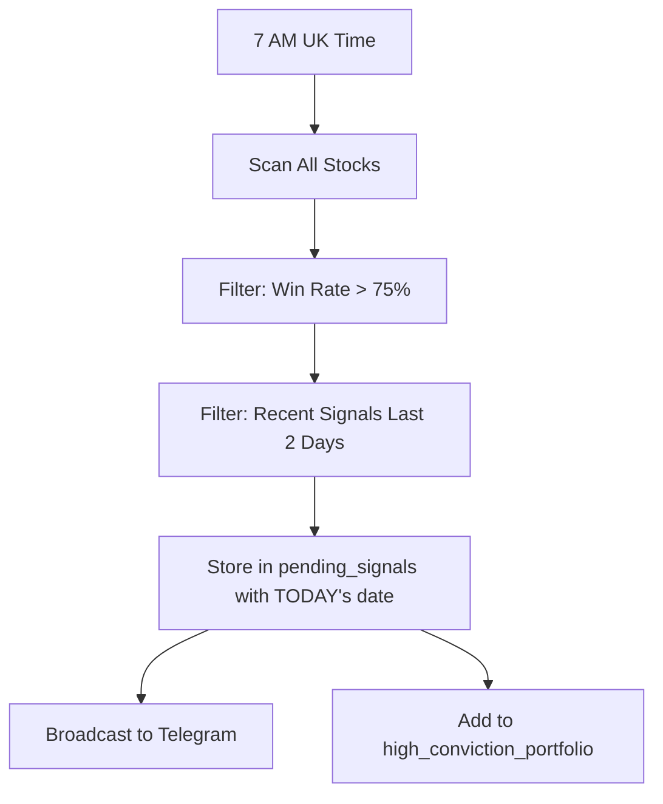
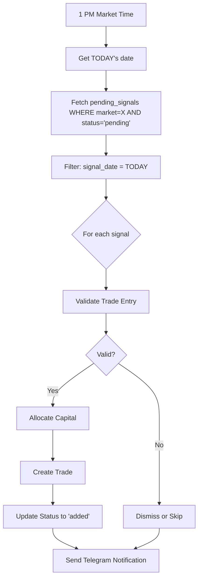

# 7 AM Signal → 1 PM Trade Execution System

## Table of Contents
1. [System Overview](#system-overview)
2. [Phase 1: 7 AM Signal Generation](#phase-1-7-am-signal-generation)
3. [Phase 2: 1 PM Trade Execution](#phase-2-1-pm-trade-execution)
4. [Why Signals May Not Execute](#why-signals-may-not-execute)
5. [Database Schema](#database-schema)
6. [Market Detection Logic](#market-detection-logic)
7. [Capital Management](#capital-management)
8. [Testing Procedures](#testing-procedures)
9. [Troubleshooting Guide](#troubleshooting-guide)

---

## System Overview

The automated trading system operates in two distinct phases:

1. **7 AM Signal Generation** - Scans all global stocks and identifies high conviction trading opportunities
2. **1 PM Trade Execution** - Executes pending signals at market-specific times (India 1 PM IST, UK 1 PM GMT/BST, US 1 PM EST/EDT)

**Key Design Principle:** Signals are generated centrally at 7 AM UK time, but executed separately at 1 PM in each market's timezone to ensure trades happen during market hours.

---

## Phase 1: 7 AM Signal Generation

### Location
`lib/scanner/scanner.js` (lines 30-56)

### Schedule
- **Cron Expression:** `0 7 * * 1-5` (7:00 AM, Monday-Friday)
- **Timezone:** `Europe/London` (UK time)

### Process Flow



### Code Implementation

**Initialization (scanner.js:30-56):**
```javascript
cron.schedule('0 7 * * 1-5', async () => {
    const ukTime = new Date().toLocaleString("en-GB", {timeZone: "Europe/London"});
    console.log('🔔 [CRON TRIGGER] 7 AM scan triggered at UK time:', ukTime);

    // Check if Telegram is configured at runtime
    if (!process.env.TELEGRAM_BOT_TOKEN || !process.env.TELEGRAM_CHAT_ID) {
        console.log('⚠️ [CRON] Skipping scan - Telegram not configured');
        return;
    }

    const result = await this.runHighConvictionScan();
    console.log('✅ [CRON] Scan completed successfully');
}, {
    timezone: "Europe/London",
    scheduled: true
});
```

**Signal Storage (scanner.js:286-327):**
```javascript
async storeSignalsForExecution(opportunities) {
    // CRITICAL FIX: Use TODAY's date for signal_date so trade executor can find them
    const todayDate = new Date().toISOString().split('T')[0];
    console.log(`📊 [SIGNALS] Using signal date: ${todayDate} (today's date, not historical backtest date)`);

    const signalsToStore = opportunities.map(opp => {
        const symbol = opp.stock.symbol;
        const market = this.getMarketFromSymbol(symbol); // Determines India/UK/US
        const entryPrice = opp.trade?.currentPrice || opp.trade?.entryPrice || 0;
        const targetPrice = entryPrice * 1.08; // 8% profit target
        const stopLoss = entryPrice * 0.95; // 5% stop loss
        const signalDate = todayDate; // ⚠️ USES TODAY, not historical date

        return {
            symbol,
            signalDate,
            entryPrice,
            targetPrice,
            stopLoss,
            market,
            winRate: opp.trade?.winRate || 0,
            historicalSignalCount: opp.trade?.totalTrades || 0,
            // ... other fields
        };
    });

    // Posts to /api/signals/from-scan endpoint
    const response = await axios.post(signalsUrl, { signals: signalsToStore });
}
```

### Key Points

1. **Date Handling:** Uses `new Date().toISOString().split('T')[0]` to get TODAY's date in YYYY-MM-DD format
2. **Market Detection:** Symbol suffix determines market (see [Market Detection Logic](#market-detection-logic))
3. **Duplicate Prevention:** UNIQUE constraint on (symbol, signal_date) prevents duplicates
4. **Telegram Dependency:** Scanner skips execution if Telegram is not configured

---

## Phase 2: 1 PM Trade Execution

### Location
`lib/scheduler/trade-executor.js` (lines 27-60)

### Schedule

Three separate cron jobs for each market:

| Market | Local Time | UTC Equivalent | Cron Expression |
|--------|-----------|----------------|-----------------|
| India  | 1:00 PM IST | 7:30 AM UTC | `30 7 * * 1-5` |
| UK     | 1:00 PM GMT/BST | 1:00 PM UTC / 12:00 PM UTC | `0 13 * * 1-5` |
| US     | 1:00 PM EST/EDT | 6:00 PM UTC / 5:00 PM UTC | `0 13 * * 1-5` |

### Process Flow



### Code Implementation

**Initialization (trade-executor.js:27-60):**
```javascript
// India Market: 1 PM IST = 7:30 AM UTC
cron.schedule('30 7 * * 1-5', async () => {
    console.log('🇮🇳 [INDIA] Starting 1 PM trade execution...');
    await this.executeMarketSignals('India');
}, {
    timezone: "Asia/Kolkata"
});

// UK Market: 1 PM GMT/BST
cron.schedule('0 13 * * 1-5', async () => {
    console.log('🇬🇧 [UK] Starting 1 PM trade execution...');
    await this.executeMarketSignals('UK');
}, {
    timezone: "Europe/London"
});

// US Market: 1 PM EST/EDT
cron.schedule('0 13 * * 1-5', async () => {
    console.log('🇺🇸 [US] Starting 1 PM trade execution...');
    await this.executeMarketSignals('US');
}, {
    timezone: "America/New_York"
});
```

**Execution Logic (trade-executor.js:65-187):**
```javascript
async executeMarketSignals(market) {
    // Get today's date
    const today = new Date().toISOString().split('T')[0];
    console.log(`   📅 Today's date: ${today}`);

    // Get pending signals for this market from today only
    const signals = await TradeDB.getPendingSignals('pending', market);
    console.log(`   📈 Found ${signals.length} pending signals total`);

    // ⚠️ CRITICAL: Filter to only execute signals from TODAY
    const todaySignals = signals.filter(s => {
        const signalDateStr = new Date(s.signal_date).toISOString().split('T')[0];
        return signalDateStr === today;
    });

    console.log(`   🎯 ${todaySignals.length} signals from today to execute`);

    // Execute each signal
    for (const signal of todaySignals) {
        const result = await this.executeSingleSignal(signal, market);

        if (result.success) {
            console.log(`      ✓ Trade created (ID: ${result.tradeId})`);
        } else {
            console.log(`      ✗ Failed - ${result.reason}`);
        }
    }
}
```

**Single Signal Execution (trade-executor.js:192-252):**
```javascript
async executeSingleSignal(signal, market) {
    // Step 1: Validate capital and position limits
    const validation = await CapitalManager.validateTradeEntry(market, signal.symbol);

    if (!validation.valid) {
        // Mark signal as dismissed
        await TradeDB.updateSignalStatus(signal.id, 'dismissed');
        return {
            success: false,
            reason: validation.reason,
            code: validation.code
        };
    }

    // Step 2: Allocate capital
    await TradeDB.allocateCapital(market, validation.tradeSize);

    // Step 3: Create trade
    const trade = {
        symbol: signal.symbol,
        entryDate: new Date(),
        entryPrice: signal.entry_price,
        targetPrice: signal.target_price,
        stopLossPercent: 5,
        status: 'active',
        market: signal.market,
        tradeSize: validation.tradeSize,
        signalDate: signal.signal_date,
        winRate: signal.win_rate,
        autoAdded: true
    };

    const newTrade = await TradeDB.insertTrade(trade, 'default');

    // Step 4: Update signal status
    await TradeDB.updateSignalStatus(signal.id, 'added', newTrade.id);

    return {
        success: true,
        tradeId: newTrade.id,
        symbol: signal.symbol,
        tradeSize: validation.tradeSize
    };
}
```

### Key Points

1. **Date Matching:** Executor filters for signals WHERE signal_date = TODAY
2. **Market Isolation:** Each market's cron job only processes signals for that market
3. **Validation Required:** Every signal must pass capital/position validation
4. **Status Updates:** Signals marked as 'added' (success) or 'dismissed' (failed validation)

---

## Why Signals May Not Execute

### Issue 1: Date Mismatch

**Problem:** Scanner runs at 7 AM, executor runs at 1 PM. If date calculation happens at different times across timezones, signals won't match.

**Example Scenario:**
- Scanner runs at 7 AM UK time on Monday → Stores signal_date = '2025-10-16'
- Server is in UTC+0, but crosses midnight before executor runs
- Executor runs at 1 PM India time → Looks for signal_date = '2025-10-17'
- **Result:** No match, signal not executed

**How to Check:**
```sql
SELECT symbol, market, signal_date, status, created_at
FROM pending_signals
WHERE status = 'pending'
ORDER BY created_at DESC;
```

### Issue 2: Market Misclassification

**Problem:** Market determined by symbol suffix. Wrong suffix = wrong market = signal not found by executor.

**Market Detection Logic (scanner.js:575-580):**
```javascript
getMarketFromSymbol(symbol) {
    if (symbol.includes('.NS')) return 'India';
    if (symbol.includes('.L')) return 'UK';
    if (!symbol.includes('.')) return 'US';
    return 'International';
}
```

**Example:**
- Scanner detects `RELIANCE.NS` → Market = 'India' ✓
- Scanner detects `RELIANCE` (no suffix) → Market = 'US' ✗
- India executor looks for market='India' → Won't find `RELIANCE`

**How to Check:**
```sql
SELECT symbol, market, signal_date
FROM pending_signals
WHERE status = 'pending'
GROUP BY market;
```

### Issue 3: Capital/Position Limits

**Problem:** `CapitalManager.validateTradeEntry()` rejects trades that exceed limits.

**Validation Checks (capital-manager.js:63-127):**

1. **Total Position Limit:**
   - Max 30 active positions across all markets
   - Check: `status.totals.totalPositions >= 30`

2. **Market Position Limit:**
   - Max 10 active positions per market
   - Check: `marketCap.positions >= 10`

3. **Capital Availability:**
   - Trade size calculation: `totalCapital / maxPositionsPerMarket`
   - Check: `marketCap.available < requiredCapital`

4. **Duplicate Position:**
   - Check: `TradeDB.getActiveTradeBySymbol(symbol)`

**Example Rejection:**
```
✗ Failed - Market limit reached for India (10/10)
✗ Failed - Insufficient capital in UK market
✗ Failed - Already have active position in AAPL
```

**How to Check:**
```sql
SELECT market, COUNT(*) as active_positions
FROM trades
WHERE status = 'active'
GROUP BY market;
```

### Issue 4: Cron Not Running

**Problem:** Cron jobs may fail to initialize on server startup.

**Possible Causes:**
- Module import errors
- Database connection issues
- Missing environment variables
- Server timezone misconfiguration

**How to Check:**
```bash
# Check server logs for initialization messages
✅ Trade Executor loaded successfully
✅ [SCANNER] Scanner initialized with 4 scheduled jobs
```

### Issue 5: Silent Failures

**Problem:** No visibility into why signals aren't executing.

**Missing Information:**
- Which signals are pending?
- What date are they stored with?
- Why are they being skipped/dismissed?
- What's the current capital status?

---

## Database Schema

### pending_signals Table

```sql
CREATE TABLE pending_signals (
    id SERIAL PRIMARY KEY,
    symbol VARCHAR(50) NOT NULL,
    signal_date DATE NOT NULL,              -- ⚠️ ALWAYS TODAY'S DATE
    entry_price DECIMAL(12, 4) NOT NULL,
    target_price DECIMAL(12, 4) NOT NULL,
    stop_loss DECIMAL(12, 4) NOT NULL,
    square_off_date DATE NOT NULL,
    market VARCHAR(50) NOT NULL CHECK(market IN ('India', 'UK', 'US')),
    win_rate DECIMAL(8, 4) NOT NULL CHECK(win_rate >= 0 AND win_rate <= 100),
    historical_signal_count INTEGER NOT NULL CHECK(historical_signal_count >= 0),
    entry_dti DECIMAL(8, 4),
    entry_7day_dti DECIMAL(8, 4),
    prev_dti DECIMAL(8, 4),
    prev_7day_dti DECIMAL(8, 4),
    created_at TIMESTAMP DEFAULT CURRENT_TIMESTAMP,
    status VARCHAR(20) DEFAULT 'pending' CHECK(status IN ('pending', 'added', 'dismissed', 'expired')),
    dismissed_at TIMESTAMP,
    added_to_trade_id BIGINT REFERENCES trades(id) ON DELETE SET NULL,
    UNIQUE(symbol, signal_date)             -- Prevents duplicate signals for same day
);
```

### portfolio_capital Table

```sql
CREATE TABLE portfolio_capital (
    id SERIAL PRIMARY KEY,
    user_id VARCHAR(255),
    market VARCHAR(50) NOT NULL CHECK(market IN ('India', 'UK', 'US')),
    currency VARCHAR(10) NOT NULL CHECK(currency IN ('INR', 'GBP', 'USD')),
    initial_capital DECIMAL(12, 4) NOT NULL CHECK(initial_capital >= 0),
    realized_pl DECIMAL(12, 4) DEFAULT 0,
    allocated_capital DECIMAL(12, 4) DEFAULT 0,
    available_capital DECIMAL(12, 4) DEFAULT 0,
    active_positions INTEGER DEFAULT 0 CHECK(active_positions >= 0),
    max_positions INTEGER DEFAULT 10 CHECK(max_positions > 0),
    updated_at TIMESTAMP DEFAULT CURRENT_TIMESTAMP,
    UNIQUE(user_id, market)
);
```

### Default Capital Allocation

```sql
INSERT INTO portfolio_capital (user_id, market, currency, initial_capital, available_capital)
VALUES
    (NULL, 'India', 'INR', 1000000, 1000000),
    (NULL, 'UK', 'GBP', 10000, 10000),
    (NULL, 'US', 'USD', 15000, 15000);
```

---

## Market Detection Logic

### Symbol Suffix Rules

| Symbol Pattern | Market | Example |
|---------------|--------|---------|
| `.NS` or `.BO` | India | RELIANCE.NS |
| `.L` | UK | BP.L |
| No dot | US | AAPL |
| Other suffix | International | N/A |

### Implementation

```javascript
getMarketFromSymbol(symbol) {
    if (symbol.includes('.NS') || symbol.includes('.BO')) return 'India';
    if (symbol.includes('.L')) return 'UK';
    if (!symbol.includes('.')) return 'US';
    return 'International';
}
```

### Important Notes

1. **Case Sensitive:** Symbols must have UPPERCASE suffixes
2. **No Validation:** If symbol has wrong/missing suffix, market will be misclassified
3. **International:** Signals with 'International' market are never executed

---

## Capital Management

### Configuration (capital-manager.js:10-18)

```javascript
CONFIG = {
    TRADE_SIZES: {
        'India': { currency: 'INR', amount: 50000 },
        'UK': { currency: 'GBP', amount: 400 },
        'US': { currency: 'USD', amount: 500 }
    },
    MAX_POSITIONS_TOTAL: 30,
    MAX_POSITIONS_PER_MARKET: 10
};
```

### Dynamic Trade Sizing

Trade size is calculated dynamically based on available capital:

```javascript
calculateTradeSize(market, capital) {
    const marketCap = capital[market];
    const totalCapital = marketCap.initial + marketCap.realized;
    const dynamicSize = totalCapital / MAX_POSITIONS_PER_MARKET; // Divide by 10
    const minSize = TRADE_SIZES[market].amount * 0.1; // Floor at 10% of standard

    return Math.max(dynamicSize, minSize);
}
```

**Example for India Market:**
- Initial Capital: ₹1,000,000
- Realized P/L: ₹50,000
- Total Capital: ₹1,050,000
- Trade Size: ₹1,050,000 / 10 = ₹105,000 per trade

### Validation Flow

```
1. Check Total Positions (all markets) < 30
   ↓
2. Check Market Positions (this market) < 10
   ↓
3. Calculate Required Capital for Trade
   ↓
4. Check Available Capital >= Required
   ↓
5. Check No Duplicate Position (symbol)
   ↓
VALID → Allocate Capital → Create Trade
INVALID → Dismiss Signal
```

---

## Testing Procedures

### Manual Testing via API

#### 1. Test 7 AM Signal Generation

```bash
# Trigger scanner manually
POST /api/admin/trigger-scan
```

#### 2. Test 1 PM Trade Execution

```bash
# Execute India market signals
POST /api/executor/execute
Body: { "market": "India" }

# Execute UK market signals
POST /api/executor/execute
Body: { "market": "UK" }

# Execute US market signals
POST /api/executor/execute
Body: { "market": "US" }
```

#### 3. View Pending Signals

```bash
GET /api/admin/pending-signals
```

#### 4. View Execution Logs

```bash
GET /api/executor/logs
```

### Database Queries for Testing

#### Check Pending Signals

```sql
SELECT
    symbol,
    market,
    signal_date,
    entry_price,
    win_rate,
    status,
    created_at
FROM pending_signals
WHERE status = 'pending'
ORDER BY created_at DESC;
```

#### Check Capital Status

```sql
SELECT
    market,
    currency,
    initial_capital,
    allocated_capital,
    available_capital,
    active_positions,
    max_positions
FROM portfolio_capital
WHERE user_id IS NULL;
```

#### Check Today's Executions

```sql
SELECT
    symbol,
    market,
    entry_date,
    entry_price,
    trade_size,
    win_rate,
    auto_added
FROM trades
WHERE DATE(entry_date) = CURRENT_DATE
  AND auto_added = true
ORDER BY entry_date DESC;
```

#### Check Dismissed Signals

```sql
SELECT
    ps.symbol,
    ps.market,
    ps.signal_date,
    ps.win_rate,
    ps.status,
    ps.dismissed_at
FROM pending_signals ps
WHERE ps.status = 'dismissed'
  AND DATE(ps.dismissed_at) = CURRENT_DATE
ORDER BY ps.dismissed_at DESC;
```

---

## Troubleshooting Guide

### Problem: No signals being generated at 7 AM

**Possible Causes:**
1. Cron job not initialized
2. Telegram not configured
3. No high conviction opportunities found

**How to Diagnose:**
```bash
# Check server logs for:
✅ [SCANNER] Scanner initialized with 4 scheduled jobs
📅 [SCANNER] Next 7 AM scan scheduled for (UK time): ...

# If Telegram not configured:
⚠️ [CRON] Skipping scan - Telegram not configured
⚠️ [CRON] TELEGRAM_BOT_TOKEN: NOT SET
⚠️ [CRON] TELEGRAM_CHAT_ID: NOT SET

# Test manually:
POST /api/admin/trigger-scan
```

**Solution:**
1. Ensure `TELEGRAM_BOT_TOKEN` and `TELEGRAM_CHAT_ID` are set in .env
2. Restart server to reinitialize cron jobs
3. Check timezone configuration

---

### Problem: Signals generated but not executed at 1 PM

**Possible Causes:**
1. Date mismatch between scanner and executor
2. Market misclassification
3. Capital/position limits exceeded
4. No signals match today's date

**How to Diagnose:**
```sql
-- Check if signals exist for today
SELECT symbol, market, signal_date, status
FROM pending_signals
WHERE signal_date = CURRENT_DATE
  AND status = 'pending';

-- Check date mismatch
SELECT
    DISTINCT signal_date,
    COUNT(*) as count,
    status
FROM pending_signals
WHERE status = 'pending'
GROUP BY signal_date, status
ORDER BY signal_date DESC;
```

**Solution:**
1. Ensure server timezone matches expected behavior
2. Verify market detection logic is correct
3. Check capital availability
4. Test execution manually for specific market

---

### Problem: Signals dismissed immediately

**Possible Causes:**
1. Position limits reached
2. Insufficient capital
3. Duplicate position

**How to Diagnose:**
```sql
-- Check active positions
SELECT market, COUNT(*) as positions
FROM trades
WHERE status = 'active'
GROUP BY market;

-- Check capital
SELECT market, available_capital, active_positions, max_positions
FROM portfolio_capital
WHERE user_id IS NULL;

-- Check for duplicates
SELECT symbol, COUNT(*) as count
FROM trades
WHERE status = 'active'
GROUP BY symbol
HAVING COUNT(*) > 1;
```

**Solution:**
1. Close some positions to free up slots
2. Increase initial capital
3. Remove duplicate positions

---

### Problem: Timezone issues

**How to Diagnose:**
```javascript
// Log current times
console.log('Server Time:', new Date().toISOString());
console.log('UK Time:', new Date().toLocaleString("en-GB", {timeZone: "Europe/London"}));
console.log('India Time:', new Date().toLocaleString("en-IN", {timeZone: "Asia/Kolkata"}));
console.log('US Time:', new Date().toLocaleString("en-US", {timeZone: "America/New_York"}));
```

**Solution:**
1. Ensure TZ environment variable is set correctly
2. Use timezone-aware cron expressions
3. Log all date calculations for debugging

---

## Contact & Support

For issues or questions about this system:
1. Check logs in `/var/log/` or console output
2. Run diagnostic queries in this guide
3. Test manually using admin panel
4. Review cron job status: `/api/health/trading-automation`

---

**Last Updated:** 2025-10-16
**Version:** 1.0
**Maintainer:** Development Team
